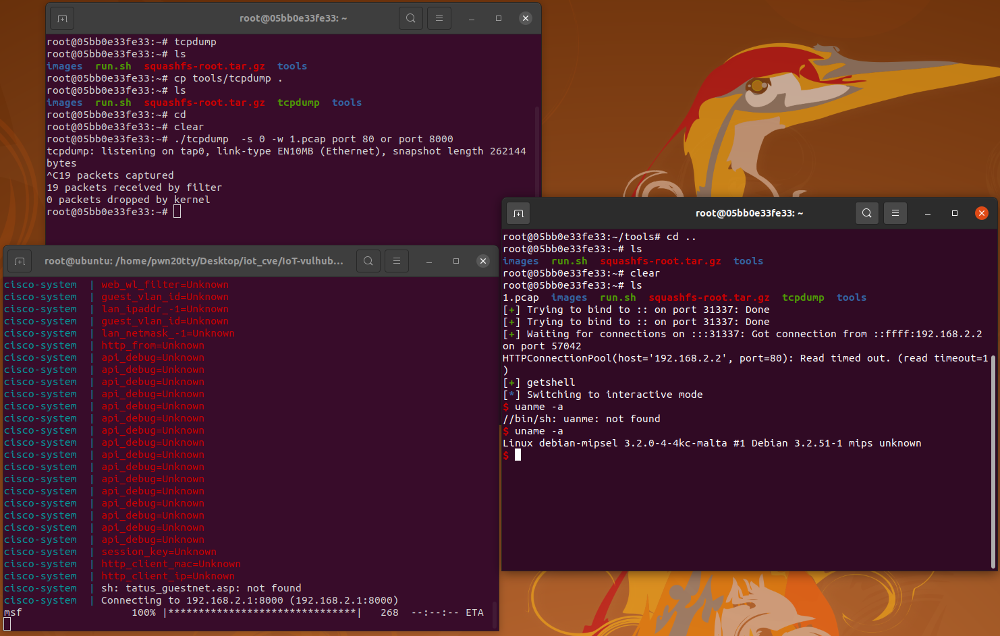
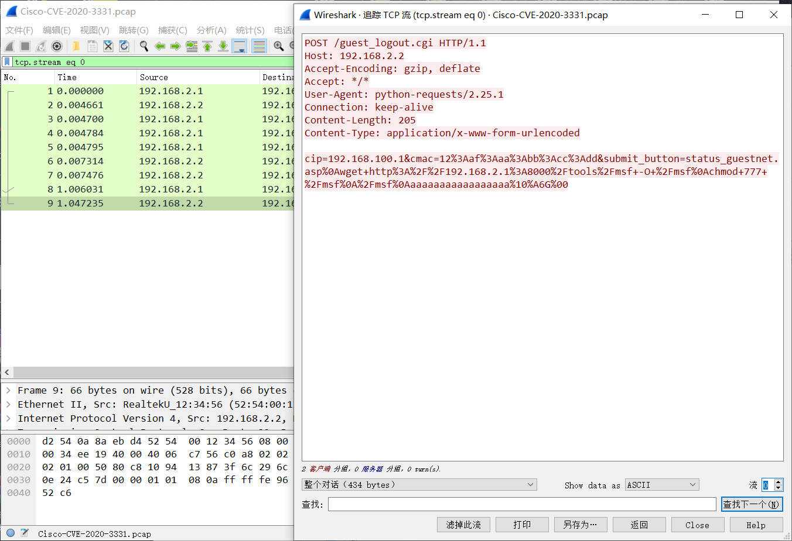

# Cisco RV110W 远程代码执行漏洞（CVE-2020-3331）

基础环境从IoT-vulhub下载https://github.com/firmianay/IoT-vulhub

- 版本：Cisco RV110W 1.2.2.5
- 漏洞：前台 cgi 接口 `guest_logout.cgi` 栈溢出
- 利用：a0 寄存器可控，ret2system

## 漏洞环境

- docker：攻击、调试主机：192.168.2.1
- qemu-system：固件主机：192.168.2.2
- httpd（有漏洞 Web 服务器）：192.168.2.2:80
- 镜像依赖：`firmianay/ubuntu1604 -> firmianay/qemu-system:mipsel`

使用 `firmianay/binwalk` 解压固件：

```bash
$ docker run --rm -v $PWD/firmware/:/root/firmware firmianay/binwalk -Mer "/root/firmware/RV110W_FW_1.2.2.5.bin"
```

构建并启动漏洞环境：

```bash
# 初始化环境
$ ./init_env.sh mipsel

# 构建镜像
$ docker-compose -f docker-compose-system.yml build

# 启动容器
$ docker-compose -f docker-compose-system.yml up
```

## 漏洞复现

在容器中运行利用脚本

```bash
# 漏洞利用
$ python3 tools/exp.py
```



## 流量抓取

把编译静态的tcpdump进行流量抓取

```bash
$ ./tcpdump  -s 0 -w 1.pcap port 80 or port 8000
```



