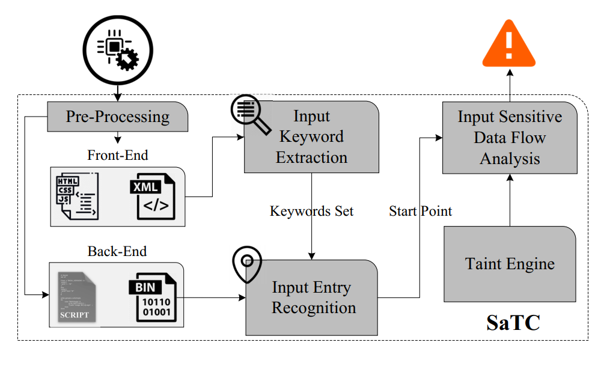
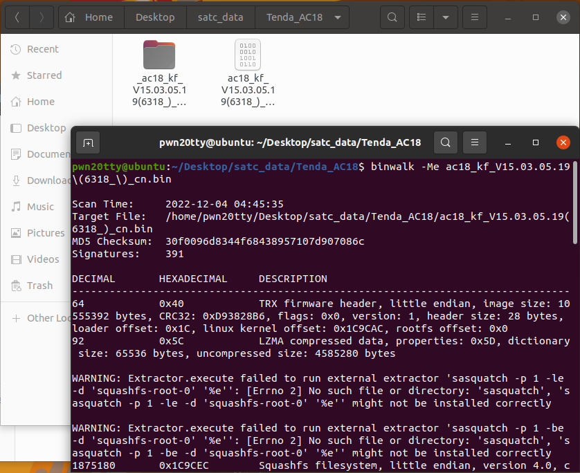
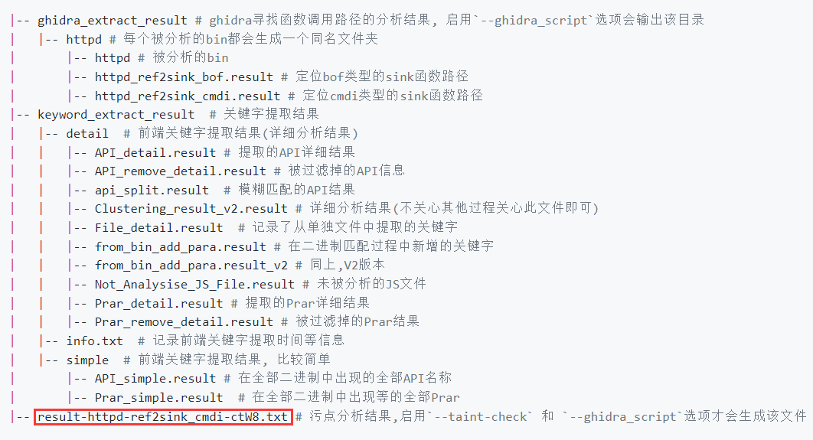
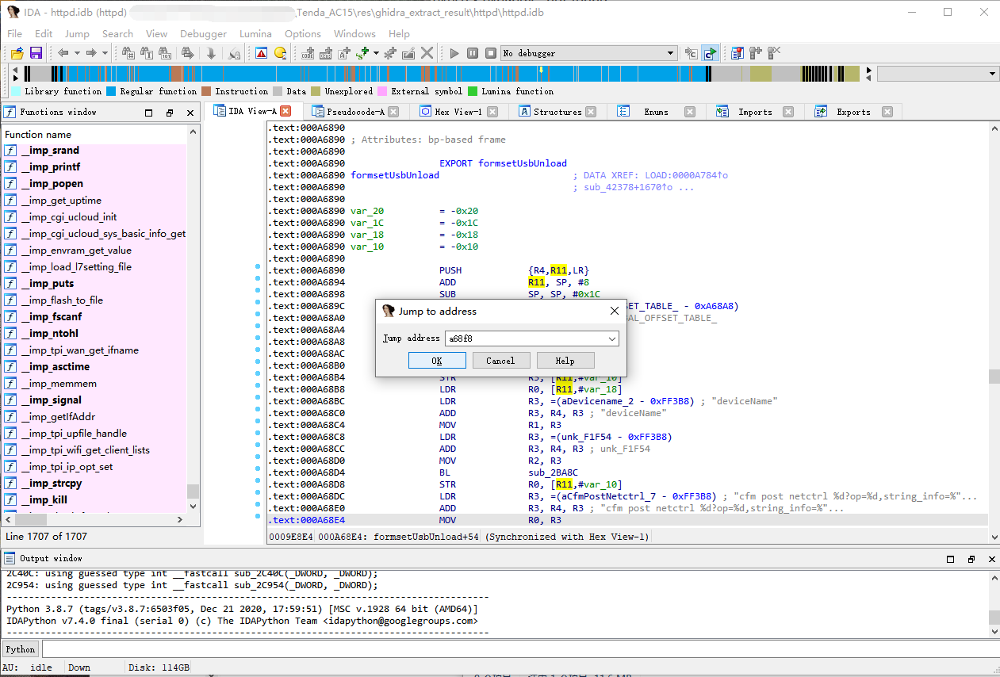
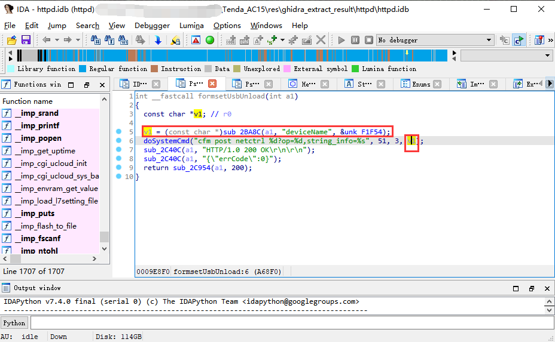

SaTC代码：https://github.com/NSSL-SJTU/SaTC/tree/py2_env

数据集 https://drive.google.com/file/d/1rOhjBlmv3jYmkKhTBJcqJ-G56HoHBpVX/view?usp=sharing

论文 https://www.usenix.org/system/files/sec21fall-chen-libo.pdf

## 工作流程图



## 安装运行

### docker运行

```bash
# 拉取docker镜像
docker pull smile0304/satc
# 进入docker环境，-v将固件解包后的目录挂载
docker run -it -v /home/pwn20tty/Desktop/satc_data/TOTOLink_T10/_TOTOLINK_CS185R_T10_IP04336_8197F_SPI_16M64M_V5.9c.1485_B20180122_ALL.web.extracted/squashfs-root/:/home/satc/SaTC/SaTC_data smile0304/satc
```

**固件解压**

```bash
# 先安装binwalk
# binwalk -Me 要解压的固件文件
binwalk -Me US_AC15V1.0BR_V15.03.05.19_multi_TD01.bin
```

工具详细参数&输出结果说明见 https://github.com/NSSL-SJTU/SaTC/blob/py2_env/README_CN.md

运行方法可参考 https://www.freebuf.com/sectool/339207.html

### 本地环境运行

暂时没搞


## 例子

这里以Tenda_AC18为例，测试`/bin/httpd`是否存在命令注入漏洞

首先binwalk解压，从firmware_SaTC中下载的Tenda_AC18固件



进入docker容器，并且添加映射

```bash
docker run -it -v /home/pwn20tty/Desktop/satc_data/Tenda_AC18/_ac18.extracted/squashfs-root/:/home/satc/SaTC/SaTC_data smile0304/satc
```

进入容器后检查`/home/satc/SaTC/SaTC_data`文件夹中是否有数据

- 测试`/bin/httpd`是否存在命令注入漏洞

```bash
python satc.py -d /home/satc/SaTC/SaTC_data -o /home/satc/res --ghidra_script=ref2sink_cmdi -b httpd --taint_check
```

- 测试`/bin/httpd`是否存在缓冲区溢出漏洞

```bash
python satc.py -d /home/satc/SaTC/SaTC_data -o /home/satc/res --ghidra_script=ref2sink_bof -b httpd --taint_check
```


过程中可能会飘红，或者警告，直接忽略，只要在`/home/satc/res`下输出txt文件就ok




## 结果说明

以`Tenda_AC15`中测试`/bin/httpd`的输出结果为例

**result-httpd-ref2sink_cmdi-kcjV.txt**

````
binary: /home/satc/SaTC/SaTC_data/bin/httpd
configfile: /home/satc/res/ghidra_extract_result/httpd/httpd_ref2sink_cmdi.result-alter2
0xef168 0xa1808   not found
```
0xf2208 0xa6890   found : 0xa68f8
```
0xefb24 0xa2994   not found
total cases: 110
find cases: 1
binary: /home/satc/SaTC/SaTC_data/bin/httpd
configfile: /home/satc/res/ghidra_extract_result/httpd/httpd_ref2sink_cmdi.result-alter2
````

ida分析found地址附近内容

`/bin/httpd`拖入IDA，g跳转到对应地址



f5反编译，可以看到这里doSystemCmd是能够命令注入的。



搜索资料看看Tenda_AC15命令注入的cve，可找到该漏洞对应cve编号`cve-2020-10987`，https://nosec.org/home/detail/4634.html

**复现**

**https://app.gitbook.com/o/CpfFrICVTo3X6VjanIFM/s/uwgMglOO1ZJHVzm7lxVc/iot-lou-dong-wa-jue/iotvulhub-xue-xi/tenda-cve-2020-10987**


## 统计结果

【腾讯文档】satc结果统计
https://docs.qq.com/sheet/DWlhLcklyVW5adUtD?tab=BB08J2