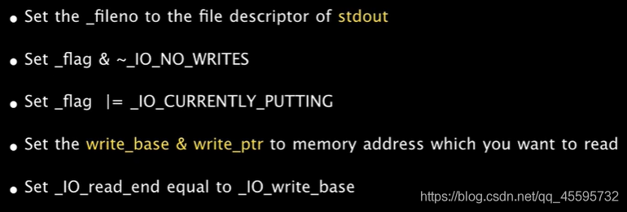
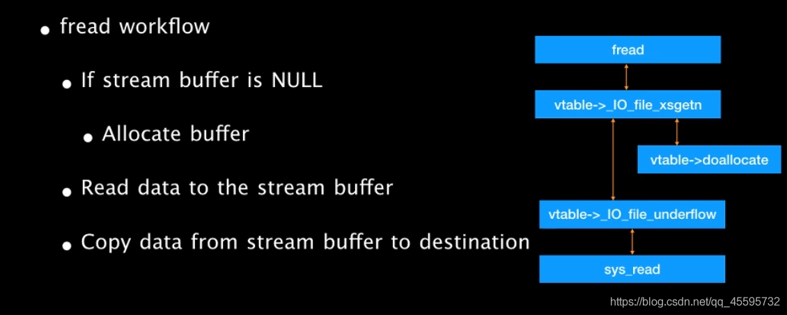
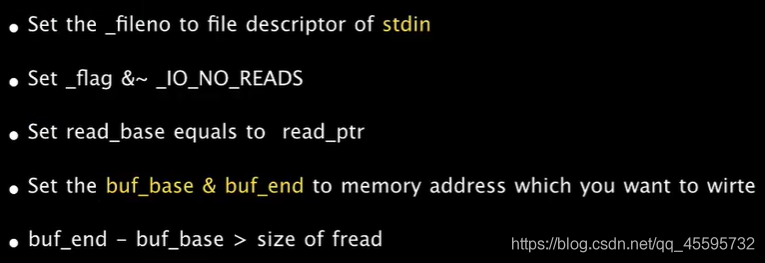
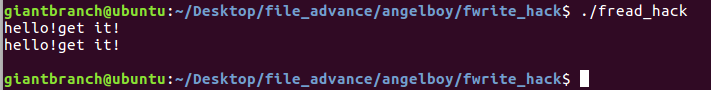

## FILE\_advance


<br></br>
#### **glibc2.24中加入了对vtable劫持的检测**

在 2.24 版本的 glibc 中，全新加入了针对 IO\_FILE\_plus 的 vtable 劫持的检测措施，glibc 会在调用虚函数之前首先检查 vtable 地址的合法性。首先会验证 vtable 是否位于\_IO\_vtable 段中，如果满足条件就正常执行，否则会调用\_IO\_vtable\_check 做进一步检查。

```c
/* Check if unknown vtable pointers are permitted; otherwise,
   terminate the process.  */
void _IO_vtable_check (void) attribute_hidden;
/* Perform vtable pointer validation.  If validation fails, terminate
   the process.  */
static inline const struct _IO_jump_t *
IO_validate_vtable (const struct _IO_jump_t *vtable)
{
  /* Fast path: The vtable pointer is within the __libc_IO_vtables
     section.  */
  uintptr_t section_length = __stop___libc_IO_vtables - __start___libc_IO_vtables;
  uintptr_t ptr = (uintptr_t) vtable;
  uintptr_t offset = ptr - (uintptr_t) __start___libc_IO_vtables;
  if (__glibc_unlikely (offset >= section_length))
    /* The vtable pointer is not in the expected section.  Use the
       slow path, which will terminate the process if necessary.  */
    _IO_vtable_check ();
  return vtable;
}
```

计算 `section_length = __stop___libc_IO_vtables - __start___libc_IO_vtables;`，紧接着会判断 vtable - \_\_start\_\_\_libc\_IO\_vtables 的 offset ，如果这个 offset 大于 section_length , 即大于 `__stop___libc_IO_vtables - __start___libc_IO_vtables` 那么就会调用 `_IO_vtable_check()` 这个函数。

```c
void attribute_hidden
_IO_vtable_check (void)
{
#ifdef SHARED
  /* Honor the compatibility flag.  */
  void (*flag) (void) = atomic_load_relaxed (&IO_accept_foreign_vtables);
#ifdef PTR_DEMANGLE
  PTR_DEMANGLE (flag);
#endif
  if (flag == &_IO_vtable_check)
    return;

  /* In case this libc copy is in a non-default namespace, we always
     need to accept foreign vtables because there is always a
     possibility that FILE * objects are passed across the linking
     boundary.  */
  {
    Dl_info di;
    struct link_map *l;
    if (_dl_open_hook != NULL
        || (_dl_addr (_IO_vtable_check, &di, &l, NULL) != 0
            && l->l_ns != LM_ID_BASE))
      return;
  }

#else /* !SHARED */
  /* We cannot perform vtable validation in the static dlopen case
     because FILE * handles might be passed back and forth across the
     boundary.  Therefore, we disable checking in this case.  */
  if (__dlopen != NULL)
    return;
#endif

  __libc_fatal ("Fatal error: glibc detected an invalid stdio handle\n");
}
```

如果 vtable 是非法的，那么会引发 abort。

这里的检查使得以往使用 vtable 进行利用的技术很难实现


所以需要去寻找新的利用方式

#### **fwrite**

先给出fwrite执行的大致流程图


执行过程中的进行实际操作的函数符号(方便在源码中寻找)：

\_IO\_fwrite==>\_IO\_new\_file\_xsputn==>\_IO\_new\_file\_overflow==>\_IO\_new\_do\_write==>new\_do\_write==>

\_IO\_SYSWRITE

这里给出angelboy的一种泄露方式




各个需要检查的位置

**Set  \_flags & ~\_IO\_NO\_WRITES**

**Set  \_flags |= \_IO\_CURRENTLY\_PUTTING**    

```c
#define _IO_NO_WRITES 8 
#define _IO_CURRENTLY_PUTTING 0x800
...
int
_IO_new_file_overflow (_IO_FILE *f, int ch)
{
  if (f->_flags & _IO_NO_WRITES) /* SET ERROR */
    {
      f->_flags |= _IO_ERR_SEEN;
      __set_errno (EBADF);
      return EOF;
    }
  /* If currently reading or no buffer allocated. */
  if ((f->_flags & _IO_CURRENTLY_PUTTING) == 0 || f->_IO_write_base == NULL)
    {
            ...
    }
  if (ch == EOF)
    return _IO_do_write (f, f->_IO_write_base,
			 f->_IO_write_ptr - f->_IO_write_base);    //<=====ourgoal
            ...
}
```


**Set \_IO\_read\_end == \_IO\_write\_base**

```c
static
_IO_size_t
new_do_write (_IO_FILE *fp, const char *data, _IO_size_t to_do)
{
  _IO_size_t count;
  if (fp->_flags & _IO_IS_APPENDING)
    ...
  else if (fp->_IO_read_end != fp->_IO_write_base)
    {
    ...      
    }
  count = _IO_SYSWRITE (fp, data, to_do); //<=====our goal
    ....
  return count;
}
```


演示程序

```c
#include<stdio.h>
#include<stdlib.h>
#include<unistd.h>
int main(){
	char *msg = "secret";
	FILE *fp;
	char *buf = malloc(100);
	read(0,buf,100);
	fp = fopen("key.txt","rw");
//=================================================
	fp->_flags &= ~8;
	fp->_flags |= 0x800;
	fp->_flags |= _IO_IS_APPENDING;
	fp->_IO_write_base = msg;
	fp->_IO_write_ptr = msg+6;
	fp->_IO_read_end = fp->_IO_write_base;
	fp->_fileno = 1;
//=================================================
	fwrite(buf,1,100,fp);
}
```

运行结果


</br>
</br>

#### fread
给出fread执行的大致流程图




一种写入方式




**Set read_base == read_ptr**

```c
_IO_size_t
_IO_file_xsgetn (_IO_FILE *fp, void *data, _IO_size_t n)
{    
     ...
      have = fp->_IO_read_end - fp->_IO_read_ptr;
      if (want <= have)
	        ...//copy data from buffer to destination
	  if (fp->_IO_buf_base
	      && want < (size_t) (fp->_IO_buf_end - fp->_IO_buf_base))//buffer size must be larger than read size
	    {
	      if (__underflow (fp) == EOF)
				...
        }
     ...
}
```


**Set  \_flags & ~\_IO\_NO\_READS**

```c
#define _IO_NO_READS 4
...
int
_IO_new_file_underflow (_IO_FILE *fp)
{
  ...
  if (fp->_flags & _IO_NO_READS)
    {
        ...
      return EOF;
    }
   ...
  count = _IO_SYSREAD (fp, fp->_IO_buf_base,
		       fp->_IO_buf_end - fp->_IO_buf_base);//<=====our goal
   ...
}
```


演示程序

```c
#include<stdio.h>
#include<stdlib.h>
#include<unistd.h>
int main(){
	FILE *fp;
	char *buf = malloc(100);
	char msg[100];
	fp = fopen("key.txt","rw");
//=================================================
	fp->_flags &= ~4;
	fp->_IO_buf_base = msg;
	fp->_IO_buf_end = msg+100;
	fp->_fileno = 0;
//=================================================
	fread(buf,1,6,fp);
	puts(msg);
}
```

运行结果




