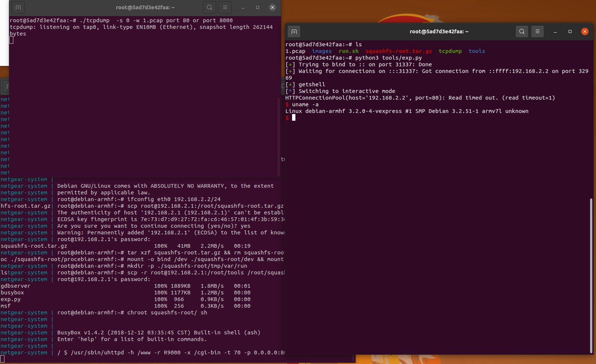
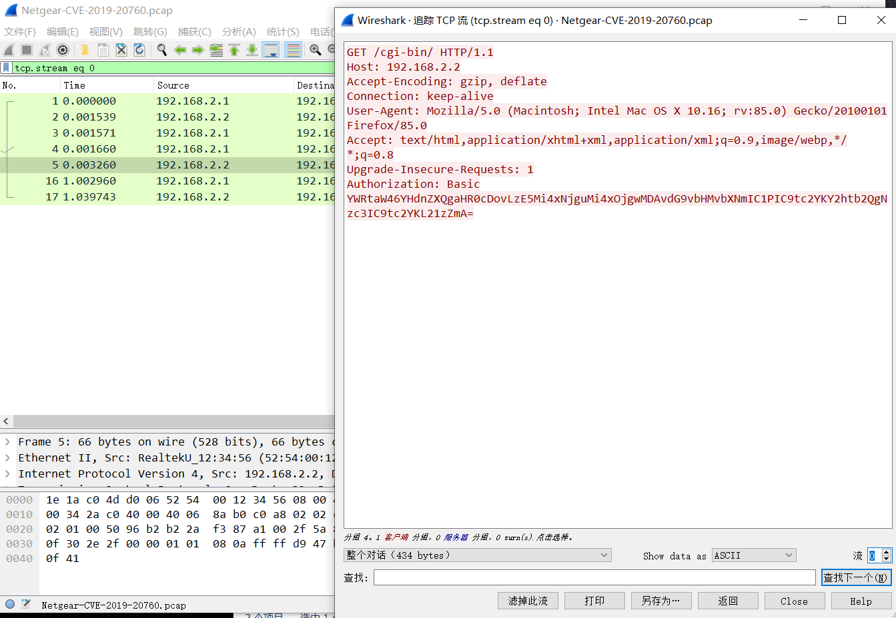

# Netgear R9000 命令注入漏洞（CVE-2019-20760）

基础环境从IoT-vulhub下载https://github.com/firmianay/IoT-vulhub

## 漏洞环境

- docker：攻击、调试主机：192.168.2.1
- qemu-system：固件主机：192.168.2.2
- uhttpd（有漏洞 Web 服务器）：192.168.2.2:80
- 镜像依赖：`firmianay/ubuntu1604 -> firmianay/qemu-system:armhf`

使用 `firmianay/binwalk` 解压固件：

```
$ docker run --rm -v $PWD/firmware/:/root/firmware firmianay/binwalk -Mer "/root/firmware/R9000-V1.0.4.26.img"
```

构建并启动漏洞环境：

```
# 初始化环境
$ ./init_env.sh arm

# 构建镜像
$ docker-compose -f docker-compose-system.yml build

# 启动容器
$ docker-compose -f docker-compose-system.yml up

# 启动完成后，开启 socks 代理
$ ssh -D 2345 root@127.0.0.1 -p 1234
# 配置浏览器代理，即可登陆 Web 后台 http://192.168.2.2/cgi-bin/

# 漏洞利用
$ python3 tools/exp.py
```

## 漏洞复现

在容器中运行利用脚本

```bash
# 漏洞利用
$ python3 tools/exp.py
```




## 流量抓取

把编译静态的tcpdump进行流量抓取

```bash
$ ./tcpdump  -s 0 -w 1.pcap port 80 or port 8000 
```



