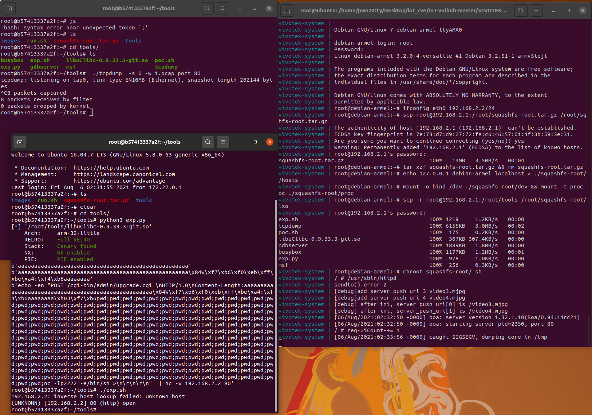
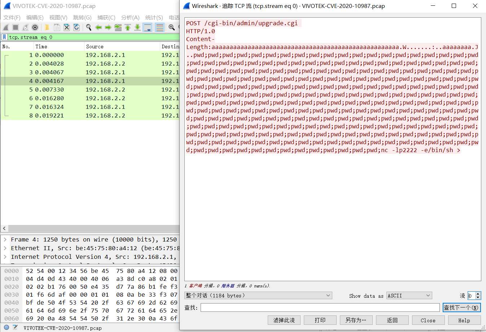

# Vivotek CC8160 栈溢出漏洞

基础环境从IoT-vulhub下载https://github.com/firmianay/IoT-vulhub

## 漏洞环境

- docker：攻击、调试主机：192.168.2.1
- qemu-system：固件主机：192.168.2.2
- httpd（有漏洞服务）：192.168.2.2:80
- 镜像依赖：`firmianay/ubuntu1604 -> firmianay/qemu-system:armel`

使用 `firmianay/binwalk` 解压固件：

```bash
$ docker run --rm -v $PWD/firmware/:/root/firmware firmianay/binwalk -Mer "/root/firmware/CC8160-VVTK-0100d.flash.pkg"
```

### 系统模拟

构建并启动漏洞环境：

```bash
# 初始化环境
$ ./init_env.sh arm

# 构建镜像
$ docker-compose -f docker-compose-system.yml build

# 启动容器
$ docker-compose -f docker-compose-system.yml up

# 等待启动完成，重新打开一个窗口
$ docker exec -it vivotek-system /bin/bash

$ ssh root@192.168.2.2
```

## 漏洞复现

在容器中运行利用脚本

需要将libuClibc-0.9.33.3-git.so拷至exp运行目录下

```bash
$ cd tools
$ python3 exp.py
$ ./exp.sh
```



## 流量抓取

把编译静态的tcpdump进行流量抓取

```bash
$ ./tcpdump  -s 0 -w 1.pcap port 80
```

