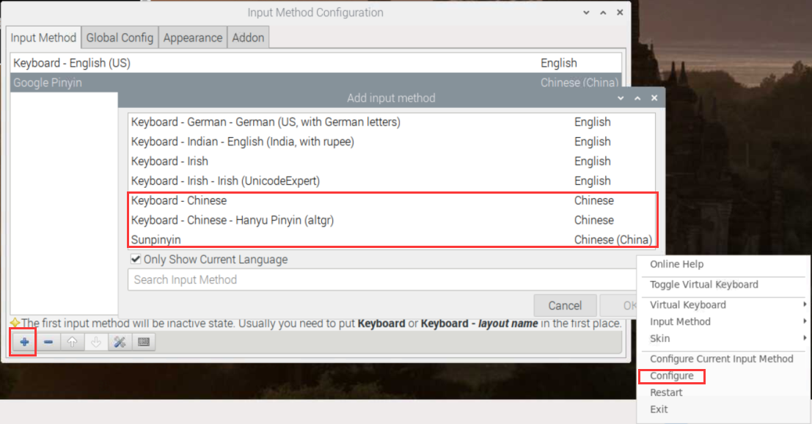

# 树莓派搭建ARM64位环境


## 换源（很重要！！！）

  64位镜像可以直接使用debian的系统源，首先需要编辑/etc/apt/sources.list，使用#号注释原内容，然后在末尾添加Debian的系统源： 

```
# 默认注释了源码镜像以提高 apt update 速度，如有需要可自行取消注释
deb https://mirrors.tuna.tsinghua.edu.cn/debian/ buster main contrib non-free
# deb-src https://mirrors.tuna.tsinghua.edu.cn/debian/ buster main contrib non-free
deb https://mirrors.tuna.tsinghua.edu.cn/debian/ buster-updates main contrib non-free
# deb-src https://mirrors.tuna.tsinghua.edu.cn/debian/ buster-updates main contrib non-free
deb https://mirrors.tuna.tsinghua.edu.cn/debian/ buster-backports main contrib non-free
# deb-src https://mirrors.tuna.tsinghua.edu.cn/debian/ buster-backports main contrib non-free
deb https://mirrors.tuna.tsinghua.edu.cn/debian-security buster/updates main contrib non-free
# deb-src https://mirrors.tuna.tsinghua.edu.cn/debian-security buster/updates main contrib non-free
```

  接着需要配置树莓派官方的软件源，编辑/etc/apt/sources.list.d/raspi.list，同样的，注释原内容，在末尾添加如下内容： 

```
deb http://mirrors.tuna.tsinghua.edu.cn/raspberrypi/ buster main ui
```


## lrzsz 

为了xshell传文件方便

```bash
$ sudo apt install lrzsz  
```


## pwntools

python2安装pwntools

```bash
$ apt-get update
$ apt-get install -y python-pip build-essential python-dev python-setuptools libffi-dev libssl-dev
$ python -m pip install --upgrade pip
$ pip install -U setuptools
$ pip install more-itertools==5.0.0
$ pip install pwntools
```

装一半失败了。。。选择从github上去下

```bash
$ git clone https://github.com/Gallopsled/pwntools.git
$ cd pwntools
$ python setup.py install
```

python3安装pwntools

```bash
$ apt-get update
$ apt-get install python3 python3-pip python3-dev git libssl-dev libffi-dev build-essential
$ python3 -m pip install --upgrade pip
$ python3 -m pip install --upgrade pwntools
```


## Binutils

这个工具主要是为了各个架构的汇编，要不然pwntools里的asm模块不能够正常使用

假如是ubuntu装起来很容易，但是别的系统装起来就很麻烦

这里选择去github上找

先安装texinfo，要不然编译会出错

```bash
$ apt install texinfo
```

```bash
$ git clone https://github.com/Gallopsled/pwntools-binutils
$ cd pwntools-binutils/generic
$ chmod +x install.sh
$ chmod +x install_all.sh
```

可以直接选择运行install_all.sh，不过不建议，全架构太慢了。

可以./install.sh architecture来安装相应的架构

支持的架构

```
aarch64 alpha arm avr cris hppa ia64 m68k mips mips64 msp430 powerpc powerpc64 s390 sparc vax xscale i386 x86_64
```


## pwndbg

好像没有什么坑，比较顺利

```bash
$ git clone https://github.com/pwndbg/pwndbg
$ cd pwndbg
$ ./setup.sh
```


## 安装谷歌输入法

```bash
$ sudo apt-get install fcitx fcitx-googlepinyin fcitx-module-cloudpinyin fcitx-sunpinyin
```

重启后在配置里添加中文键盘



ctrl+空格切换输入法

然后就可以快乐中文输入啦

