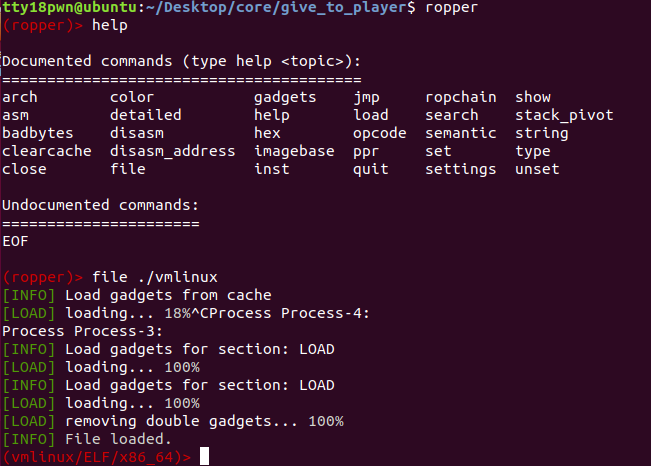
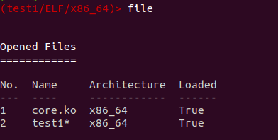
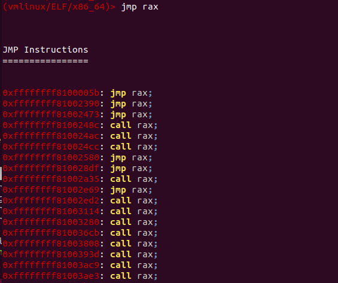
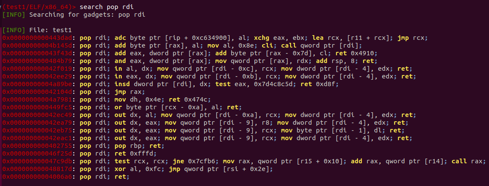
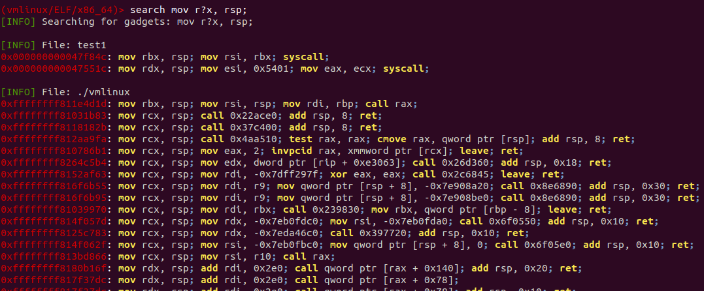
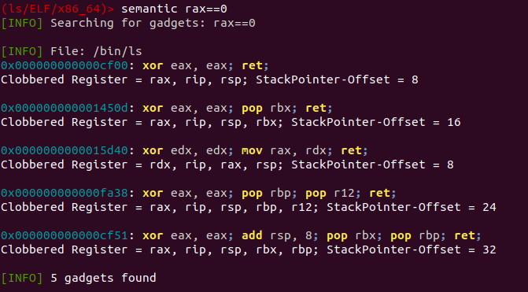
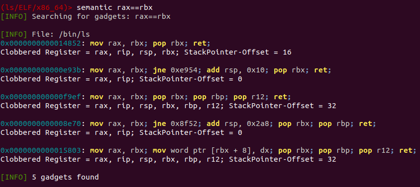

ropper是用来找gadgets的用处和ROPgadget一样，但内核的vmlinux文件比较大用ROPgadget会跑的特别慢。下面简单的介绍用法。

#### 安装

https://www.jianshu.com/p/e14c811496ac

#### 使用方法

直接ropper进入交互界面

#### file命令

file加载要分析的文件

支持的架构

```
supported architectures:
  x86 [x86]
  x86_64 [x86_64]
  MIPS [MIPS, MIPS64]
  ARM/Thumb [ARM, ARMTHUMB]
  ARM64 [ARM64]
  PowerPC [PPC, PPC64]
  SPARC [SPARC64]
```


ropper支持一次性加载多个文件，file可以查看加载进来的文件和文件标识，同时file [文件标识]可以切换当前选中文件





gadgets命令会列出所有的gadgets，实在是太多了，所以感觉一般不会这么用。

#### jmp指令



#### 用search可以更加精准的查找相关的指令





#### semantic命令（实现一定功能的片段）

感觉只能跑跑小程序，大程序貌似不太跑的出来。

需要先安装依赖的库

```shell
pip3 install z3
pip3 install archinfo
pip3 install pyvex
```

支持的约束命令

```
reg == reg     -  assign register to another
reg == number  -  assign number to register
reg == [reg]   -  assign memory to register
reg += number/reg/[reg]
reg -= number/reg/[reg]
reg *= number/reg/[reg]
reg /= number/reg/[reg]
```

示例：



