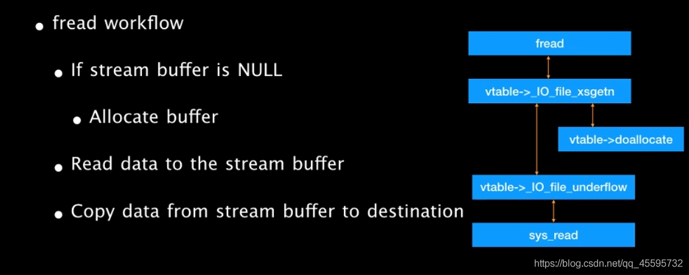
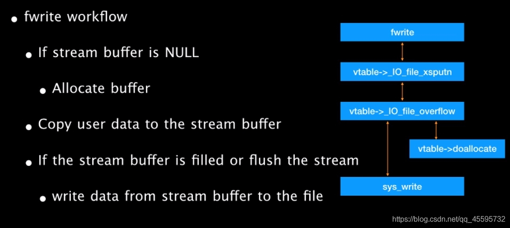
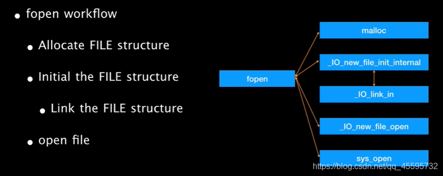
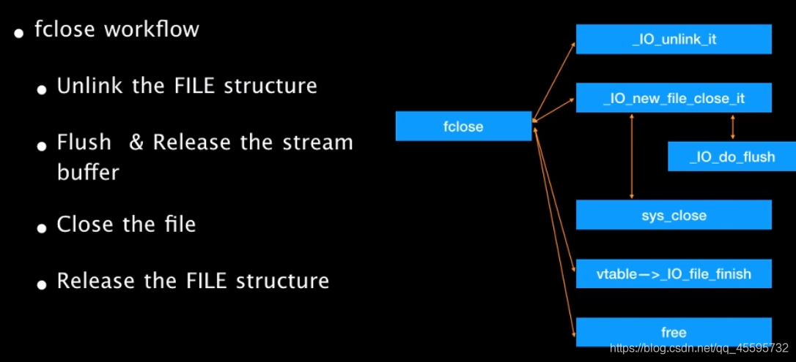



# FILE结构
<br></br>

FILE结构体的定义（截自/glibc2.23/libio/libio.h）
<br></br>

```c
struct _IO_FILE {
  int _flags;		/* High-order word is _IO_MAGIC; rest is flags. */
#define _IO_file_flags _flags

  /* The following pointers correspond to the C++ streambuf protocol. */
  /* Note:  Tk uses the _IO_read_ptr and _IO_read_end fields directly. */
  char* _IO_read_ptr;	/* Current read pointer */
  char* _IO_read_end;	/* End of get area. */
  char* _IO_read_base;	/* Start of putback+get area. */
  char* _IO_write_base;	/* Start of put area. */
  char* _IO_write_ptr;	/* Current put pointer. */
  char* _IO_write_end;	/* End of put area. */
  char* _IO_buf_base;	/* Start of reserve area. */
  char* _IO_buf_end;	/* End of reserve area. */
  /* The following fields are used to support backing up and undo. */
  char *_IO_save_base; /* Pointer to start of non-current get area. */
  char *_IO_backup_base;  /* Pointer to first valid character of backup area */
  char *_IO_save_end; /* Pointer to end of non-current get area. */

  struct _IO_marker *_markers;

  struct _IO_FILE *_chain;

  int _fileno;
#if 0
  int _blksize;
#else
  int _flags2;
#endif
  _IO_off_t _old_offset; /* This used to be _offset but it's too small.  */

#define __HAVE_COLUMN /* temporary */
  /* 1+column number of pbase(); 0 is unknown. */
  unsigned short _cur_column;
  signed char _vtable_offset;
  char _shortbuf[1];

  /*  char* _save_gptr;  char* _save_egptr; */

  _IO_lock_t *_lock;
#ifdef _IO_USE_OLD_IO_FILE
};
```


进程中的 FILE 结构会通过chain 域彼此连接形成一个链表，链表头部用全局变量IO_list_all 表示，通过这个值我们可以遍历所有的 FILE 结构。

在标准 I/O 库中，每个程序启动时有三个文件流是自动打开的：stdin、stdout、stderr。因此在初始状态下，_IO_list_all 指向了一个有这些文件流构成的链表，但是需要注意的是这三个文件流位于 libc.so 的数据段。而我们使用 fopen 创建的文件流是分配在堆内存上的。


我们可以在 libc.so 中找到 stdin\stdout\stderr 等符号，这些符号是指向 FILE 结构的指针，真正结构的符号是IO_2_1_stderr      IO_2_1_stdout     IO_2_1_stdin

其在glibc中的声明（/glibc2.23/libio/libio.h）

```c
extern struct _IO_FILE_plus _IO_2_1_stdin_;
extern struct _IO_FILE_plus _IO_2_1_stdout_;
extern struct _IO_FILE_plus _IO_2_1_stderr_;
```

但是事实上 _IO_FILE 结构外包裹着另一种结构 _IO_FILE_plus，其中包含了一个重要的指针 **vtable** 指向了一系列函数指针。**在 libc2.23 版本下，32 位的 vtable 偏移为 0x94，64 位偏移为 0xd8。**

```c
struct _IO_FILE_plus
{
  _IO_FILE file;
  const struct _IO_jump_t *vtable;
};
```

IO_jump_t结构体的定义(/glibc2.23/libio/libio.h)

```c
struct _IO_jump_t
{
    JUMP_FIELD(size_t, __dummy);
    JUMP_FIELD(size_t, __dummy2);
    JUMP_FIELD(_IO_finish_t, __finish);
    JUMP_FIELD(_IO_overflow_t, __overflow);
    JUMP_FIELD(_IO_underflow_t, __underflow);
    JUMP_FIELD(_IO_underflow_t, __uflow);
    JUMP_FIELD(_IO_pbackfail_t, __pbackfail);
    /* showmany */
    JUMP_FIELD(_IO_xsputn_t, __xsputn);
    JUMP_FIELD(_IO_xsgetn_t, __xsgetn);
    JUMP_FIELD(_IO_seekoff_t, __seekoff);
    JUMP_FIELD(_IO_seekpos_t, __seekpos);
    JUMP_FIELD(_IO_setbuf_t, __setbuf);
    JUMP_FIELD(_IO_sync_t, __sync);
    JUMP_FIELD(_IO_doallocate_t, __doallocate);
    JUMP_FIELD(_IO_read_t, __read);
    JUMP_FIELD(_IO_write_t, __write);
    JUMP_FIELD(_IO_seek_t, __seek);
    JUMP_FIELD(_IO_close_t, __close);
    JUMP_FIELD(_IO_stat_t, __stat);
    JUMP_FIELD(_IO_showmanyc_t, __showmanyc);
    JUMP_FIELD(_IO_imbue_t, __imbue);
#if 0
    get_column;
    set_column;
#endif
};
```

\_IO\_2\_1\_stdin\_、\_IO\_2\_1\_stdout\_、\_IO\_2\_1\_stderr\_这三个默认开启的\_IO\_FILE\_plus结构的vtable默认指向\_IO\_file\_jumps。（不可被修改）

```c
const struct _IO_jump_t _IO_file_jumps =
{
  JUMP_INIT_DUMMY,
  JUMP_INIT(finish, _IO_file_finish),
  JUMP_INIT(overflow, _IO_file_overflow),
  JUMP_INIT(underflow, _IO_file_underflow),
  JUMP_INIT(uflow, _IO_default_uflow),
  JUMP_INIT(pbackfail, _IO_default_pbackfail),
  JUMP_INIT(xsputn, _IO_file_xsputn),
  JUMP_INIT(xsgetn, _IO_file_xsgetn),
  JUMP_INIT(seekoff, _IO_new_file_seekoff),
  JUMP_INIT(seekpos, _IO_default_seekpos),
  JUMP_INIT(setbuf, _IO_new_file_setbuf),
  JUMP_INIT(sync, _IO_new_file_sync),
  JUMP_INIT(doallocate, _IO_file_doallocate),
  JUMP_INIT(read, _IO_file_read),
  JUMP_INIT(write, _IO_new_file_write),
  JUMP_INIT(seek, _IO_file_seek),
  JUMP_INIT(close, _IO_file_close),
  JUMP_INIT(stat, _IO_file_stat),
  JUMP_INIT(showmanyc, _IO_default_showmanyc),
  JUMP_INIT(imbue, _IO_default_imbue)
};
```


这里gdb中解析出的函数符号稍微有点奇怪，有些在glibc中找不到声明。

**(注：所有带\__GI\_的需要去掉这部分)**

**例：  \_\_xsgetn = 0x7ffff7a85ed0 <\_\_GI\_\_IO\_file_xsgetn> ，glibc中的函数符号是\_IO\_file\_xsgetn。**(不知道为何gdb解析出来的符号会不太一样，反正就挺秃然的.......)

```c
gdb-peda$ p _IO_file_jumps
$1 = {
  __dummy = 0x0, 
  __dummy2 = 0x0, 
  __finish = 0x7ffff7a869d0 <_IO_new_file_finish>, 
  __overflow = 0x7ffff7a87740 <_IO_new_file_overflow>, 
  __underflow = 0x7ffff7a874b0 <_IO_new_file_underflow>, 
  __uflow = 0x7ffff7a88610 <__GI__IO_default_uflow>, 
  __pbackfail = 0x7ffff7a89990 <__GI__IO_default_pbackfail>, 
  __xsputn = 0x7ffff7a861f0 <_IO_new_file_xsputn>, 
  __xsgetn = 0x7ffff7a85ed0 <__GI__IO_file_xsgetn>, 
  __seekoff = 0x7ffff7a854d0 <_IO_new_file_seekoff>, 
  __seekpos = 0x7ffff7a88a10 <_IO_default_seekpos>, 
  __setbuf = 0x7ffff7a85440 <_IO_new_file_setbuf>, 
  __sync = 0x7ffff7a85380 <_IO_new_file_sync>, 
  __doallocate = 0x7ffff7a7a190 <__GI__IO_file_doallocate>, 
  __read = 0x7ffff7a861b0 <__GI__IO_file_read>, 
  __write = 0x7ffff7a85b80 <_IO_new_file_write>, 
  __seek = 0x7ffff7a85980 <__GI__IO_file_seek>, 
  __close = 0x7ffff7a85350 <__GI__IO_file_close>, 
  __stat = 0x7ffff7a85b70 <__GI__IO_file_stat>, 
  __showmanyc = 0x7ffff7a89b00 <_IO_default_showmanyc>, 
  __imbue = 0x7ffff7a89b10 <_IO_default_imbue>
}
```


<br></br>
<br></br>

几个常用的函数：

#### fread

fread 是标准 IO 库函数，作用是从文件流中读数据，函数原型如下

```c
size_t fread ( void *buffer, size_t size, size_t count, FILE *stream) ;
```

- buffer 存放读取数据的缓冲区。
- size：指定每个记录的长度。
- count： 指定记录的个数。
- stream：目标文件流。
- 返回值：返回读取到数据缓冲区中的记录个数

实现主要功能的函数(/glibc2.23/libio/fileops.c)

```c
_IO_size_t _IO_file_xsgetn (_IO_FILE *fp, void *data, _IO_size_t n);
```
<br></br>


大致流程图


<br></br>

#### fwrite

fwrite 同样是标准 IO 库函数，作用是向文件流写入数据，函数原型如下

```c
size_t fwrite(const void* buffer, size_t size, size_t count, FILE* stream);
```

- buffer: 是一个指针，对 fwrite 来说，是要写入数据的地址;
- size: 要写入内容的单字节数;
- count: 要进行写入 size 字节的数据项的个数;
- stream: 目标文件指针;
- 返回值：实际写入的数据项个数 count。

大致流程图




<br></br>

#### fopen

fopen 在标准 IO 库中用于打开文件，函数原型如下

```c
FILE *fopen(char *filename, *type);
```

- filename: 目标文件的路径
- type: 打开方式的类型
- 返回值: 返回一个文件指针

在 fopen 内部会创建 FILE 结构并进行一些初始化操作，下面来看一下这个过程

首先在 fopen 对应的函数**__fopen_internal 内部会调用 malloc 函数**，分配 FILE 结构的空间。因此我们可以获知 FILE 结构是存储在堆上的

```C
*new_f = (struct locked_FILE *) malloc (sizeof (struct locked_FILE));
```

之后会为创建的 FILE 初始化 vtable，并调用_IO_file_init 进一步初始化操作

```c
_IO_JUMPS (&new_f->fp) = &_IO_file_jumps;
_IO_file_init (&new_f->fp);
```


在IO_file_init 函数的初始化操作中,会调用\_IO\_link_in 把新分配的 FILE 链入_IO_list_all 为起始的 FILE 链表中

```c
void
_IO_link_in (fp)
     struct _IO_FILE_plus *fp;
{
    if ((fp->file._flags & _IO_LINKED) == 0)
    {
      fp->file._flags |= _IO_LINKED;
      fp->file._chain = (_IO_FILE *) _IO_list_all;
      _IO_list_all = fp;
      ++_IO_list_all_stamp;
    }
}
```


之后\_fopen\_internal 函数会调用\_IO\_file\_fopen 函数打开目标文件，\_IO\_file\_fopen 会根据用户传入的打开模式进行打开操作，总之最后会调用到系统接口 open 函数，这里不再深入。

```c
if (_IO_file_fopen ((_IO_FILE *) new_f, filename, mode, is32) != NULL)
    return __fopen_maybe_mmap (&new_f->fp.file);
```


总结一下 fopen 的操作是

- 使用 malloc 分配 FILE 结构
- 设置 FILE 结构的 vtable
- 初始化分配的 FILE 结构
- 将初始化的 FILE 结构链入 FILE 结构链表中
- 调用系统调用打开文件

大致流程图



<br></br>

#### fclose

fclose 是标准 IO 库中用于关闭已打开文件的函数，其作用与 fopen 相反。

```c
int fclose(FILE *stream);
```

fclose 是标准 IO 库中用于关闭已打开文件的函数，其作用与 fopen 相反。

```c
int fclose(FILE *stream)
```

功能：关闭一个文件流，使用 fclose 就可以把缓冲区内最后剩余的数据输出到磁盘文件中，并释放文件指针和有关的缓冲区

fclose 首先会调用\_IO\_unlink\_it 将指定的 FILE 从_chain 链表中脱链

```c
if (fp->_IO_file_flags & _IO_IS_FILEBUF)
    _IO_un_link ((struct _IO_FILE_plus *) fp);
```

之后会调用\_IO\_file\_close_it 函数，\_IO\_file\_close\_it 会调用系统接口 close 关闭文件

```c
if (fp->_IO_file_flags & _IO_IS_FILEBUF)
    status = _IO_file_close_it (fp);
```

最后调用 vtable 中的\_IO\_FINISH，其对应的是\_IO\_file\_finish 函数，其中会调用 free 函数释放之前分配的 FILE 结构

```c
_IO_FINISH (fp);
```

大致流程图

IO_un_link ((struct _IO_FILE_plus *) fp);
```

之后会调用\_IO\_file\_close_it 函数，\_IO\_file\_close\_it 会调用系统接口 close 关闭文件

​```c
if (fp->_IO_file_flags & _IO_IS_FILEBUF)
    status = _IO_file_close_it (fp);
```

最后调用 vtable 中的\_IO\_FINISH，其对应的是\_IO\_file\_finish 函数，其中会调用 free 函数释放之前分配的 FILE 结构

```c
_IO_FINISH (fp);
```

大致流程图



