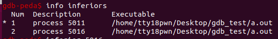

| **命令**           | **命令缩写** | **命令说明**                                                 |
| ------------------ | ------------ | ------------------------------------------------------------ |
| set args           |              | 设置主程序的参数。 例如：./book119 /oracle/c/book1.c /tmp/book1.c设置参数的方法是： (gdb) set args /oracle/c/book1.c /tmp/book1.c |
| break              | b            | 设置断点，b 20 表示在第20行设置断点，可以设置多个断点。      |
| run                | r            | 开始运行程序, 程序运行到断点的位置会停下来，如果没有遇到断点，程序一直运行下去。 |
| next               | n            | 执行当前行语句，如果该语句为函数调用，不会进入函数内部执行。 |
| step               | s            | 执行当前行语句，如果该语句为函数调用，则进入函数执行其中的第一条语句。注意了，如果函数是库函数或第三方提供的函数，用s也是进不去的，因为没有源代码，如果是您自定义的函数，只要有源码就可以进去。 |
| print              | p            | 显示变量值，例如：p name表示显示变量name的值。               |
| continue           | c            | 继续程序的运行，直到遇到下一个断点。                         |
| set var name=value |              | 设置变量的值，假设程序有两个变量：int ii; char name[21]; set var ii=10 把ii的值设置为10； set var name="西施" 把name的值设置为"西施"，注意，不是strcpy。 |
| quit               | q            | 退出gdb环境。                                                |

## 多进程调试

调试父进程： set follow-fork-mode parent (默认)

调试子进程： set follow-fork-mode child

调试模式： set detach-on-fork [on|off] ，默认是on

on：表示调试当前进程时，其他进程继续运行

off：表示调试当前进程时，其他进程被gdb挂起

查看调试的进程：info inferiors

切换当前调试的进程：inferior [Num]

