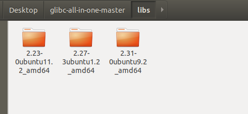

## 获取不同版本glibc版本方法

这里使用自动化工具

https://github.com/matrix1001/glibc-all-in-one

使用方法也很简单

先./update_list获取glibc列表

cat查看可以下载的glibc版本

```
$ cat list
2.23-0ubuntu11.2_amd64
2.23-0ubuntu11.2_i386
2.23-0ubuntu3_amd64
2.23-0ubuntu3_i386
2.27-3ubuntu1.2_amd64
2.27-3ubuntu1.2_i386
2.27-3ubuntu1.4_amd64
2.27-3ubuntu1.4_i386
2.27-3ubuntu1_amd64
2.27-3ubuntu1_i386
2.31-0ubuntu9.2_amd64
2.31-0ubuntu9.2_i386
2.31-0ubuntu9_amd64
2.31-0ubuntu9_i386
2.32-0ubuntu3.1_amd64
2.32-0ubuntu3.1_i386
2.32-0ubuntu3_amd64
2.32-0ubuntu3_i386
2.33-0ubuntu4_amd64
2.33-0ubuntu4_i386
```

./download指定版本glibc即可下载，默认源是清华源，速度也很给力，并且符号表存入对应 libc 的 ".debug" 文件夹中。 

```
$ ./download 2.27-3ubuntu1.2_amd64
Getting 2.27-3ubuntu1.2_amd64
  -> Location: https://mirror.tuna.tsinghua.edu.cn/ubuntu/pool/main/g/glibc/libc6_2.27-3ubuntu1.2_amd64.deb
  -> Downloading libc binary package
  -> Extracting libc binary package
  -> Package saved to libs/2.27-3ubuntu1.2_amd64
  -> Location: https://mirror.tuna.tsinghua.edu.cn/ubuntu/pool/main/g/glibc/libc6-dbg_2.27-3ubuntu1.2_amd64.deb
  -> Downloading libc debug package
  -> Extracting libc debug package
  -> Package saved to libs/2.27-3ubuntu1.2_amd64/.debug
```

下载完glibc的文件夹在lib里面，链接器和动态库文件都在里面了。




## patchelf改变程序链接器和动态库

 https://github.com/NixOS/patchelf 

```
./bootstrap.sh
./configure
make
make check
sudo make install
```

可能会遇到 autoreconf: not found 

安装一下就好啦

```
sudo apt-get install autoconf automake libtool
```


打patch方法，两种都可以

第一种，改变链接器+改变搜索路径

例子

```
patchelf --set-interpreter ./glibc-all-in-one-master/libs/2.31-0ubuntu9.2_amd64/ld-2.31.so --set-rpath ./glibc-all-in-one-master/libs/2.31-0ubuntu9.2_amd64 target_file
```


第二种，改变链接器+直接改变动态库的路径

例子

```
patchelf --set-interpreter ./glibc-all-in-one-master/libs/2.31-0ubuntu9.2_amd64/ld-2.31.so --replace-needed libc.so.6 ./glibc-all-in-one-master/libs/2.31-0ubuntu9.2_amd64/libc.so.6 target_file
```


个人感觉第一种会好一点，万一动态库有好多个，那第二种就需要手动一个一个设置了。


## 利用pwntools

例

p = process(["ld.so","./goal"],env={"LD_PRELOAD":"./libc-2.24.so"})


参考文章

https://bbs.pediy.com/thread-254868.htm