# 数据处理

## 机器学习重要指标

###  **TP、TN、FP、FN概念** 

TP（True Postive）：分类器识别正确，分类器认为该样本为正样本；
TN（True Negative）：分类器识别正确，分类器认为该样本为负样本；
FP（False Postive）：分类器识别结果错误，分类器认为该样本是正样本；所以实际上该样本是负样本；
FN（False Negative）：分类器识别结果错误，分类器认为该样本是负样本；所以实际上该样本是正样本； 

总样本数 = TP + TN + FP + FN

### 准确率、精确率、召回率、F1值

#### 准确率（Accuracy）

 有的预测正确（正类负类）的占总的比重。 

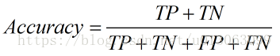

####  精确率（Precision） 

 查准率，即正确预测为正的占全部预测为正的比例，真正正确的占所有预测为正的比例。 

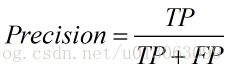

####  召回率（Recall）

 查全率，即正确预测为正的占全部实际为正的比例，真正正确的占所有实际为正的比例。 

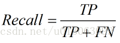

####  F1值（H-mean值）

 F1值为算数平均数除以几何平均数，且越大越好，将Precision和Recall的上述公式带入会发现，当F1值小时，True Positive相对增加，而false相对减少，即Precision和Recall都相对增加，即F1对Precision和Recall都进行了加权。 

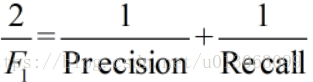

转化之后

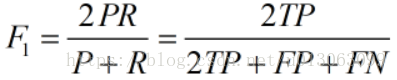

### TPR、FPR、TNR、FNR概念

####  TPR（True Positive Rate）

可以理解为所有正类中，有多少被预测成正类（正类预测正确），即召回率。

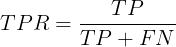

####  FPR（False Positive Rate）

可以理解为所有反类中，有多少被预测成正类（正类预测错误）

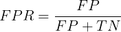

####  TNR（True Negative Rate）

可以理解为所有反类中，有多少被预测成反类（反类预测正确）

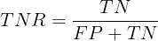

####  FNR（False Negative Rate）

可以理解为所有正类中，有多少被预测成反类（反类预测错误） 


### ROC、AUC

 以FPR（False Positive Rate）为横坐标，TPR（True Positive Rate）为纵坐标，可以做如下图 ，称作**ROC曲线**。

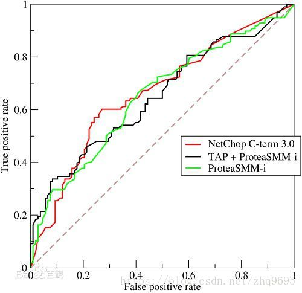

ROC曲线又称作“受试者工作特性曲线”，很明显，越靠近左上角的点，效果越好。

**AUC**

AUC（Area Under Curve）定义为ROC曲线下的面积，很明显，这个值越大越好。 

- AUC = 1，是完美分类器，采用这个预测模型时，不管设定什么阈值都能得出完美预测。绝大多数预测的场合，不存在完美分类器。

- 0.5 < AUC < 1，优于随机猜测。这个分类器（模型）妥善设定阈值的话，能有预测价值。

- AUC = 0.5，跟随机猜测一样（例：丢铜板），模型没有预测价值。

- AUC < 0.5，比随机猜测还差；但只要总是反预测而行，就优于随机猜测。


## 预处理

### 归一化

​	当数据(x)按照最小值中心化后，再按极差（最大值 - 最小值）缩放，数据移动了最小值个单位，并且会被收敛到 

[0,1]之间，而这个过程，就叫做数据归一化。

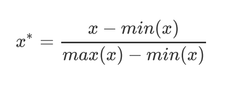

​	在sklearn当中，我们使用preprocessing.MinMaxScaler来实现这个功能。MinMaxScaler有一个重要参数， 

feature_range，控制我们希望把数据压缩到的范围，默认是[0,1]。

#### **例1**

```python
from sklearn.preprocessing import MinMaxScaler
data = [[-1, 2], [-0.5, 6], [0, 10], [1, 18]]
#实现归一化
scaler = MinMaxScaler()          #实例化
scaler = scaler.fit(data)        #fit，在这里本质是生成min(x)和max(x)
result = scaler.transform(data)   #通过接口导出结果
print(result)
```

或

```python
from sklearn.preprocessing import MinMaxScaler
data = [[-1, 2], [-0.5, 6], [0, 10], [1, 18]]
scaler = MinMaxScaler()              #实例化
result = scaler.fit_transform(data)  #训练和导出结果一步达成
print(result)
```

输出：

```python
[[0.   0.  ]
 [0.25 0.25]
 [0.5  0.5 ]
 [1.   1.  ]]
```

#### **例2**

```python
from sklearn.preprocessing import MinMaxScaler
#使用MinMaxScaler的参数feature_range实现将数据归一化到[0,1]以外的范围中
data = [[-1, 2], [-0.5, 6], [0, 10], [1, 18]]
scaler = MinMaxScaler(feature_range=[5,10])         #依然实例化
result = scaler.fit_transform(data)                 #fit_transform一步导出结果
print(result)
```

输出：

```python
[[ 5.    5.  ]
 [ 6.25  6.25]
 [ 7.5   7.5 ]
 [10.   10.  ]]
```

#### 例3

将数据还原

```python
rusult = scaler.inverse_transform(result)
```


### 标准化

​	当数据(x)按均值(μ)中心化后，再按标准差(σ)缩放，数据就会服从为均值为0，方差为1的正态分布（即标准正态分布），而这个过程，就叫做数据标准化。

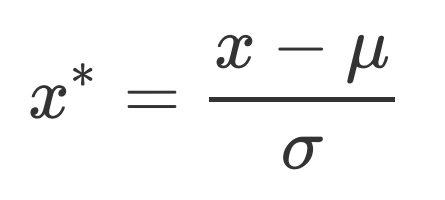

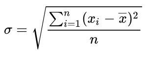


#### 例1

```python
from sklearn.preprocessing import StandardScaler
data = [[-1, 2], [-0.5, 6], [0, 10], [1, 18]]
scaler = StandardScaler()       #实例化
scaler.fit(data)                #fit，本质是生成均值和方差
print(scaler.mean_)             #查看均值的属性mean_
print(scaler.var_)              #查看方差的属性var_

x_std = scaler.transform(data)  #通过接口导出结果
print(x_std.mean())             #导出的结果是一个数组，用mean()查看均值
print(x_std.std())              #用std()查看方差
print(x_std)
```

输出

```python
[-0.125  9.   ]
[ 0.546875 35.      ]
0.0
1.0
[[-1.18321596 -1.18321596]
 [-0.50709255 -0.50709255]
 [ 0.16903085  0.16903085]
 [ 1.52127766  1.52127766]]
```

#### 例2

```python
scaler = StandardScaler()   #实例化
scaler.fit_transform(data)  #使用fit_transform(data)一步达成结果
```

#### 例3

```python
scaler.inverse_transform(x_std)  #使用inverse_transform逆转标准化
```


### 缺失值处理

#### 填充数据

用到的类

```python
class sklearn.impute.SimpleImputer(missing_values=nan, strategy=’mean’, fill_value=None, verbose=0,copy=True)
```

参数详解

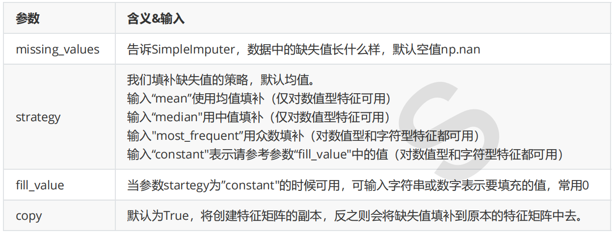

**例子**

```python
import pandas as pd
from sklearn.impute import SimpleImputer
data = pd.read_csv("Narrativedata.csv",index_col=0)
Age = data.loc[:,"Age"].values.reshape(-1,1) #sklearn当中特征矩阵必须是二维

imp_mean = SimpleImputer() #实例化，默认均值填补
imp_median = SimpleImputer(strategy="median") #用中位数填补
imp_0 = SimpleImputer(strategy="constant",fill_value=0) #用0填补

imp_mean = imp_mean.fit_transform(Age)                  #fit_transform一步完成调取结果
imp_median = imp_median.fit_transform(Age)
imp_0 = imp_0.fit_transform(Age)

#在这里我们使用中位数填补Age
data.loc[:,"Age"] = imp_median
```

或一步完成

```python
import pandas as pd
from sklearn.impute import SimpleImputer
data = pd.read_csv("Narrativedata.csv",index_col=0)
data.loc[:,"Age"] = data.loc[:,"Age"].fillna(data.loc[:,"Age"].median())
#.fillna 在DataFrame里面直接进行填补
```

#### 删除缺失数据

```python
#df为dataFrame类型
df.dropna(axis=0,inplace=True)
#.dropna(axis=0)删除所有有缺失值的行，.dropna(axis=1)删除所有有缺失值的列
#参数inplace，为True表示在原数据集上进行修改，为False表示生成一个复制对象，不修改原数据，默认False
```


### 文本处理

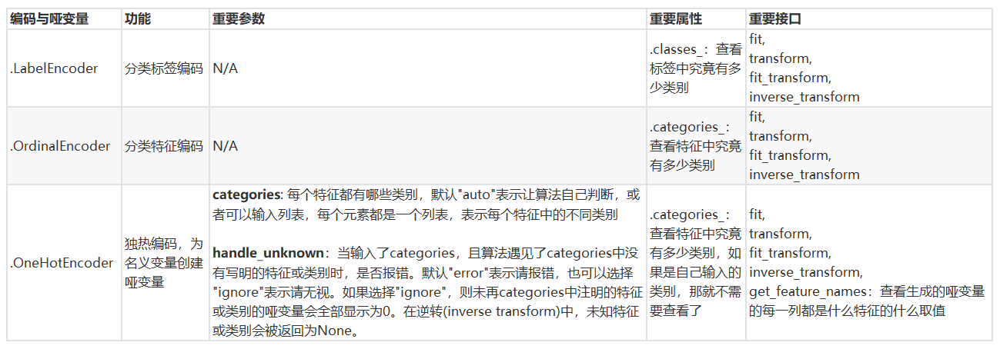

#### 普通编码

不同的类型从0开始累加编码，将文字型数据转换为数值型。

##### 单列处理

```python
import pandas as pd
from sklearn.preprocessing import LabelEncoder
data = pd.read_csv("Narrativedata.csv",index_col=0)

y = data.iloc[:,-1]     #要输入的是标签，不是特征矩阵，所以允许一维
le = LabelEncoder()     #实例化
le = le.fit(y)          #导入数据
label = le.transform(y) #transform接口调取结果
#label = le.fit_transform(y) #也可以直接fit_transform一步到位

print(le.classes_)      #属性.classes_查看标签中究竟有多少类别
print(le.inverse_transform(label))#使用inverse_transform可以逆转

data.iloc[:,-1] = label  #让标签等于我们运行出来的结果
```

结果

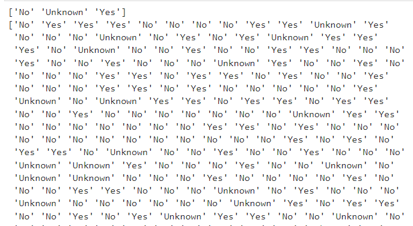


一步完成

```python
from sklearn.preprocessing import LabelEncoder
import pandas as pd
data = pd.read_csv("Narrativedata.csv",index_col=0)
data.iloc[:,-1] = LabelEncoder().fit_transform(data.iloc[:,-1])
data
```

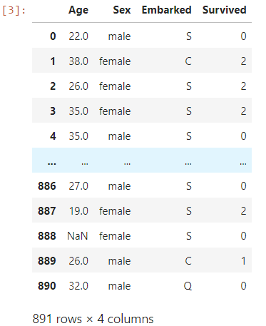

##### 多列处理

```python
from sklearn.preprocessing import LabelEncoder
from sklearn.preprocessing import OrdinalEncoder
import pandas as pd
data = pd.read_csv("Narrativedata.csv",index_col=0)
# data.info()
co_data = data.iloc[:,1:-1] #需要编码的列
oEncoder = OrdinalEncoder() #实例化
oEncoder.fit(co_data)       #导入数据
print(oEncoder.categories_)
re = oEncoder.transform(data.iloc[:,1:-1])  #转化
print(re)  #输出转化结果
data.iloc[:,1:-1] = re      #修改dataFrame

print(oEncoder.inverse_transform(re)) #复原标签
```

结果

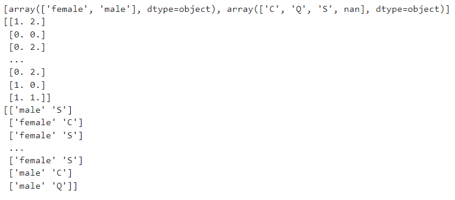


#### 独热编码

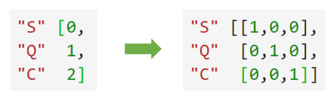

例子

```python
from sklearn.preprocessing import OneHotEncoder
import pandas as pd
data = pd.read_csv("Narrativedata.csv",index_col=0)
data.dropna(axis=0,inplace=True)              #清除含nan的行
data.reset_index(drop=True,inplace=True)                #重新标号
X = data.iloc[:,1:-1]
enc = OneHotEncoder(categories='auto').fit(X) #实例化，导入数据，自动识别需要编码的列
result = enc.transform(X).toarray()           #转化
#enc.inverse_transform(result)                #还原
print(enc.categories_)                        #输出每个列的标签数组
print(enc.get_feature_names_out())            #输出转化后数组的每列含义


oh_df = pd.DataFrame(result)
oh_df.columns = enc.get_feature_names_out() 
#axis=1,表示跨行进行合并，也就是将量表左右相连，如果是axis=0，就是将量表上下相连
newdata = pd.concat([data,oh_df],axis=1)
newdata
```

结果

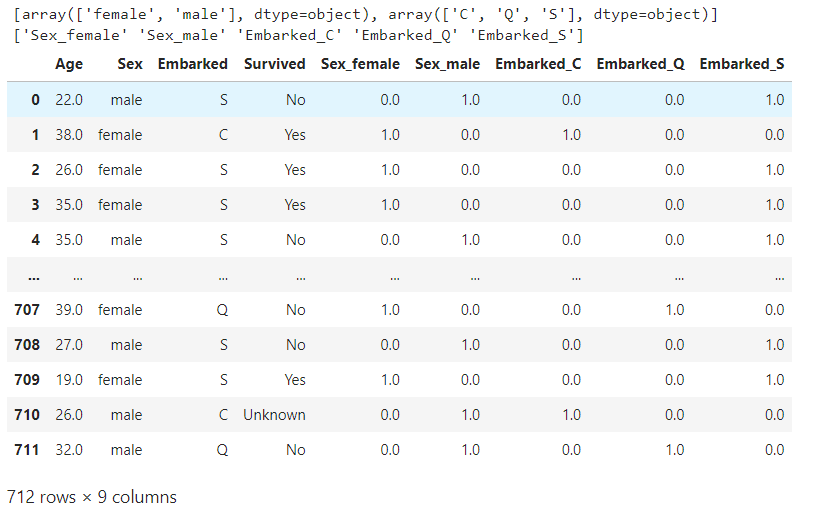


### 连续性变量处理

#### 二分处理

​	根据阈值将数据二值化（将特征值设置为0或1），用于处理连续型变量。大于阈值的值映射为1，而小于或等于阈值的值映射为0。默认阈值为0时，特征中所有的正值都映射到1。二值化是对文本计数数据的常见操作，分析人员可以决定仅考虑某种现象的存在与否。它还可以用作考虑布尔随机变量的估计器的预处理步骤（例如，使用贝叶斯设置中的伯努利分布建模）。

```python
from sklearn.preprocessing import Binarizer
import pandas as pd
data = pd.read_csv("Narrativedata.csv",index_col=0)
data.dropna(axis=0,inplace=True)              #清除含nan的行
data.reset_index(drop=True,inplace=True)      #重新标号

X = data['Age'].values.reshape(-1,1)       #类为特征专用，所以不能使用一维数组
# threshold为阈值，大于30映射为1，小于等于30映射为0
transformer = Binarizer(threshold=30).fit_transform(X)
data['Age'] = transformer
data
```

结果

年龄以30为界进行二分处理

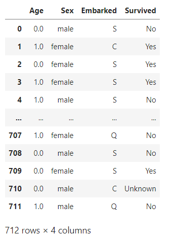


#### 分段

这是将连续型变量划分为分类变量的类，能够将连续型变量排序后按顺序分箱后编码。总共包含三个重要参数： 

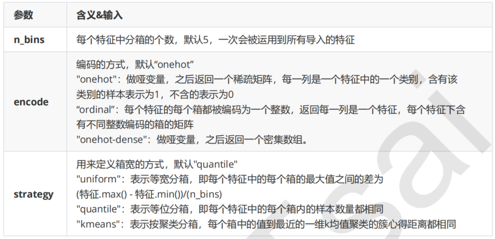

例

```python
from sklearn.preprocessing import KBinsDiscretizer
import pandas as pd
data = pd.read_csv("Narrativedata.csv",index_col=0)
data.dropna(axis=0,inplace=True)              #清除含nan的行
data.reset_index(drop=True,inplace=True)      #重新标号

X = data['Age'].values.reshape(-1,1) 
est = KBinsDiscretizer(n_bins=3, encode='ordinal', strategy='uniform')
result = est.fit_transform(X)
print(result)                       #查看转换后分的箱
```

结果

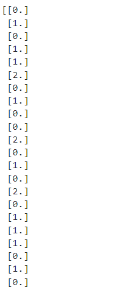


## pandas&numpy

### DataFrame构造方法和参数

```
pandas.DataFrame( data, index, columns, dtype, copy)
```

参数说明：

- **data**：一组数据(ndarray、series, map, lists, dict 等类型)。
- **index**：索引值，或者可以称为行标签。
- **columns**：列标签，默认为 RangeIndex (0, 1, 2, …, n) 。
- **dtype**：数据类型。
- **copy**：拷贝数据，默认为 False。


### 多维度array转一维

```python
import numpy as np
arr = np.array([[1,2],[3,4],[5,6]])
print(arr.ravel())
```

输出

```python
[1 2 3 4 5 6]
```


