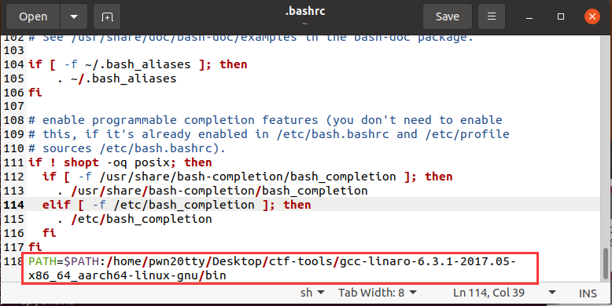
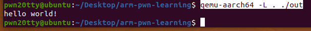

# ARMpwn基础环境搭建

## QEMU

选择源码安装

官网下载https://www.qemu.org/


先安装一些依赖

```bash
$ sudo apt-get install ninja-build
$ sudo apt-get install build-essential zlib1g-dev pkg-config libglib2.0-dev 
$ sudo apt-get install libmount-dev 
$ sudo apt-get install libpixman-1-dev
```

解压，编译安装

```bash
$ tar xvJF qemu-6.0.0.tar.xz
#文件夹改个名字
$ mv qemu-6.0.0 qemu
#创建一个临时文件夹
$ mkdir build
$ cd build
$ ../qemu/configure
$ make; make install
```

验证

```bash
pwn20tty@ubuntu:~/Desktop/ctf-tools$ qemu-riscv64 --version
qemu-riscv64 version 6.0.0
Copyright (c) 2003-2021 Fabrice Bellard and the QEMU Project developers
```


## 交叉编译工具

```bash
#  下载资源
$ wget http://releases.linaro.org/components/toolchain/binaries/6.3-2017.05/aarch64-linux-gnu/gcc-linaro-6.3.1-2017.05-x86_64_aarch64-linux-gnu.tar.xz
# 解压
$ tar -xvf gcc-linaro-6.3.1-2017.05-x86_64_aarch64-linux-gnu.tar.xz
```

写入环境变量

```bash
$ gedit ~/.bashrc
```

在最后一行加上信息

路径为~/gcc-linaro-6.3.1-2017.05-x86_64_aarch64-linux-gnu/bin



环境变量生效

```bash
$ source ~/.bashrc
```


## 编译运行一个arm程序

a.c

```c
#include<stdio.h>
int main(){
	printf("hello world!\n");
	return 0;
}
```

编译 (可以加上-static参数进行静态编译)

```bash
$ aarch64-linux-gnu-gcc -o out a.c
```

假如是动态链接，则需要将运行库文件夹拷贝到当前目录（也可以直接加上-L参数指定动态链接库文件夹）

注：交叉编译工具里有动态运行库文件夹

```bash
$ cp -r ~/Desktop/ctf-tools/gcc-linaro-6.3.1-2017.05-x86_64_aarch64-linux-gnu/aarch64-linux-gnu/libc/lib ./
```


运行

```bash
$ qemu-aarch64 -L . ./out
```



或者直接-L参数写上lib路径，这样就不用拷贝，不过调试的时候需要手动加载了，要不然符号信息可能不能加载。

```bash
$ qemu-aarch64 -L /home/pwn20tty/Desktop/ctf-tools/gcc-linaro-6.3.1-2017.05-x86_64_aarch64-linux-gnu/aarch64-linux-gnu/libc ./out
```


## 调试arm程序

安装能够调试多架构的gdb

```bash
$ sudo apt-get install gdb-multiarch
```

先启动程序开启监听

```bash
$ qemu-aarch64 -L . -g 1234 out
```

调试

```bash
$ gdb-multiarch out
pwndbg> target remote :1234
```

之后调试就和正常x86/x64一样啦，并且符号表信息成功加载


