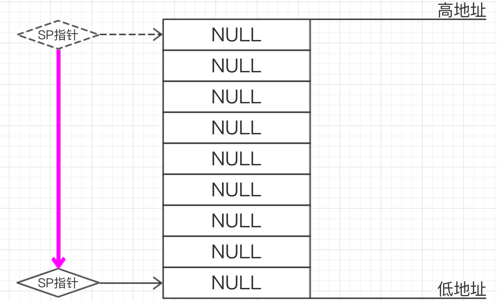
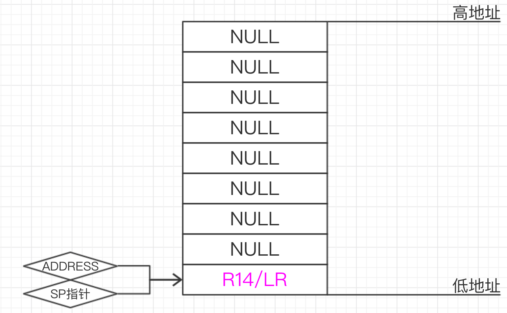
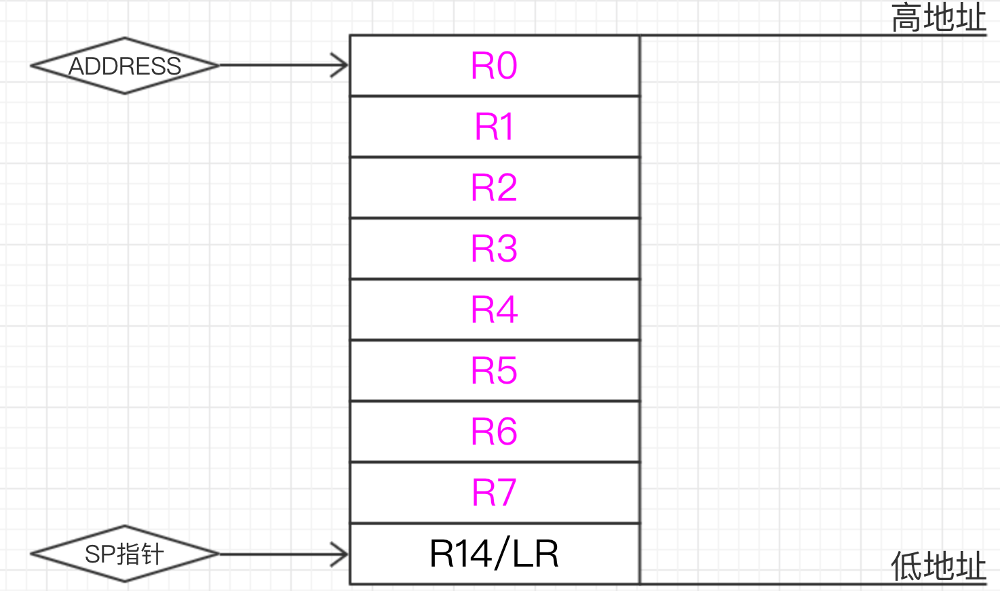

# arm&aarch64汇编

### ARM 架构

ARM架构使用了与Intel/AMD架构所不同的精简指令集(RISC)，因此其函数调用约定以及寄存器也有了一定的差异。

#### 过程调用标准

ARM/ARM64使用的是AAPCS或ATPCS标准。

ATPCS即为ARM-Thumb Procedure Call Standard/ARM-Thumb过程调用标准，规定了一些子程序间调用的基本规则，这些规则包括子程序调用过程中寄存器的使用规则，数据栈的使用规则，参数的传递规则。有了这些规则之后，单独编译的C语言程序就可以和汇编程序相互调用。使用ADS(ARM Developer Suite)的C语言编译器编译的C语言子程序满足用户指定的ATPCS类型。而对于汇编语言来说，则需要用户来保证各个子程序满足ATPCS的要求。而AAPCS即为ARM Archtecture Procedure Call Standard是2007年ARM公司正式推出的新标准，AAPCS是ATPCS的改进版，目前， AAPCS和ATPCS都是可用的标准。

#### 寄存器规则

1. 子程序间通过寄存器**R0～R3**来**传递参数**。这时，寄存器R0～R3可记作arg0～arg3。**被调用的子程序在返回前无需恢复寄存器R0～R3的内容，R0被用来存储函数调用的返回值**。
2. 在子程序中，使用寄存器**R4～R11**来**保存局部变量**。这时，寄存器R4～R11可以记作var1～var8。如果在子程序中使用了寄存器v1～v8中的某些寄存器，则**子程序进入时必须保存这些寄存器的值，在返回前必须恢复这些寄存器的值**。**R7经常被用作存储系统调用号，R11存放着帮助我们找到栈帧边界的指针，记作FP**。在Thumb程序中，通常只能使用寄存器R4～R7来保存局部变量。
3. 寄存器**R12**用作**过程调用中间临时寄存器**，记作IP。在子程序之间的连接代码段中常常有这种使用规则。
4. 寄存器**R13**用作**堆栈指针**，记作SP。在子程序中寄存器R13不能用作其他用途。**寄存器SP在进入子程序时的值和退出子程序时的值必须相等**。
5. 寄存器**R14**称为**连接寄存器**，记作LR。它用于**保存子程序的返回地址**。如果在子程序中保存了返回地址，寄存器R14则可以用作其他用途。
6. 寄存器**R15**是**程序计数器**，记作PC。它不能用作其它用途。当执行一个分支指令时，**PC存储目的地址。在程序执行中，ARM模式下的PC存储着当前指令加8(两条ARM指令后)的位置，Thumb(v1)模式下的PC存储着当前指令加4(两条Thumb指令后)的位置**。

给出ARM架构寄存器与Intel架构寄存器的关系：

| ARM架构 寄存器名 |   寄存器描述   |   Intel架构 寄存器名    |
| :--------------: | :------------: | :---------------------: |
|        R0        |   通用寄存器   |           EAX           |
|      R1~R5       |   通用寄存器   | EBX、ECX、EDX、EDI、ESI |
|      R6~R10      |   通用寄存器   |           无            |
|     R11(FP)      |    栈帧指针    |           EBP           |
|     R12(IP)      |  内部程序调用  |           无            |
|     R13(SP)      |    堆栈指针    |           ESP           |
|     R14(LP)      |   链接寄存器   |           无            |
|     R15(PC)      |   程序计数器   |           EIP           |
|       CPSR       | 程序状态寄存器 |         EFLAGS          |

#### 堆栈(Stack)规则

1. ATPCS规定堆栈为FD类型，即Full Descending，意思是 **SP指向最后一个压入的值(栈顶)，数据栈由高地址向低地址生长**，即满递减堆栈，并且对堆栈的操作是8字节对齐。所以经常使用的指令就有**STMFD和LDMFD**。

2. STMFD指令即Store Multiple FULL Descending指令，相当于压栈。

   ```
   STMFD SP! ,{R0-R7，LR}
   ```

   实际上会执行以下命令：

   ```c
   SP = SP - 9 x 4 (共计压入R0-R7以及LR一共九个寄存器)
   ADDRESS = SP
   MEMORY[ADDRESS] = LR
   for i = 7 to 0
       MEMORY[ADDRESS] = Ri
       ADDRESS = ADDRESS + 4
   ```

   此处也可以看出，事实上的入栈顺序与`R0-R7，LR`相反。

   1. 执行`SP = SP - 9 x 4`后

   


   2.执行`ADDRESS = SP`后 


3. 执行`MEMORY[ADDRESS] = LR`后 



4. 接下来，`ADDRESS`逐次上移，以此填入寄存器的值 




   5.至此，入栈指令执行结束。

   ⚠️：若入栈指令为`STMFD SP ,{R0-R7，LR}`，SP指针会在最后回到原位，不会改变SP指针的值。

3.LDMFD指令即Load Multiple FULL Descending指令，相当于出栈，也就是STMFD指令的逆操作。

```
LDMFD SP! ,{R0-R7，LR}
```

实际上会执行以下命令：

```c
SP = SP + 9 x 4
ADDRESS = SP
for i = 0 to 7
    Ri = MEMORY[ADDRESS]
    ADDRESS = ADDRESS - 4
LR = MEMORY[ADDRESS]
```

4.对于汇编程序来说，如果目标文件中包含了外部调用，则必须满足下列条件：

1. 外部接口的堆栈必须是8字节对齐的。
2. 在汇编程序中使用PRESERVE8伪指令告诉连接器，本汇编程序数据是8字节对齐的。

#### 传参规则

1. 对于参数个数可变的子程序，当参数个数不超过4个时，可以使用寄存器R0～R3来传递参数；当参数超过4个时，还可以使用堆栈来传递参数。
2. 在传递参数时，将所有参数看作是存放在连续的内存字单元的字数据。然后，依次将各字数据传递到寄存器R0，R1，R2和R3中。**如果参数多于4个，则将剩余的字数据传递到堆栈中。入栈的顺序与参数传递顺序相反，即最后一个字数据先入栈。**

#### 返回值规则

1. 结果为一个32位整数时，可以通过寄存器R0返回
2. 结果为一个64位整数时，可以通过寄存器R0和R1返回
3. 结果为一个浮点数时，可以通过浮点运算部件的寄存器f0、d0或s0来返回
4. 结果为复合型浮点数（如复数）时，可以通过寄存器f0～fn或d0～dn来返回
5. 对于位数更多的结果，需要通过内存来传递。

#### 访址规则

1. 通常，LDR指令被用来从内存中加载数据到寄存器，STR指令被用作将寄存器的值存放到内存中。

   ```assembly
   @ LDR操作：从R0指向的地址中取值放到R2中
   LDR R2, [R0]   @ [R0] - 数据源地址来自于R0指向的内存地址
   @ STR操作：将R2中的值放到R1指向的地址中
   STR R2, [R1]   @ [R1] - 目的地址来自于R1在内存中指向的地址
   ```

   那么我们给出示例代码和解释：

   ```assembly
   .data          /* 数据段是在内存中动态创建的，所以它的在内存中的地址不可预测*/
   var1: .word 3  /* 内存中的第一个变量且赋值为3 */
   var2: .word 4  /* 内存中的第二个变量且赋值为4 */
   
   .text          /* 代码段开始 */ 
   .global _start
   
   _start:
       ldr r0, adr_var1  @ 将存放var1值的地址adr_var1加载到寄存器R0中 
       ldr r1, adr_var2  @ 将存放var2值的地址adr_var2加载到寄存器R1中 
       ldr r2, [r0]      @ 将R0所指向地址中存放的0x3加载到寄存器R2中  
       str r2, [r1]      @ 将R2中的值0x3存放到R1做指向的地址，此时，var2变量的值是0x3
       bkpt        
   
   adr_var1: .word var1  /* var1的地址助记符 */
   adr_var2: .word var2  /* var2的地址助记符 */
   ```

   接下来我们对这段代码进行反编译，结果如下：

   ```assembly
   ldr  r0, [ pc, #12 ]   ; 0x8088 <adr_var1>
   ldr  r1, [ pc, #12 ]   ; 0x808c <adr_var2>
   ldr  r2, [r0]
   str  r2, [r1]
   bx   lr
   ```

   此处，`[PC,#12]`的意义是`PC + 4*3`，可以看出，程序使用了偏移寻址的思路，但是，根据我们所写的汇编码：

   ```assembly
   _start:
       ldr  r0, [ pc, #12 ]   ; <- PC
       ldr  r1, [ pc, #12 ]   
       ldr  r2, [r0]
       str  r2, [r1]
       bx   lr       
   
   adr_var1: .word var1  
   adr_var2: .word var2
   ```

   我们若想获取var_1，应该为`PC + 4 * 5`才对，但是我们之前提过的，**在程序执行中，ARM模式下的PC存储着当前指令加8(两条ARM指令后)的位置**，也就是说，此时程序中的状况应该如下表所示：

   ```assembly
   _start:
       ldr  r0, [ pc, #12 ]
       ldr  r1, [ pc, #12 ]   
       ldr  r2, [r0]          ; <- PC
       str  r2, [r1]
       bx   lr       
   
   adr_var1: .word var1  
   adr_var2: .word var2
   ```

   这种形如`[Ri , num]`的方式被称为**立即数作偏移寻址**。

   ```assembly
   str r2, [r1, #2]  @ 取址模式：基于偏移量。R2寄存器中的值0x3被存放到R1寄存器的值加2所指向地址处。
   str r2, [r1, #4]! @ 取址模式：基于索引前置修改。R2寄存器中的值0x3被存放到R1寄存器的值加4所指向地址处，之后R1寄存器中存储的值加4,也就是R1=R1+4。
   ldr r3, [r1], #4  @ 取址模式：基于索引后置修改。R3寄存器中的值是从R1寄存器的值所指向的地址中加载的，加载之后R1寄存器中存储的值加4,也就是R1=R1+4。
   ```

2. 形如`[Ri , Rj]`的方式被称为**寄存器作偏移寻址**。
   
   ```assembly
str r2, [r1, r2]  @ 取址模式：基于偏移量。R2寄存器中的值0x3被存放到R1寄存器的值加R2寄存器的值所指向地址处。R1寄存器不会被修改。 
   str r2, [r1, r2]! @ 取址模式：基于索引前置修改。R2寄存器中的值0x3被存放到R1寄存器的值加R2寄存器的值所指向地址处，之后R1寄存器中的值被更新,也就是R1=R1+R2。
ldr r3, [r1], r2  @ 取址模式：基于索引后置修改。R3寄存器中的值是从R1寄存器的值所指向的地址中加载的，加载之后R1寄存器中的值被更新也就是R1=R1+R2。
   ```

3. 形如`[Ri , Rj , <shifter>]`的方式被称为**寄存器缩放值作偏移寻址**。
   

   ```assembly
str r2, [r1, r2, LSL#2]  @ 取址模式：基于偏移量。R2寄存器中的值0x3被存放到R1寄存器的值加(左移两位后的R2寄存器的值)所指向地址处。R1寄存器不会被修改。
str r2, [r1, r2, LSL#2]! @ 取址模式：基于索引前置修改。R2寄存器中的值0x3被存放到R1寄存器的值加(左移两位后的R2寄存器的值)所指向地址处，之后R1寄存器中的值被更新,也就R1 = R1 + R2<<2。
ldr r3, [r1], r2, LSL#2  @ 取址模式：基于索引后置修改。R3寄存器中的值是从R1寄存器的值所指向的地址中加载的，加载之后R1寄存器中的值被更新也就是R1 = R1 + R2<<2。
   ```


### AArch64 架构

需要指出的是，AArch64架构并不是ARM-32架构的简单扩展，他是在ARMv8引入的一种全新架构。

#### 寄存器变化

AArch拥有31个通用寄存器，系统运行在64位状态下的时候名字叫Xn，运行在32位的时候就叫Wn。

| 寄存器  | 别名 |                             意义                             |
| :-----: | :--: | :----------------------------------------------------------: |
|   SP    |  –   |                     Stack Pointer:栈指针                     |
|   R30   |  LR  |  Link Register:在调用函数时候，保存下一条要执行指令的地址。  |
|   R29   |  FP  |              Frame Pointer:保存函数栈的基地址。              |
| R19-R28 |  –   |         Callee-saved registers（含义见上面术语解释）         |
|   R18   |  –   |              平台寄存器，有特定平台解释其用法。              |
|   R17   | IP1  |     The second intra-procedure-call temporary register……     |
|   R16   | IP0  |     The first intra-procedure-call temporary register……      |
| R9-R15  |  –   |                          临时寄存器                          |
|   R8    |  –   |              在一些情况下，返回值是通过R8返回的              |
|  R0-R7  |  –   |               在函数调用过程中传递参数和返回值               |
|  NZCV   |  –   | 状态寄存器：N（Negative）负数 Z(Zero) 零 C(Carry) 进位 V(Overflow) 溢出 |

#### 指令集变化

1. 除了批量加载寄存器指令 LDM/STM, PUSH/POP, 使用STP/LDP 一对加载寄存器指令代替。
2. 没有提供访问CPSR的单一寄存器，但是提供访问PSTATE的状态域寄存器。
3. A64没有协处理器的概念，没有协处理器指令MCR,MRC。
4. 相比A32少了很多条件执行指令，只有条件跳转和少数数据处理这类指令才有条件执行。

##### 指令基本格式

```
<Opcode>{<Cond>}<S> <Rd>, <Rn> {,<Opcode2>}
```

Opcode：操作码，也就是助记符，说明指令需要执行的操作类型。

Cond：指令执行条件码。

S：条件码设置项,决定本次指令执行是否影响PSTATE寄存器响应状态位值。

Rd/Xt：目标寄存器，A32指令可以选择R0-R14,T32指令大部分只能选择RO-R7，A64指令可以选择X0-X30。

Rn/Xn：第一个操作数的寄存器，和Rd一样，不同指令有不同要求。

Opcode2：第二个操作数，可以是立即数，寄存器Rm和寄存器移位方式（Rm，#shit）。

##### 内存操作指令-load/store

在分析AArch64架构程序时，会发现我们找不到ARM中常见的STMFD/LDMFD命令，取而代之的是STP/LDP命令。

在ARM-v8指令集中，程序支持以下五种寻址方式：

1. Base register only (no offset) ：基址寄存器无偏移。形如:`[ base { , #0 } ]`。
2. Base plus offset：基址寄存器加偏移。形如:`[ base { , #imm } ]`。
3. Pre-indexed：事先更新寻址，先变化后操作。形如:`[ base , #imm ]!`。⚠️：!符号表示则当数据传送完毕之后，将最后的地址写入基址寄存器，否则基址寄存器的内容不改变。
4. Post-indexed：事后更新寻址，先操作后变化。形如:`[ base ] , #imm`。
5. Literal (PC-relative): PC相对寻址。

常见的Load/Store指令有：

LDR，LDRB，LDRSB，LDRH，LDRSW，STR，STRB，STRH

⚠️：此处R – Register(寄存器)、RB – Byte(字节-8bit)、SB – Signed Byte(有符号字节)、RH – Half Word(半字-16bit)、SW- Signed Word(带符号字-32bit)。

举例：

`LDR X1 , [X2]`——将X2寄存器中的值赋给X1寄存器。

`LDR X1 , [X2] ， #4`——将X2寄存器中的值赋给X1寄存器，然后X2寄存器中的值加4。

对于Load Pair/Store Pair这两个指令：从Memory地址addr处读取两个双字/字数据到目标寄存器Xt1，Xt2。


参考文章: [https://www.anquanke.com/post/id/199112#h3-13](https://www.anquanke.com/post/id/199112#h3-13)