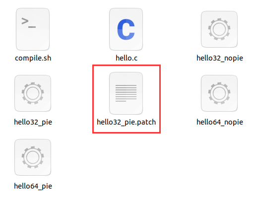
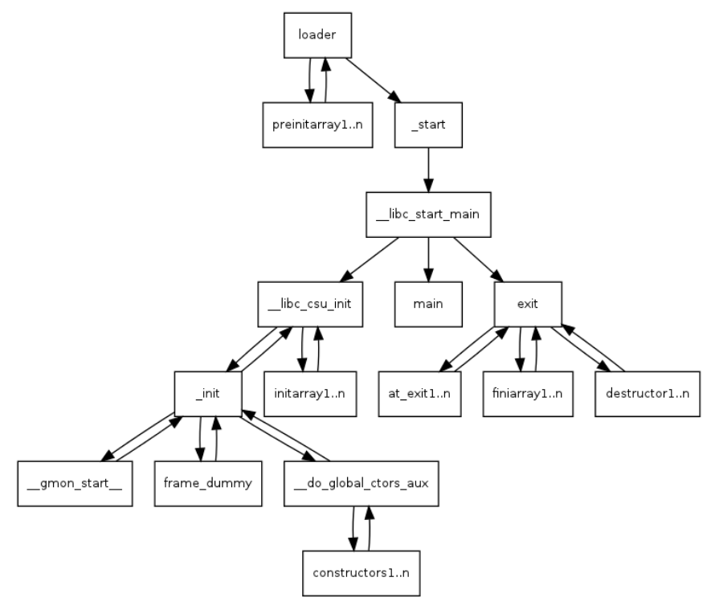

# 基于pwntools和seccomp-tools的awd pwn通防小工具

​	最初想法是搞到一种不影响程序本身运行，但是能够给程序禁用一些系统调用的方法。看了网上很多资料，感觉没有找到我想要的那种方法，有一些是环境我都搭不起来，也非常不好用，再有一些就是对文件本身内容改动太大了，而awd中假如check的脚本是本地运行的话是有可能check文件修改字节数的。那就只能自己动手，丰衣足食了。


## 工具说明


### 环境需求

​	运行需要依赖seccomps-tools和pwntools

​	seccomps-tools github地址 https://github.com/david942j/seccomp-tools

### 目录说明

**sandboxs文件夹**

​	sandboxs里面存放了禁用的规则，这里根据自己的需要进行修改和选择。

实例（sandbox1.asm）

```
A = sys_number
A >= 0x40000000 ? dead : next
A == execve ? dead : next
A == open ? dead : next
return ALLOW
dead:
return KILL
```


**test文件夹**

​	执行`./complie.sh`生成四个可执行文件可供测试。


### 运行脚本命令

​	第一个参数是想要patch的elf文件，第二个参数是沙箱规则文件，可以从sandboxs文件夹里选，假如想输出更多的中间过程可以在最后参数加上一个1。

```
Usage: python evil_patcher.py elfFile sandboxFile
       python evil_patcher.py elfFile sandboxFile 1 (more detailed process message)
```

**运行**


​	结果输出一个patch过后的文件，文件名为原来文件加上.patch后缀，再改回原来的名字就可以开开心心传到靶机上了。



**验证**


## 禁用系统调用的两种方式


### 1.seccomp库实现

这种方法需要安装一些库文件

```bash
sudo apt install libseccomp-dev libseccomp2 seccomp
```

实例

```c
#include <unistd.h>
#include <seccomp.h>
#include <linux/seccomp.h>

int main(void){
    scmp_filter_ctx ctx;
    ctx = seccomp_init(SCMP_ACT_ALLOW);
    seccomp_rule_add(ctx, SCMP_ACT_KILL, SCMP_SYS(execve), 0);
    seccomp_load(ctx);
    char * str = "/bin/sh";
    write(1,"hello worldn",12);
    syscall(59,str,NULL,NULL);//execve
    return 0;
}
```

​	scmp_filter_ctx是过滤器的结构体

​	seccomp_init对结构体进行初始化，若参数为SCMP_ACT_ALLOW，则过滤为黑名单模式；若为SCMP_ACT_KILL，则为白名单模式，即没有匹配到规则的系统调用都会杀死进程，默认不允许所有的syscall。

​	seccomp_rule_add用来添加一条规则，arg_cnt为0,表示我们直接限制execve,不管参数是什么，如果arg_cnt不为0,那arg_cnt表示后面限制的参数的个数,也就是只有调用execve,且参数满足要求时,才会拦截

​	seccomp_load是应用过滤器,如果不调用seccomp_load则上面所有的过滤都不会生效

​	注意：编译的时候要在最后面加 -lseccomp

​	这该种方式实现的话会涉及到堆的操作，会留下堆使用痕迹，出题一般不用这种，假如栈题倒是可以用。正常用倒是方便，直接调库就行。


### 2.prctl实现

实例

```c
#include <stdio.h>
#include <signal.h>
#include <unistd.h>
#include <time.h>
#include <string.h>
#include <stdlib.h>
#include <malloc.h>
#include <sys/prctl.h>
#include <seccomp.h>
#include <linux/seccomp.h>
#include <linux/filter.h>

int main() {
	setvbuf(stdin, 0LL, 2, 0LL);
	setvbuf(stdout, 0LL, 2, 0LL);
	setvbuf(stderr, 0LL, 2, 0LL);
    struct sock_filter filter[] = {
    BPF_STMT(BPF_LD+BPF_W+BPF_ABS,4),
    BPF_JUMP(BPF_JMP+BPF_JEQ,0xc000003e,0,2),
    BPF_STMT(BPF_LD+BPF_W+BPF_ABS,0),
    BPF_JUMP(BPF_JMP+BPF_JEQ,59,0,1),
    BPF_STMT(BPF_RET+BPF_K,SECCOMP_RET_KILL),
    BPF_STMT(BPF_RET+BPF_K,SECCOMP_RET_ALLOW),
    };
    struct sock_fprog prog = {
    .len = (unsigned short)(sizeof(filter)/sizeof(filter[0])),
    .filter = filter,
    };
    prctl(PR_SET_NO_NEW_PRIVS,1,0,0,0);
    prctl(PR_SET_SECCOMP,SECCOMP_MODE_FILTER,&prog);
    printf("start!\n");
    system("id");
    return 0;
}
```

​	主要用到两个结构体sock_filter和sock_fprog，prog会作为参数传入prctl,这里禁用了execve，x64的情况下其系统调用号为59。

效果图


​	ps：一种更快捷的方式是通过seccomp-tools，可以直接生成代码，不过得提前写好沙箱规则的文件，格式和sandboxs文件夹中的文件一样。


## 实现思路


### 1.修改\_start代码块

ELF执行流程图



​	程序的入口默认情况下都是_start函数，这里主要就是调用了__libc_start_main。

函数原型

```c
int __libc_start_main(int *(main) (int, char * *, char * *), int argc, char * * ubp_av, void (*init) (void), void (*fini) (void), void (*rtld_fini) (void), void (* stack_end));
```

​	main函数的地址就是第一个参数，那么我们可以修改这个参数为我们提前布置好的代码的地址，然后最后再跳转回main去执行正常流程，类似于病毒，不过这里藏得更深一点，病毒一般会修改程序入口点。

#### 32位情况

pie未开启

​	情况比较简单，直接修改mov的第二个操作数为我们要跳转的地址就行。


pie开启

​	这里情况稍微特殊一点，`push ds:(main_ptr - 3FC4)[ebx]`指令长度为6个字节，`lea ecx, (unk_2060 - 3FC4h)[ebx];push ecx;`两条指令长度起来为7，所以后面的`call ___libc_start_main`指令其实往后移了一个字节，把`hlt`覆盖了。


#### 64位情况

​	64位情况比较简单，都是修改mov或者lea的第二个参数就行，因为64位情况下是通过寄存器来传递参数的。

pie未开启


pie开启


### 2.prctl汇编实现

​	我们需要实现的其实是以下两个函数完成的事情，只不过我们现在使用系统调用来完成。

```c
prctl(PR_SET_NO_NEW_PRIVS,1,0,0,0);
prctl(PR_SET_SECCOMP,SECCOMP_MODE_FILTER,&prog);
```
​	PR_SET_NO_NEW_PRIVS、PR_SET_SECCOMP、SECCOMP_MODE_FILTER这三个都是常数，那么只要解决prog和prctl系统调用汇编实现就行了。幸运的是pwntools对于系统调用汇编实现已经有了相应的模块，好耶，懒狗狂喜。


​	对于sock_filter和sock_fprog两个结构体可以当一维数组来看就行了，无脑push进栈就行了，不过最后还是需要进行堆栈平衡操作的，主要怕程序结束的时候异常。

**注入代码放在哪？**

**.eh_frame节**

​	正常编译处理的程序一般都会包含这个节区，里面主要记载一些异常处理的信息，一般是只读权限的，但是加载到内存的时候是有可能和`.text`节在同一个页，具有执行权限（之后发现ubuntu18.04编译出来的是如下图，但ubuntu16.04编译出来的`.eh_frame`并没有和`.text`节在一个段里）

​	选择把shellcode注入到这个节上，这个节的长度也一般会>0x100个字节。

​	实现代码如下，不同情况汇编代码稍有区别，但思路一致。


### 3.修改段权限

​	编译出的文件`.eh_frame`节对应的那个段不一定有可执行权限，和编译器版本相关，那么我们只需要把`.eh_frame`节对应的那个段加上可执行权限就行。


​	ps：假如想手动修改段权限可以用01Editor直接改，非常好用，学习ELF文件格式用它非常好用。

