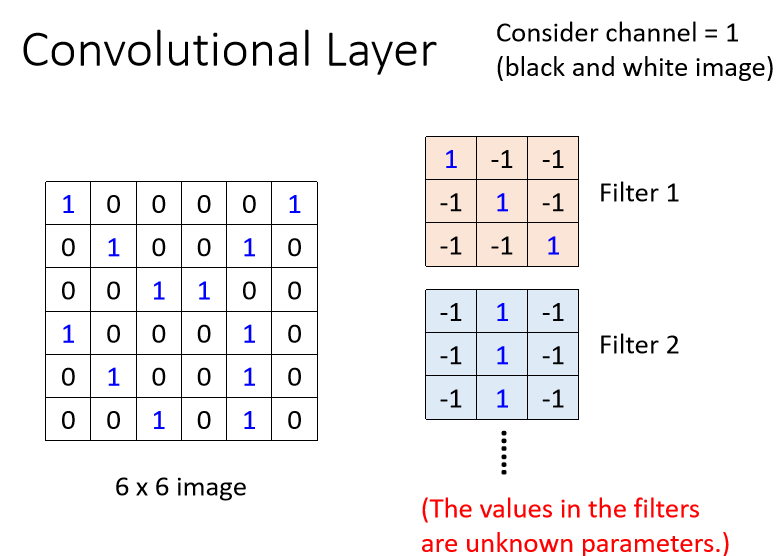
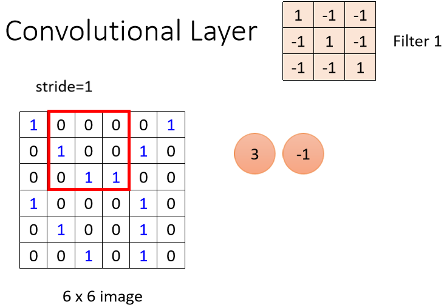
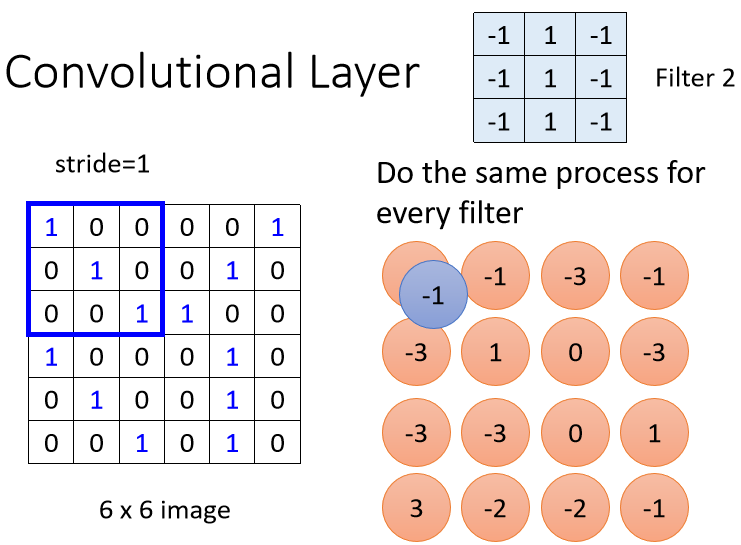
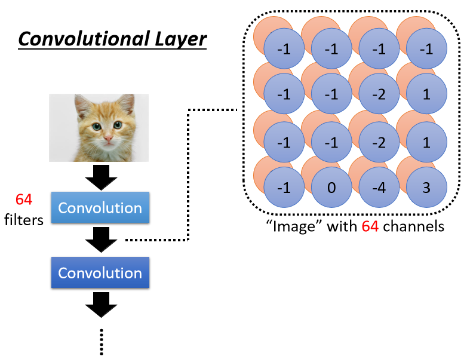

## Dataset&DataLoader

### Dataset

```python
class torch.utils.data.Dataset
```

​	Dataset是一个包装类，用来将数据包装为Dataset类，然后传入DataLoader中，我们再使用DataLoader这个类来更加快捷的对数据进行操作。 

​	所有其他数据集都应该进行子类化。所有子类应该override`__len__`和`__getitem__`，前者提供了数据集的大小，后者支持整数索引，范围从0到len(self)。

```python
class torch.utils.data.TensorDataset(data_tensor, target_tensor)
```

参数

- **data_tensor** (Tensor) －　包含样本数据
- **target_tensor** (Tensor) －　包含样本目标（标签）


### DataLoader

```python
class torch.utils.data.DataLoader(dataset, batch_size=1, shuffle=False, sampler=None, num_workers=0, collate_fn=<function default_collate>, pin_memory=False, drop_last=False)
```

- **dataset**(Dataset): 传入的数据集

- **batch_size**(int, optional): 每个batch有多少个样本

- **shuffle**(bool, optional): 在每个epoch开始的时候，对数据进行重新排序

- **sampler**(Sampler, optional): 自定义从数据集中取样本的策略，如果指定这个参数，那么shuffle必须为False

- **batch_sampler**(Sampler, optional): 与sampler类似，但是一次只返回一个batch的indices（索引），需要注意的是，一旦指定了这个参数，那么batch_size,shuffle,sampler,drop_last就不能再制定了（互斥——Mutually exclusive）

- **num_workers** (int, optional): 这个参数决定了有几个进程来处理data loading。0意味着所有的数据都会被load进主进程。（默认为0）

- **collate_fn** (callable, optional): 将一个list的sample组成一个mini-batch的函数

- **pin_memory** (bool, optional)： 如果设置为True，那么data loader将会在返回它们之前，将tensors拷贝到CUDA中的固定内存（CUDA pinned memory）中.

- **drop_last** (bool, optional): 如果设置为True：这个是对最后的未完成的batch来说的，比如你的batch_size设置为64，而一个epoch只有100个样本，那么训练的时候后面的36个就被扔掉了…
  如果为False（默认），那么会继续正常执行，只是最后的batch_size会小一点。

- **timeout**(numeric, optional): 如果是正数，表明等待从worker进程中收集一个batch等待的时间，若超出设定的时间还没有收集到，那就不收集这个内容了。这个numeric应总是大于等于0。默认为0

- **worker_init_fn** (callable, optional): 每个worker初始化函数 If not None, this will be called on each
  worker subprocess with the worker id (an int in [0, num_workers - 1]) as
  input, after seeding and before data loading. (default: None)


## Loss

### CrossEntropyLoss 

分类问题常用的损失函数

Pytorch中CrossEntropyLoss()函数的主要是将softmax-log-NLLLoss合并到一块得到的结果。

1、Softmax后的数值都在0~1之间，所以ln之后值域是负无穷到0。

2、然后将Softmax之后的结果取log，将乘法改成加法减少计算量，同时保障函数的单调性 。

3、NLLLoss的结果就是把上面的输出与Label对应的那个值拿出来，去掉负号，再求均值。 

#### 分解

**1.softmax**

公式


```python
import numpy as np
import torch
inputs = torch.FloatTensor([[1,2,3],[1,3,4]]) #2个样本3个特征
labels = torch.LongTensor([0,1])
#计算输入softmax，此时可以看到每一行加到一起结果都是1
softmax_func=torch.nn.Softmax(dim=1)
soft_output=softmax_func(inputs)
print('soft_output:\n',soft_output)
```


0.0900 = exp(1)/(exp(1)+exp(2)+exp(3))

0.2447 = exp(2)/(exp(1)+exp(2)+exp(3))

...

**2.log**

```python
log_output = torch.log(soft_output)
print('log_output:\n',log_output)
```


**3.NLLLoss**

```python
loss = torch.nn.NLLLoss()
print(loss(log_output,labels))
```

outputs:

```python
tensor(1.8783)
```

labels为[0,1]，第一个样本选择第一个输出，第二个样本选择第二个输出

1.8783 = (2.4076+1.3490)/2


#### 合并

```python
import numpy as np
import torch
inputs = torch.FloatTensor([[1,2,3],[1,3,4]])
labels = torch.LongTensor([0,1])
criterion = torch.nn.CrossEntropyLoss()
loss = criterion(inputs, labels)
print(loss)
```

output:

```python
tensor(1.8783)
```


## CNN


### Convolutional Layer

 	一张彩色的图片,它每一个 Pixel,都是由 R G B 三个顏色所组成的,所以这三个 Channel 就代表了 R G B 三个顏色,那长跟宽就代表了今天这张图片的解析度,代表这张图片裡面有的 Pixel,有的像素的数目。

​	 这些Filter ,它们的大小是**3 × 3 × Channel** 的 Size,如果彩色图片的话,那就是 RGB 三个 Channel,如果是黑白的图片的话,它的 Channel 就等于 1。

​	 **一个 Convolutional 的 Layer 裡面就是有一排的 Filter**,每一个 Filter ,它都是一个 3 × 3 × Channel 。


#### 例子

​	假设 Channel 是 1,也就是说我们图片是黑白的图片 。Filter 就是一个一个的 Tensor，它们的数值其实就是 Model 里面的 Parameter，**在训练的时候会不断的梯度下降修正**。



​	它是一个 6 × 6 的大小的图片,那这些 Filter的做法就是,先把 Filter 放在图片的左上角,然后**把 Filter 里面所有的值,跟左上角这个范围内的 9 个值做相乘**,得到结果是3。


​	接下来这个 Filter ,本来放在左上角,接下来就往右移一点,那这个移动的距离叫做 **Stride** ,这里stride等于1。3444



计算结果


接下来，用下一个filter做相同的操作。



​	每一个 Filter,都会给我们一群数字,红色的 Filter 给我们一群数字,蓝色的 Filter 给我们一群数字,如果我们有 64 个 Filter,我们就得到 64 群的数字了,得到的结果叫做 **Feature Map** 。


​	当我们把一张图片,通过一个 Convolutional Layer,里面有一堆 Filter 的时候,我们产生出来了一个 Feature Map。



**扩展到彩色图像的情况（channel=3）**

- 卷积运算


- 单个样本*单个filter


- 单个样本*多个filter


- 单个样本*多个filter+偏置


- 多个样本*多个filter+偏置


### Max pooling Layer

​	 如图，按步幅2进行2x2的Max池化处理。一般来讲，池化的窗口大小会和步幅设定成相同的值。


### 标准化

#### BatchNorm2d

```python
class torch.nn.BatchNorm2d(num_features, eps=1e-05, momentum=0.1, affine=True)
```

对小批量(mini-batch)3d数据组成的4d输入进行批标准化(Batch Normalization)操作


- num_features：一般输入参数为**batch_size \* num_features \* height \* width**，即为其中特征的数量，即为输入BN层的通道数；
- eps：分母中添加的一个值，目的是为了计算的稳定性，默认为：1e-5,避免分母为0；
- momentum：一个用于运行过程中均值和方差的一个估计参数（一个稳定系数，类似于SGD中的momentum的系数）；
- affine： 一个布尔值，当设为true，给该层添加可学习的仿射变换参数。 
  

**输入：（N, C，H, W)** 

**输出：（N, C，H, W) （输入输出相同）** 

**详细说明**


**详细例子**


