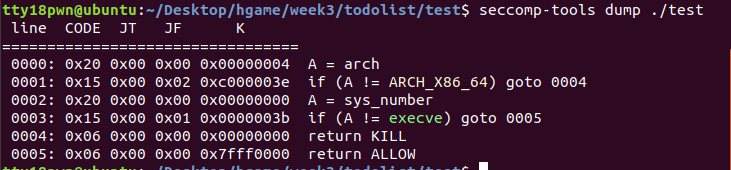

详细细节看这篇

https://www.anquanke.com/post/id/208364#h2-2

沙箱可以禁用一些系统调用，还是比较常见的感觉。

## seccomp

下面这段代码用seccomp沙箱来禁用

安装相应库

```shell
sudo apt-get install libseccomp-dev
```

具体参数啥的就不多讲了。。。看大佬的博客就行。

```c
//gcc -g simple_syscall_seccomp.c -o simple_syscall_seccomp -lseccomp
#include <unistd.h>
#include <seccomp.h>
#include <linux/seccomp.h>

int main(void){
	scmp_filter_ctx ctx;
	ctx = seccomp_init(SCMP_ACT_ALLOW);
	seccomp_rule_add(ctx, SCMP_ACT_KILL, SCMP_SYS(execve), 0);
	//seccomp_rule_add(ctx, SCMP_ACT_KILL, SCMP_SYS(write), 0);
	seccomp_load(ctx);

	char * filename = "/bin/sh";
	char * argv[] = {"/bin/sh",NULL};
	char * envp[] = {NULL};
	write(1,"i will give you a shell\n",24);
	syscall(59,filename,argv,envp);//execve
	return 0;
}
```

```shell
$ ./simple_syscall_seccomp 
i will give you a shell
Bad system call (core dumped)
```

（以下直接搬运了）

scmp_filter_ctx是过滤器的结构体

seccomp_init对结构体进行初始化，若参数为SCMP_ACT_ALLOW，则过滤为黑名单模式；若为SCMP_ACT_KILL，则为白名单模式，即没有匹配到规则的系统调用都会杀死进程，默认不允许所有的syscall。

seccomp_rule_add用来添加一条规则，arg_cnt为0,表示我们直接限制execve,不管参数是什么，如果arg_cnt不为0,那arg_cnt表示后面限制的参数的个数,也就是只有调用execve,且参数满足要求时,才会拦截

seccomp_load是应用过滤器,如果不调用seccomp_load则上面所有的过滤都不会生效

注意：编译的时候要在最后面加 -lseccomp

但是这种禁用方式会涉及到堆的操作，会留下堆使用痕迹，出题不用这种，假如栈题倒是可以用。正常用倒是方便，直接调库就行。


## prctl

另外一种禁用手段，不会有堆操作，具体原理看大佬文章。。。

示例代码

```c
#include<unistd.h>
#include <sys/prctl.h>
#include <linux/filter.h>
#include <linux/seccomp.h>
void sandbox(){
	struct sock_filter filter[] = {
	BPF_STMT(BPF_LD+BPF_W+BPF_ABS,4),
	BPF_JUMP(BPF_JMP+BPF_JEQ,0xc000003e,0,2),
	BPF_STMT(BPF_LD+BPF_W+BPF_ABS,0),
	BPF_JUMP(BPF_JMP+BPF_JEQ,59,0,1),
	BPF_STMT(BPF_RET+BPF_K,SECCOMP_RET_KILL),
	BPF_STMT(BPF_RET+BPF_K,SECCOMP_RET_ALLOW),
	};
	struct sock_fprog prog = {
	.len = (unsigned short)(sizeof(filter)/sizeof(filter[0])),
	.filter = filter,
	};
	prctl(PR_SET_NO_NEW_PRIVS,1,0,0,0);
	prctl(PR_SET_SECCOMP,SECCOMP_MODE_FILTER,&prog);
}
```

直接加这个函数就行，这里只禁用了execve。


## Seccomp Tools

一个查沙箱禁用规则的工具

安装

```shell
sudo apt install gcc ruby-dev
sudo gem install seccomp-tools
```

使用方法seccomp-tools dump ./file



